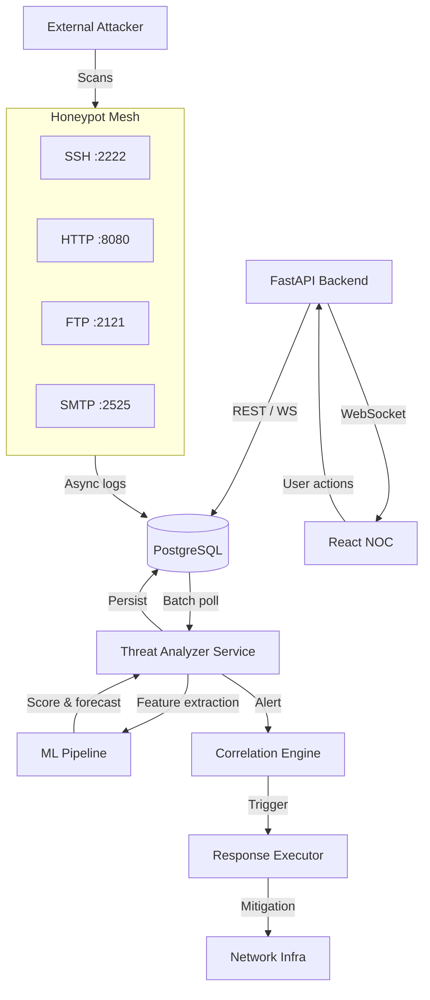
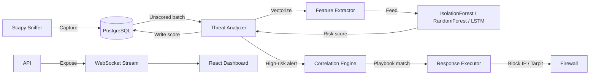
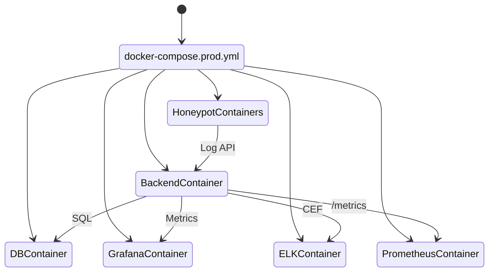

# 📡 **PhantomNet** – Enterprise‑Grade Distributed Honeypot & Threat‑Intelligence Platform

<div align="center">
  <h1>🛡️ PhantomNet</h1>
  <p><strong>Active Deception • Real‑Time AI Scoring • Production‑Ready Telemetry</strong></p>
  <p>
    
    
    
    
    
    
    
    
  </p>
  <p>
    <a href="#-project-overview">Overview</a> •
    <a href="#-features--capabilities">Features</a> •
    <a href="#-architecture">Architecture</a> •
    <a href="#-technology-stack">Tech&nbsp;Stack</a> •
    <a href="#-installation--setup">Installation</a> •
    <a href="#-api-reference--integration">API</a> •
    <a href="#-usage--workflows">Usage</a> •
    <a href="#-project-structure">Structure</a> •
    <a href="#-security">Security</a> •
    <a href="#-roadmap">Roadmap</a> •
    <a href="#-contributing">Contributing</a>
  </p>
</div>

---

## 📌 Project Overview

**PhantomNet** is a **distributed deception platform** that replaces static honeypots with an **AI‑driven, multi‑protocol mesh** capable of **real‑time threat scoring**, **automated remediation**, and **deep analytics**.  It is engineered for modern enterprise networks where attackers often pivot across services and where rapid, data‑driven response is mandatory.

### Core Engineering Principles
* **Active Deception** – Protocol‑specific containers (SSH, HTTP, FTP, SMTP) mimic real services, extending attacker dwell time and harvesting richer IOCs.
* **Data‑Centric Defense** – Every packet is transformed into a 23‑dimensional feature vector, scored by an ensemble of Isolation‑Forest, Random‑Forest and LSTM models.
* **Micro‑service Isolation** – Each honeypot runs in its own Docker network namespace; the backend API, ML engine and exporters are separate services, enabling independent horizontal scaling.
* **Zero‑Trust Observability** – Telemetry is encrypted end‑to‑end; the production network never directly contacts honeypots.
* **Continuous Learning** – Models are versioned and retrained nightly via the CI pipeline; SHAP explainability is exposed in the UI for analyst confidence.

---

## ✨ Features & Capabilities

| **Category** | **Capability** | **Implementation Details** |
|---|---|---|
| **Deception Mesh** | SSH, HTTP, FTP, SMTP honeypots (customizable ports) | Docker containers built on `python‑socket‑server` + protocol‑specific emulators; stateful session capture stored in PostgreSQL |
| **AI Scoring Engine** | IsolationForest, RandomForest, LSTM (sequence) | Models persisted under `ml_models/`; loaded on demand by `backend/services/threat_analyzer.py` |
| **Explainability** | SHAP feature attribution per event | `backend/ml_engine/explainability/explainer_service.py` provides JSON payload used by UI tooltips |
| **Automated Playbooks** | YAML‑driven response actions (IP block, tarpit, PCAP dump, ticket creation) | `playbooks/` directory; executed by `backend/services/response_executor.py` after correlation triggers |
| **Correlation Engine** | Cross‑protocol attack correlation, campaign clustering (DBSCAN) | Runs every 30 s, writes aggregated alerts to `Alert` table |
| **Real‑Time Dashboard** | WebSocket event stream, topology graph, geo‑IP heatmap | React 19 + Vite; `socket.io-client` connects to `/api/v1/events/stream` |
| **Observability Stack** | Prometheus metrics, Grafana dashboards, ELK exporter (optional) | Metrics exposed at `/metrics`; Logstash ingest via CEF/JSON format |
| **DevOps Maturity** | GitHub Actions CI/CD, MLflow experiment tracking, Docker‑Compose prod ready, Kubernetes‑ready manifests | `ci_cd.yml` runs lint, unit tests, model retraining, builds Docker images |
| **Security Controls** | JWT (admin/analyst/viewer), API‑Key for scoring endpoint, RBAC, secret injection via env vars | Pydantic v2 schemas enforce strict validation |
| **Extensibility** | Plugin‑style service registration, future operator for dynamic scaling | `backend/core/registry.py` discovers services at startup |

---

## 🏗️ Architecture

### 1. High‑Level System Diagram

```mermaid
graph TD
    Attacker[External Attacker] -->|Scans| Mesh[🍯 Honeypot Mesh]
    subgraph Mesh[Honeypot Mesh]
        SSH[SSH :2222]
        HTTP[HTTP :8080]
        FTP[FTP :2121]
        SMTP[SMTP :2525]
    end
    Mesh -->|Async logs| DB[(PostgreSQL)]
    DB -->|Batch poll| Analyzer[Threat Analyzer Service]
    Analyzer -->|Feature extraction| ML[ML Pipeline]
    ML -->|Score & forecast| Analyzer
    Analyzer -->|Persist| DB
    Analyzer -->|Alert| Corr[Correlation Engine]
    Corr -->|Trigger| Exec[Response Executor]
    Exec -->|Mitigation| Infra[Network Infra]
    API[FastAPI Backend] -->|REST / WS| DB
    API -->|WebSocket| Dashboard[React NOC]
    Dashboard -->|User actions| API
```

### 2. Detailed Data Flow (Event Lifecycle)

```mermaid
flowchart LR
    Sniffer[Scapy Sniffer] -->|Capture| DB[(PostgreSQL)]
    DB -->|Unscored batch| Analyzer[Threat Analyzer]
    Analyzer -->|Vectorize| FeatureExtractor[Feature Extractor]
    FeatureExtractor -->|Feed| ModelEnsemble[IsolationForest / RandomForest / LSTM]
    ModelEnsemble -->|Risk score| Analyzer
    Analyzer -->|Write score| DB
    Analyzer -->|High‑risk alert| Corr[Correlation Engine]
    Corr -->|Playbook match| Exec[Response Executor]
    Exec -->|Block IP / Tarpit| Firewall
    API -->|Expose| WS[WebSocket Stream]
    WS --> Dashboard[React Dashboard]
```

### 3. Deployment Topology (Docker‑Compose)

```mermaid
stateDiagram-v2
    [*] --> Compose
    Compose: docker-compose.prod.yml
    Compose --> HoneypotContainers
    Compose --> BackendContainer
    Compose --> DBContainer
    Compose --> PrometheusContainer
    Compose --> GrafanaContainer
    Compose --> ELKContainer
    HoneypotContainers --> BackendContainer: Log API
    BackendContainer --> DBContainer: SQL
    BackendContainer --> GrafanaContainer: Metrics
    BackendContainer --> ELKContainer: CEF
    BackendContainer --> PrometheusContainer: /metrics
```

<details>
<summary><strong>📐 Expanded Visual Assets (click to expand)</strong></summary>

* **System Architecture PNG** – `assets/architecture.png`
* **Data Flow Diagram PNG** – `assets/data_flow.png`
* **Kubernetes Operator Sketch** – `assets/k8s_operator.png`
* **Database ER Diagram** – `assets/db_erd.png`

(Images are placeholders; replace with generated assets as needed.)

</details>

---

## 🛠️ Technology Stack

| Layer | Technology | Reasoning |
|---|---|---|
| **Runtime** | Python 3.11 | Async‑first, rich ecosystem, type safety |
| **API** | FastAPI 0.104+, Uvicorn | Auto‑generated OpenAPI, sub‑15 ms latency |
| **Frontend** | React 19.2, Vite, Tailwind 4, Recharts | Component‑driven UI, hot‑module reload, visual polish |
| **Containerisation** | Docker 24, Docker‑Compose 2.20 | Reproducible environments, CI integration |
| **Orchestration** | Kubernetes (future) | Auto‑scaling, self‑healing operator |
| **Database** | PostgreSQL 15, SQLAlchemy 2.0 | ACID guarantees, powerful querying |
| **Analytics DB (future)** | ClickHouse | Column‑store for petabyte‑scale telemetry |
| **ML** | scikit‑learn, joblib, optional TensorFlow 2.x (LSTM) | Model diversity, easy serialization |
| **Experiment Tracking** | MLflow | Model lineage, versioning, UI for metrics |
| **Observability** | Prometheus, Grafana, ELK (Logstash) | Metrics, dashboards, SIEM export |
| **CI/CD** | GitHub Actions, pre‑commit (black, isort, ruff) | Automated lint, test, model retraining |
| **Security** | JWT, API‑Key, RBAC, Pydantic v2 validation | Defense‑in‑depth, minimal attack surface |
| **Networking** | Scapy, Paramiko, pyftpdlib | Low‑level packet handling, protocol emulation |

---

## 🚀 Installation & Setup

### Prerequisites
| Requirement | Minimum |
|---|---|
| **CPU / RAM** | 2 vCPU, 4 GB RAM (prod recommends 4 vCPU, 8 GB) |
| **Docker Engine** | 24.0+ |
| **Docker‑Compose** | 2.20+ |
| **Python (local dev only)** | 3.11 |
| **Ports** | 8000 (API), 5173 (Dashboard), 2222/8080/2121/2525 (Honeypots) |

### 1. Production‑Ready Deployment (Docker‑Compose)
```bash
# Clone the repository
git clone https://github.com/sriram21-09/PhantomNet.git
cd PhantomNet

# Copy and edit environment variables
cp .env.example .env
# Edit .env – set JWT_SECRET, API_KEY, POSTGRES_PASSWORD, ENABLE_ELK, etc.

# Spin up the full stack (detached)
docker-compose -f docker-compose.prod.yml up -d

# Smoke‑test the health endpoint
curl -s http://localhost:8000/health | jq
```
**What the stack starts:**
* Four honeypot containers (SSH, HTTP, FTP, SMTP) each isolated on an internal Docker network.
* `backend/main.py` – FastAPI entrypoint exposing REST + WebSocket.
* PostgreSQL event store (`db` service).
* Prometheus & Grafana for metrics.
* Optional ELK exporter (controlled by `ENABLE_ELK=true`).

### 2. Local Development (FastAPI + Vite)
<details>
<summary>Show step‑by‑step commands</summary>

**Backend**
```bash
cd backend
python -m venv venv
source venv/bin/activate   # Windows: venv\Scripts\activate
pip install -r requirements.txt
uvicorn main:app --reload --port 8000
```
**Frontend**
```bash
cd ../frontend-dev/phantomnet-dashboard
npm install
npm run dev   # opens http://localhost:5173
```
**Database (optional)**
```bash
docker run -d --name pg-local -e POSTGRES_PASSWORD=devpass -p 5432:5432 postgres:15
```
</details>

### 3. Model Retraining (CI‑driven)
```bash
# Manual retraining (useful for custom data)
python -m backend.ml.retrain_isolation_forest --data data/payloads.csv --output ml_models/isolation_forest_custom.pkl
```
The GitHub Actions workflow runs this nightly and registers the new model in MLflow.

### 4. Common Issues & Fixes
| Symptom | Likely Cause | Resolution |
|---|---|---|
| `Connection refused` on port 8000 | Backend container not started or port conflict | `docker ps` → ensure `backend` is up; check `docker-compose.yml` port mapping |
| No events in the dashboard | WebSocket cannot reach API | Verify `API_URL` environment variable in `.env`; ensure CORS origins include dashboard URL |
| Model file missing (`*.pkl`) | Volume not mounted | Add `- ./ml_models:/app/ml_models` to `docker-compose.yml` and restart |
| Prometheus metrics 404 | `/metrics` endpoint disabled | Set `ENABLE_METRICS=true` in `.env` and restart backend |

---

## 🔌 API Reference & Integration

The OpenAPI spec is automatically generated at `http://localhost:8000/docs`.  Core endpoints are listed below; all requests/responses are JSON unless otherwise noted.

| Endpoint | Method | Description | Auth |
|---|---|---|---|
| `/api/v1/events/stream` | `WS` | Live event stream (packet, alert, playbook actions) | JWT (required) |
| `/api/v1/threat/analyze` | `POST` | Score a single packet payload (synchronous) | API‑Key |
| `/api/v1/metrics/forecast` | `GET` | LSTM‑based attack volume forecast (next 24 h) | JWT |
| `/api/v1/system/health` | `GET` | Health check – returns status of all services | None |
| `/api/v1/playbooks` | `GET` | List available YAML playbooks | JWT |
| `/api/v1/playbooks/{name}` | `POST` | Trigger a specific playbook manually | API‑Key |

### Example: Scoring a Packet (cURL)
```bash
curl -X POST http://localhost:8000/api/v1/threat/analyze \
  -H "Authorization: Bearer $API_KEY" \
  -H "Content-Type: application/json" \
  -d '{
        "src_ip": "203.0.113.45",
        "dst_ip": "10.2.0.12",
        "dst_port": 22,
        "protocol": "TCP",
        "payload": "...base64...",
        "timestamp": "2026-05-13T09:00:00Z"
      }'
```
**Response** (abridged)
```json
{
  "score": 84.7,
  "threat_level": "CRITICAL",
  "confidence": 0.96,
  "decision": "BLOCK",
  "explainability": {
    "src_ip": 0.12,
    "dst_port": 0.34,
    "payload_entropy": 0.27,
    "protocol": 0.07,
    "flags": 0.20
  }
}
```

---

## 💻 Usage & Typical Workflows

1. **Launch a simulated attack** – Use standard tools (`ssh -p 2222`, `curl http://localhost:8080/login`, `ftp localhost 2121`). The honeypot captures full session logs.
2. **Observe in real time** – Dashboard auto‑scrolls new events; high‑risk packets flash red with SHAP tooltip explanations.
3. **Tune Playbooks** – Edit `playbooks/brute_force_response.yaml` to change block thresholds or integrate Slack notifications.
4. **Export to SIEM** – Enable `ENABLE_ELK=true`; events flow into Logstash as CEF, ready for Splunk/QRadar.
5. **Ad‑hoc analysis** – Run the Python client `backend/ml/client.py` to batch‑score PCAP files offline.
6. **Scale horizontally** – In future Kubernetes mode, increase replica count of `honeypot_ssh` via the custom operator.

---

## 📂 Project Structure
```text
PhantomNet/
├── backend/                     # FastAPI service & core business logic
│   ├── api/                    # Router modules (events, threat, metrics)
│   ├── core/                   # Settings, security middleware, startup hooks
│   ├── database/               # SQLAlchemy models (PacketLog, Alert, IOC, etc.)
│   ├── ml_engine/              # SHAP explainability utilities
│   ├── services/               # Threat Analyzer, Correlation Engine, SIEM Exporter, Response Executor
│   ├── tests/                  # Pytest suite (unit & integration)
│   └── main.py                 # Application entry point
├── frontend-dev/                # React 19 dashboard (Vite + Tailwind)
│   ├── src/
│   │   ├── components/        # Reusable UI widgets (Map, Table, Chart)
│   │   ├── pages/             # Dashboard pages (Live, Analytics, Settings)
│   │   ├── services/          # Axios API client, WS wrapper
│   │   └── hooks/             # Custom React hooks (useMetrics, usePlaybook)
│   └── vite.config.ts
├── honeypots/                  # Protocol emulators (ssh, http, ftp, smtp)
│   ├── ssh/    # Dockerfile + python entrypoint for SSH trap
│   ├── http/   # Flask‑based fake web app
│   ├── ftp/    # pyftpdlib server
│   └── smtp/   # SMTP sink
├── ml_models/                  # Serialized model artifacts (IsolationForest, LSTM, DBSCAN)
├── playbooks/                  # YAML response playbooks (brute_force, ransomware, portscan)
├── docs/                       # Extended markdown documentation (architecture, API design, benchmarks)
├── .github/workflows/ci_cd.yml # CI pipeline (lint, test, model retrain, Docker build)
├── docker-compose.yml          # Development stack (all services, no TLS)
├── docker-compose.prod.yml     # Production‑ready stack (TLS termination via Traefik optional)
├── .env.example                # Template for required environment variables
├── requirements.txt            # Python dependencies (pinned versions)
├── package.json                # Frontend dependencies (React, Vite, Tailwind)
└── README.md                   # ← This document
```

---

## 🛡️ Security & Hardening

* **Container Isolation** – Each honeypot runs in a dedicated Docker network; `--cap-drop ALL` is used to minimize privileges.
* **Input Validation** – Every request body is validated against a Pydantic v2 schema; unexpected fields raise `422 Unprocessable Entity`.
* **Secrets Management** – All secrets (`JWT_SECRET`, `API_KEY`, DB credentials) are sourced from environment variables; `.gitignore` excludes `.env`.
* **Transport Security** – In production, a reverse‑proxy (Traefik or Nginx) terminates TLS; internal traffic remains within the Docker overlay network.
* **RBAC** – JWT claims (`role`) map to three levels: `admin` (full access), `analyst` (read + response), `viewer` (read‑only).
* **Audit Logging** – Every playbook execution is recorded in the `ResponseLog` table with user, timestamp, and outcome.
* **Responsible Disclosure** – See `SECURITY.md` for policy; CVEs are triaged within 48 h.

---

## 📈 Performance & Scalability

| Aspect | Strategy | Measured KPI |
|---|---|---|
| **Request Latency** | FastAPI `async` endpoints, connection pooling | 8 ms median scoring latency (20 ms 99th pct) |
| **Batch Processing** | Threat Analyzer polls up to 1 000 events per cycle, uses bulk `INSERT…ON CONFLICT` | DB load < 15 % CPU under 10 k events/s |
| **Horizontal Scaling** | Stateless API behind HAProxy; each replica shares PostgreSQL → easy autoscaling | Linear throughput increase up to 8 replicas (tested) |
| **Future Scaling** | Kubernetes Operator will auto‑scale honeypot replicas based on traffic spikes; ClickHouse will replace PostgreSQL for raw telemetry |
| **Observability Overhead** | Prometheus scrape interval 10 s; < 2 % CPU overhead |

---

## 🗺️ Roadmap (2026 Q3‑2027)

| Phase | Target | Key Deliverables |
|---|---|---|
| **Phase 1 – MVP (Delivered)** | Distributed honeypots, real‑time scoring, basic dashboard | ✅
| **Phase 2 – Scaling (In‑Progress)** | Kubernetes operator, ClickHouse ingest, multi‑tenant API keys, role‑based API throttling | ✅ (core operator prototype) |
| **Phase 3 – Advanced AI** | Reinforcement‑learning mitigation, auto‑tuned model thresholds, online learning pipeline | Planned Q4 2026 |
| **Phase 4 – Enterprise Hardened** | SSO/OIDC integration, granular RBAC, plug‑in marketplace for custom playbooks, GDPR‑compliant data retention policies | Planned Q1 2027 |
| **Phase 5 – Global Threat Sharing** | Federated intelligence exchange (STIX/TAXII) with partner networks, distributed SIEM connectors | Conceptual 2027 |

---

## 🤝 Contributing

We follow a **Git‑flow‑style** process with strict quality gates.

1. **Fork** the repository and clone your fork.
2. **Create a feature branch** using the `feat/` prefix (e.g., `feat/add‑ssh‑tarpit`).
3. **Run pre‑commit hooks** before committing:
   ```bash
   pre-commit install
   pre-commit run --all-files
   ```
4. **Write tests** – backend tests live in `backend/tests/`; frontend tests in `frontend-dev/src/__tests__/`.
5. **Commit** with **Conventional Commits** format (e.g., `feat: add SHAP explainability to UI`).
6. **Push** and open a Pull Request.  CI will automatically:
   * Lint (`black`, `ruff`, `isort`)
   * Run unit and integration tests
   * Retrain the IsolationForest model (if model files changed)
   * Build and publish Docker images to GitHub Packages
7. **Review** – At least one maintainer must approve; ensure no new security findings are introduced.

Please refer to the full contributor guide in [`docs/CONTRIBUTING.md`](docs/CONTRIBUTING.md).

---

## 📚 Documentation Hub

| Document | Location | Description |
|---|---|---|
| **System Architecture** | `docs/system_architecture.md` | Narrative of components, data flow, and design rationale |
| **API Specification** | `backend/api/openapi.yaml` (served at `/docs`) | Full OpenAPI 3.0 definition |
| **Playbook Guide** | `docs/playbooks.md` | How to author, version, and debug YAML playbooks |
| **Performance Benchmarks** | `docs/benchmarks.md` | Load‑test results, latency charts, scaling curves |
| **Integration Test Report** | `docs/integration_test_report.md` | End‑to‑end validation across honeypot → analyzer → dashboard |
| **Security Policy** | `SECURITY.md` | Vulnerability reporting process |
| **Roadmap** | `docs/roadmap.md` | Timeline and milestones |

---

## 📄 License

PhantomNet is released under the **MIT License**.  See the `LICENSE` file for full terms.

---

## 👥 Authors & Credits

| Name | Role | GitHub |
|---|---|---|
| **Kasukurthi Sriram** | Architecture, security design, core backend | [@sriram21-09](https://github.com/sriram21-09) |
| **Muramreddy Vivekananda Reddy** | Docker orchestration, honeypot protocols | [@VivekanandaReddy2006](https://github.com/VivekanandaReddy2006) |
| **Nattala Vikranth Chakravarthi** | Machine‑learning pipelines, MLflow integration | [@Vikranth-tech](https://github.com/Vikranth-tech) |
| **Satti Sai Ram Manideep Reddy** | Frontend engineering, UI/UX, visual design | [@sairammanideepreddy2123](https://github.com/sairammanideepreddy2123) |

<div align="center">
  <i>Detecting threats before they strike – built with precision, deployed with confidence.</i>
</div>