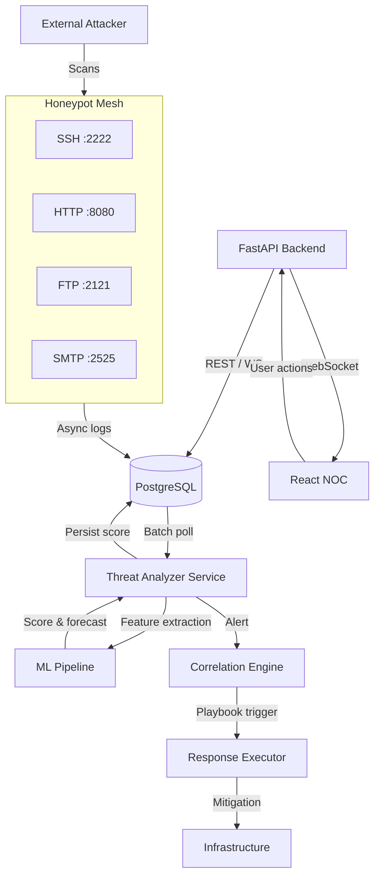
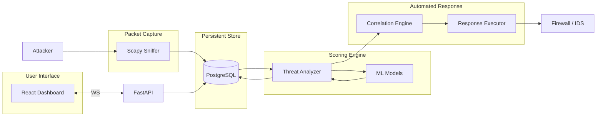
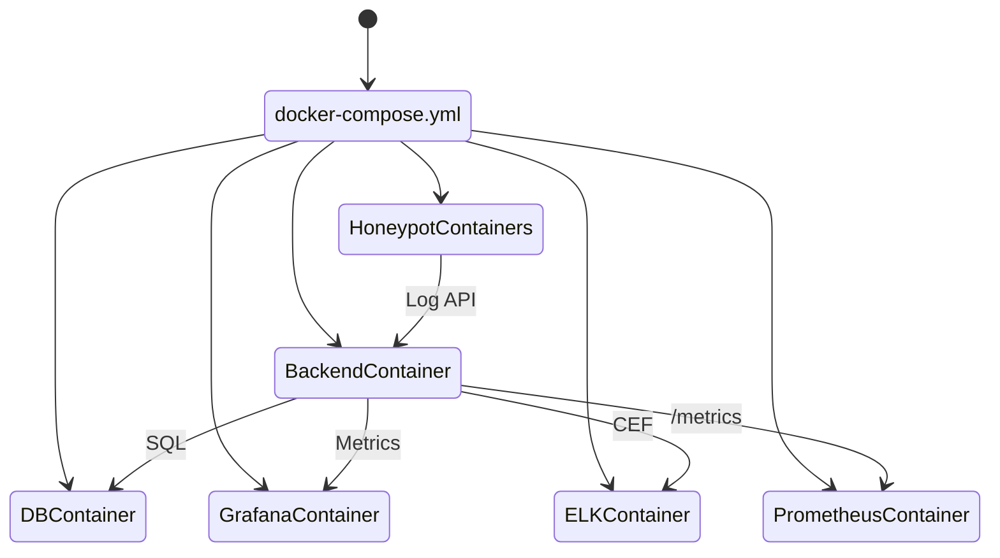
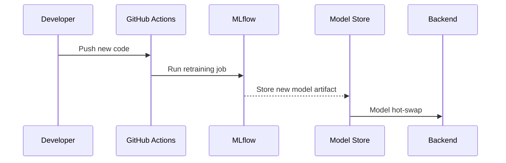

# 📡 PhantomNet

<div align="center">
  <h1>🛡️ PhantomNet</h1>
  <p><strong>Enterprise‑Grade Distributed Honeypot & Threat Intelligence Platform</strong></p>
  <p>
    
    
    
    
    
    
    
    
  </p>
  <p>
    <a href="#-project-overview">Overview</a> •
    <a href="#-features">Features</a> •
    <a href="#-architecture">Architecture</a> •
    <a href="#-installation--setup">Installation</a> •
    <a href="#-api-reference">API</a> •
    <a href="#-contributing">Contributing</a>
  </p>
</div>

---

## 📌 Project Overview

**PhantomNet** delivers a high‑performance, **distributed deception network** that actively engages attackers, records their tactics, and enriches threat intelligence in real time.  It combines protocol‑specific honeypots, an AI/ML‑driven scoring engine, and a low‑latency WebSocket dashboard to give security teams actionable visibility without exposing the production environment.

### Core Engineering Principles
* **Active Deception:** Simulated services (SSH, HTTP, FTP, SMTP) respond like real assets, extending attacker dwell time.
* **Data‑Driven Defense:** Every packet is feature‑extracted, scored, and stored for immediate analytics.
* **Micro‑service Isolation:** Each protocol handler runs in its own container, enabling independent scaling.
* **Zero‑Trust Observability:** All telemetry is encrypted in‑flight; the core network never contacts the honeypot mesh.

---

## ✨ Features & Capabilities

| Category | Capability |
|---|---|
| **Deception Mesh** | Protocol‑aware honeypots (SSH 2222, HTTP 8080, FTP 2121, SMTP 2525) with stateful session capture |
| **AI‑Powered Scoring** | Isolation Forest, RandomForest, LSTM‑based sequence analysis, DBSCAN campaign clustering |
| **Explainability** | SHAP‑based per‑event feature attribution displayed in the UI |
| **Automated Response** | Playbook‑driven actions (IP block, tarpit, PCAP capture, IOC enrichment) |
| **Real‑Time Dashboard** | React 19 + Vite, WebSocket event stream, topology map, geo‑IP heatmaps |
| **Observability** | Prometheus metrics, Grafana dashboards, ELK export (CEF/JSON) |
| **Security Controls** | JWT authentication, API‑key gating, RBAC (Admin/Analyst/Viewer) |
| **CI/CD & DevOps** | GitHub Actions pipeline, MLflow experiment tracking, Docker‑Compose & Kubernetes‑ready |
| **Extensibility** | YAML playbooks, plugin‑style service registration, future operator for dynamic scaling |

---

## 🏗️ Architecture

### System Overview

```mermaid
graph TD
    Attacker[External Attacker] -->|Scans| HoneypotMesh[🍯 Honeypot Mesh]
    subgraph HoneypotMesh[Honeypot Mesh]
        SSH[SSH :2222]
        HTTP[HTTP :8080]
        FTP[FTP :2121]
        SMTP[SMTP :2525]
    end
    HoneypotMesh -->|Async logs| DB[(PostgreSQL)]
    DB -->|Batch poll| Analyzer[Threat Analyzer Service]
    Analyzer -->|Feature extraction| ML[ML Pipeline]
    ML -->|Score & forecast| Analyzer
    Analyzer -->|Persist score| DB
    Analyzer -->|Alert| CorrelationEngine[Correlation Engine]
    CorrelationEngine -->|Playbook trigger| ResponseExecutor[Response Executor]
    ResponseExecutor -->|Mitigation| Network[Infrastructure]
    API[FastAPI Backend] -->|REST / WS| DB
    API -->|WebSocket| Dashboard[React NOC]
    Dashboard -->|User actions| API
```

### Data Flow (Detailed)

```mermaid
flowchart LR
    subgraph Capture[Packet Capture]
        Sniffer[Scapy Sniffer]
    end
    subgraph Storage[Persistent Store]
        DB[(PostgreSQL)]
    end
    subgraph Scoring[Scoring Engine]
        Analyzer[Threat Analyzer]
        ML[ML Models]
    end
    subgraph Response[Automated Response]
        Correlation[Correlation Engine]
        Executor[Response Executor]
    end
    subgraph UI[User Interface]
        Dashboard[React Dashboard]
    end
    Attacker --> Sniffer --> DB
    DB --> Analyzer --> ML --> Analyzer --> DB
    Analyzer --> Correlation --> Executor --> Network[Firewall / IDS]
    Dashboard <-- WS --> API[FastAPI]
    API --> DB
```

<details>
<summary><strong>📐 Expanded Architecture Diagrams</strong></summary>

#### 1. Deployment Topology

```mermaid
stateDiagram-v2
    [*] --> DockerCompose
    DockerCompose: docker-compose.yml
    DockerCompose --> HoneypotContainers
    DockerCompose --> BackendContainer
    DockerCompose --> DBContainer
    DockerCompose --> GrafanaContainer
    DockerCompose --> PrometheusContainer
    DockerCompose --> ELKContainer
    HoneypotContainers --> BackendContainer: Log API
    BackendContainer --> DBContainer: SQL
    BackendContainer --> GrafanaContainer: Metrics
    BackendContainer --> ELKContainer: CEF
    BackendContainer --> PrometheusContainer: /metrics
```

#### 2. Model Lifecycle

```mermaid
sequenceDiagram
    participant Dev as Developer
    participant CI as GitHub Actions
    participant ML as MLflow
    participant Store as Model Store
    Dev->>CI: Push new code
    CI->>ML: Run retraining job
    ML-->>Store: Store new model artifact
    Store->>Backend: Model hot‑swap
```
</details>

---

## 🛠️ Technology Stack

| Layer | Tech | Reason |
|---|---|---|
| **Runtime** | Python 3.11 | Modern, async‑first language |
| **API** | FastAPI 0.104+, Uvicorn | High‑throughput, OpenAPI generation |
| **Frontend** | React 19.2, Vite, Tailwind 4 | Responsive, component‑driven UI |
| **Containerisation** | Docker 24, Docker‑Compose | Isolation & reproducible environments |
| **Orchestration** | Kubernetes (planned) | Horizontal scaling of mesh nodes |
| **Database** | PostgreSQL 15, SQLAlchemy 2 | ACID‑compliant event store |
| **ML** | scikit‑learn, joblib, optional TensorFlow (LSTM) | Model variety & easy deployment |
| **Observability** | Prometheus, Grafana, ELK (Logstash) | Metrics, logs, and SIEM export |
| **CI/CD** | GitHub Actions, MLflow | Automated testing & model tracking |
| **Security** | JWT, API‑Key, RBAC, env‑var secrets | Defense‑in‑depth authentication |

---

## 🚀 Installation & Setup

### Prerequisites
* Docker Engine ≥ 24.0
* Docker‑Compose ≥ 2.20
* Minimum 2 CPU cores, 4 GB RAM (production recommends 4 CPU, 8 GB)
* Optional: Python 3.11 (for local dev without Docker)

### Production Deployment (Docker‑Compose)
```bash
# 1. Clone the repository
git clone https://github.com/sriram21-09/PhantomNet.git
cd PhantomNet

# 2. Prepare environment variables
cp .env.example .env
# Edit .env – set JWT secret, API keys, DB password, etc.

# 3. Launch the stack
docker-compose -f docker-compose.prod.yml up -d

# 4. Verify health
curl -s http://localhost:8000/health | jq
```
The stack includes:
* Four honeypot containers (SSH, HTTP, FTP, SMTP)
* Backend API (`backend/main.py`)
* PostgreSQL event store
* Prometheus & Grafana for metrics
* ELK exporter (Logstash) – optional, toggle via `ENABLE_ELK` env var

### Local Development (FastAPI + Vite)
<details>
<summary>Show step‑by‑step commands</summary>

**Backend**
```bash
cd backend
python -m venv venv
source venv/bin/activate   # Windows: venv\Scripts\activate
pip install -r requirements.txt
uvicorn main:app --reload --port 8000
```

**Frontend**
```bash
cd ../frontend-dev/phantomnet-dashboard
npm install
npm run dev   # Serves at http://localhost:5173
```

**Database (optional)**
```bash
docker run -d --name pg-local -e POSTGRES_PASSWORD=devpass -p 5432:5432 postgres:15
```
</details>

### Troubleshooting
| Symptom | Likely Cause | Fix |
|---|---|---|
| `Connection refused` on port 8000 | Backend not started or port conflict | Ensure `uvicorn` is running; check Docker port bindings |
| Dashboard shows no events | WebSocket cannot connect | Verify `API_URL` in `.env` matches backend address; check CORS settings |
| Model files missing | `ml_models/` not mounted | Add `- ./ml_models:/app/ml_models` to `docker‑compose.yml` |

---

## 🔌 API Reference & Integration

The OpenAPI spec is served at `http://localhost:8000/docs`.  Core endpoints:

| Endpoint | Method | Description | Auth |
|---|---|---|---|
| `/api/v1/events/stream` | `WS` | Real‑time event stream | JWT |
| `/api/v1/threat/analyze` | `POST` | Score a single packet payload | API‑Key |
| `/api/v1/metrics/forecast` | `GET` | LSTM‑based attack volume forecast | JWT |
| `/api/v1/system/health` | `GET` | Health check (no auth) | – |

**Example – Scoring a packet (cURL)**
```bash
curl -X POST http://localhost:8000/api/v1/threat/analyze \
  -H "Authorization: Bearer <API_KEY>" \
  -H "Content-Type: application/json" \
  -d '{"src_ip":"192.0.2.45","dst_ip":"10.0.0.5","dst_port":22,"protocol":"TCP","length":64}'
```
**Response** (excerpt)
```json
{
  "score": 78.4,
  "threat_level": "HIGH",
  "confidence": 0.92,
  "decision": "BLOCK"
}
```

---

## 💻 Usage & Workflows

1. **Simulate an attack** – Use `ssh -p 2222` or `curl http://localhost:8080/admin` to trigger honeypot logging.
2. **Observe in the dashboard** – Live map shows attacker IP, threat score, and session details.
3. **Configure a playbook** – Edit `playbooks/brute_force_response.yaml` to adjust block duration, alert channels, or escalation.
4. **Export to SIEM** – Enable the ELK exporter; events are streamed as CEF to Logstash.
5. **Run ad‑hoc analysis** – Use the Python client provided in `backend/ml/` to score batches offline.

---

## 📂 Project Structure
```text
PhantomNet/
├── backend/                     # FastAPI service & core logic
│   ├── api/                    # OpenAPI routers
│   ├── core/                   # Settings, security, middleware
│   ├── database/               # SQLAlchemy models & session handling
│   ├── ml_engine/              # Explainability (SHAP)
│   ├── services/               # Threat analyzer, correlation, SIEM exporter
│   └── main.py                 # Application entry point
├── frontend-dev/                # React Vite dashboard
│   ├── src/
│   │   ├── components/        # UI widgets (maps, tables, charts)
│   │   ├── pages/             # Dashboard views
│   │   └── services/          # Axios API client, WS hooks
│   └── vite.config.ts
├── honeypots/                  # Protocol emulators (ssh, http, ftp, smtp)
├── ml_models/                  # Serialized model artifacts
├── playbooks/                  # YAML response playbooks
├── docker-compose.yml          # Development stack
├── docker-compose.prod.yml     # Production‑ready stack
├── .github/workflows/ci_cd.yml # CI pipeline
├── .env.example                # Template for secrets
└── README.md                   # <-- you are reading this file
```

---

## 🛡️ Security & Hardening

* **Container Isolation** – Each honeypot runs in its own Docker network namespace; no privileged access is granted.
* **Input Validation** – Pydantic v2 models enforce strict type checking on every request.
* **Secrets Management** – All credentials are supplied via environment variables; no secrets are stored in the repository.
* **Transport Security** – API served over HTTPS in production (reverse‑proxy with TLS termination).
* **Role‑Based Access Control** – JWT claims map to RBAC roles (admin, analyst, viewer).
* **Responsible Disclosure** – Security researchers can submit findings via the `SECURITY.md` file.

---

## 📈 Performance & Scalability

* **Asynchronous I/O** – FastAPI with `asyncio` yields <15 ms latency for scoring requests.
* **Batch Scoring** – `ThreatAnalyzerService` processes up to 500 events per poll cycle, reducing DB round‑trips.
* **Stateless Services** – Horizontal scaling behind a load balancer is trivial; each instance shares the same PostgreSQL store.
* **Future‑Ready** – Planned Kubernetes operator will auto‑scale honeypot replicas based on traffic volume; ClickHouse will handle petabyte‑scale telemetry.

---

## 🗺️ Roadmap

| Phase | Target | Highlights |
|---|---|---|
| **Phase 1** (Delivered) | MVP | Distributed honeypots, real‑time scoring, basic dashboard |
| **Phase 2** (In‑Progress) | Scaling | Kubernetes operator, ClickHouse ingest, multi‑tenant API keys |
| **Phase 3** | Advanced AI | Reinforcement‑learning threat mitigation, auto‑tuned model thresholds |
| **Phase 4** | Enterprise | SSO/OIDC, plug‑in marketplace for custom playbooks, GDPR‑compliant data retention |

---

## 🤝 Contributing

1. **Fork** the repo and create a feature branch (`git checkout -b feat/xyz`).
2. **Commit** using Conventional Commits (e.g., `feat: add new LSTM model`).
3. **Run** pre‑commit hooks: `black`, `isort`, `ruff`.
4. **Add** tests under `backend/tests/` or `frontend-dev/.../__tests__/`.
5. **Push** and open a Pull Request – CI will lint, test, and run the model retraining job.

See [`CONTRIBUTING.md`](docs/CONTRIBUTING.md) for the full workflow and coding standards.

---

## 📚 Documentation

* **System Architecture** – `docs/system_architecture.md`
* **API Specification** – `backend/api/openapi.yaml` (also served at `/docs`)
* **Playbook Guide** – `docs/playbooks.md`
* **Performance Benchmarks** – `docs/benchmarks.md`
* **Integration Tests** – `docs/integration_test_report.md`

---

## 📄 License

This project is licensed under the **MIT License**. See the `LICENSE` file for details.

---

## 👥 Authors & Credits

* **Kasukurthi Sriram** – Architecture, security design – [@sriram21-09](https://github.com/sriram21-09)
* **Muramreddy Vivekananda Reddy** – Protocol emulation, Docker orchestration – [@VivekanandaReddy2006](https://github.com/VivekanandaReddy2006)
* **Nattala Vikranth Chakravarthi** – ML pipeline, model ops – [@Vikranth-tech](https://github.com/Vikranth-tech)
* **Satti Sai Ram Manideep Reddy** – Frontend engineering – [@sairammanideepreddy2123](https://github.com/sairammanideepreddy2123)

<div align="center">
  <i>Detecting threats before they strike.</i>
</div>