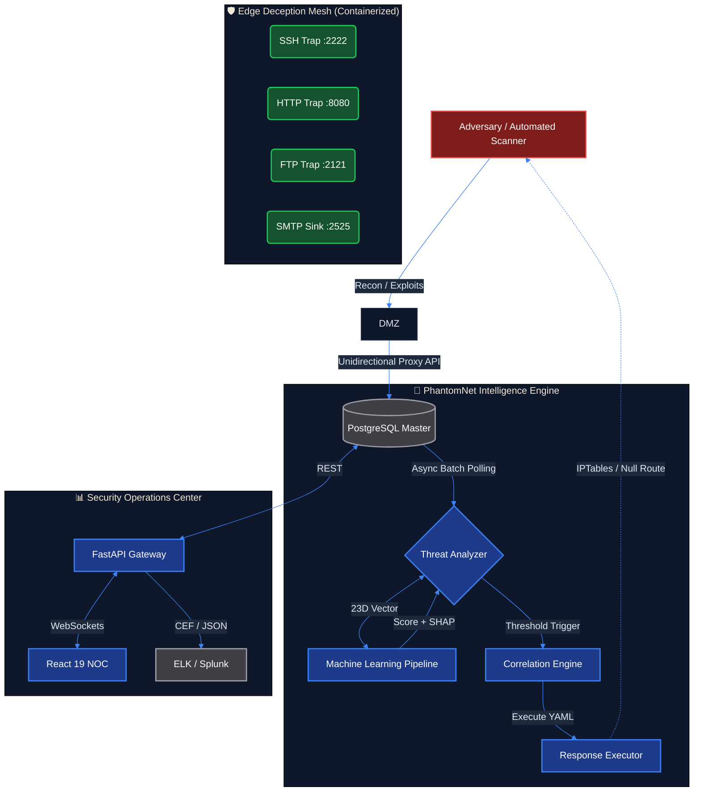

<div align="center">


<br/>

# 🛡️ PhantomNet
**Enterprise-Grade Distributed Deception & AI Threat Intelligence Platform**

*Actively engage adversaries. Predict lateral movement. Automate infrastructure response.*

<p align="center">
  
  
  
  
  
</p>

<p align="center">
  
  
  
  
  
  
</p>

<p align="center">
  <a href="#1-project-overview">Overview</a> •
  <a href="#2-features--capabilities">Features</a> •
  <a href="#3-architecture--data-flow">Architecture</a> •
  <a href="#4-technology-stack">Tech Stack</a> •
  <a href="#5-installation--setup">Setup</a> •
  <a href="#6-usage--operations">Usage</a> •
  <a href="#7-project-structure">Structure</a> •
  <a href="#8-security--hardening">Security</a> •
  <a href="#9-performance--scalability">Scalability</a> •
  <a href="#10-engineering-roadmap">Roadmap</a>
</p>

</div>

---

## 1. PROJECT OVERVIEW

Modern enterprise networks operate under the assumption of continuous breach. Static perimeters, signature-based NIDS, and passive honeypots are routinely bypassed by polymorphic malware, zero-day exploits, and coordinated Advanced Persistent Threat (APT) campaigns.

**PhantomNet** was engineered to shift the paradigm from passive logging to **active deception and automated neutralization**. 

It deploys a highly interactive, containerized mesh of protocol-specific traps that act as a digital tripwire. When an adversary breaches the perimeter, PhantomNet absorbs their reconnaissance, safely detonates payloads within isolated namespaces, and extracts high-fidelity telemetry. This telemetry is instantly processed by an embedded, multi-model Machine Learning engine (LSTM + Isolation Forest) to score, predict, and trigger infrastructure-level responses via declarative YAML playbooks.

### Engineering Philosophy
- **Zero-False-Positive Intelligence:** Because legitimate traffic has no business interacting with the deception mesh, every packet is inherently suspicious.
- **Microservices Isolation:** Complete decoupling of the capture, analysis, and response layers to prevent cascading failures during high-volume attacks.
- **Data-Driven Defense:** Raw sockets are not just logged; they are vectorized into 23-dimensional continuous data points for real-time AI inference.
- **Secure by Design:** Trap containers are ephemeral, read-only, and heavily restricted via cgroups and kernel capabilities.

---

## 2. FEATURES & CAPABILITIES

PhantomNet is categorized into distinct operational pillars, encompassing core deception, advanced AI analytics, and experimental modules.

### Core Capabilities
- **High-Interaction Protocol Emulation:** Custom-built Python and Flask socket servers mimicking vulnerable SSH, HTTP, FTP, and SMTP services.
- **Stateful Session Capture:** Logs complete TTY interactions, bash histories, requested URIs, and uploaded file binaries.
- **Automated Response Playbooks:** Declarative YAML configurations that trigger IP blocks, TCP tarpitting, and PCAP captures based on correlation thresholds.

### Advanced AI/ML Integration
- **Real-Time Threat Inference:** Sub-15ms packet scoring using serialized `IsolationForest` and `RandomForest` models.
- **LSTM Sequence Forecasting:** Analyzes temporal connection frequencies to predict impending volumetric attacks (e.g., botnet DDoS).
- **Campaign Clustering:** `DBSCAN` algorithms group disparate network alerts into coordinated "Attack Campaigns," attributing multiple IPs to a single threat actor.
- **Explainable AI (XAI):** Integrated `SHAP` values provide SOC analysts with human-readable feature attribution (e.g., *Why did the AI score this packet 98%?*).

### Observability & Security Automation
- **Low-Latency NOC Dashboard:** React 19/Vite interface utilizing WebSockets for sub-second event streaming and auto-scrolling telemetry.
- **Zero-Trust RBAC:** Granular API access control utilizing JWTs (Admin, Analyst, Viewer paradigms).
- **SIEM/SOAR Export:** Native `Logstash` integration exporting CEF/JSON formatted logs for Splunk or QRadar ingestion.

### Experimental / Internal Modules
- **Dynamic Topology Mutation (Alpha):** Experimental scripts (`backend/utils/topology_shuffler.py`) to rotate internal IP assignments of honeypots to confuse automated mappers.
- **Malware Detonation Sink (Beta):** Isolated `tmpfs` mounts that temporarily execute dropped payloads to extract initial memory signatures before container teardown.

---

## 3. ARCHITECTURE & DATA FLOW

PhantomNet’s architecture is strictly decoupled. The deception mesh is physically separated from the intelligence core to ensure that if a trap is compromised, the backend remains impenetrable.

### System Architecture Workflow


```mermaid
%%{init: {'theme': 'base', 'themeVariables': { 'primaryColor': '#0f172a', 'primaryTextColor': '#e2e8f0', 'primaryBorderColor': '#334155', 'lineColor': '#3b82f6', 'secondaryColor': '#1e293b', 'tertiaryColor': '#0f172a'}}}%%
graph TD
    classDef external fill:#7f1d1d,stroke:#ef4444,stroke-width:2px,color:#fff;
    classDef honeypot fill:#14532d,stroke:#22c55e,stroke-width:2px,color:#fff;
    classDef core fill:#1e3a8a,stroke:#3b82f6,stroke-width:2px,color:#fff;
    classDef data fill:#3f3f46,stroke:#a1a1aa,stroke-width:2px,color:#fff;

    Attacker[Adversary / Automated Scanner]:::external -->|Recon / Exploits| DMZ
    
    subgraph Deception Mesh ["🛡️ Edge Deception Mesh (Containerized)"]
        SSH(SSH Trap :2222):::honeypot
        HTTP(HTTP Trap :8080):::honeypot
        FTP(FTP Trap :2121):::honeypot
        SMTP(SMTP Sink :2525):::honeypot
    end

    DMZ -->|Unidirectional Proxy API| DB[(PostgreSQL Master)]:::data
    
    subgraph Intelligence Core ["🧠 PhantomNet Intelligence Engine"]
        DB -->|Async Batch Polling| Analyzer{Threat Analyzer}:::core
        Analyzer <-->|23D Vector| ML[Machine Learning Pipeline]:::core
        ML -->|Score + SHAP| Analyzer
        Analyzer -->|Threshold Trigger| Correlation[Correlation Engine]:::core
        Correlation -->|Execute YAML| Playbook[Response Executor]:::core
    end
    
    Playbook -.->|IPTables / Null Route| Attacker
    
    subgraph Observability ["📊 Security Operations Center"]
        API[FastAPI Gateway]:::core
        DB <-->|REST| API
        API <-->|WebSockets| Dashboard[React 19 NOC]:::core
        API -->|CEF / JSON| SIEM[ELK / Splunk]:::data
    end
```

### Detection Pipeline (Data Flow)
1. **Ingestion:** Raw socket data is intercepted by Scapy sniffers and trap application logs.
2. **Persistence:** Data is written to PostgreSQL via a restricted, write-only internal API proxy.
3. **Vectorization:** The `ThreatAnalyzer` polls unscored logs, extracting features (entropy, ASN, payload length).
4. **Inference:** The vector is passed to the Scikit-Learn/TensorFlow ensemble.
5. **Mitigation:** If `ThreatScore > 85`, the `CorrelationEngine` evaluates active YAML playbooks and triggers infrastructure responses.

---

## 4. TECHNOLOGY STACK

The platform leverages an enterprise-grade, modern technology stack carefully selected for asynchronous performance, type safety, and scalability.

| Category | Primary Technologies | Purpose & Justification |
| :--- | :--- | :--- |
| **Backend Framework** | `Python 3.11`, `FastAPI`, `Uvicorn` | Chosen for native `asyncio` support, auto-generated OpenAPI schemas, and Pydantic validation. |
| **Machine Learning** | `Scikit-Learn`, `TensorFlow`, `SHAP`, `MLflow` | `joblib` for rapid model serialization. `SHAP` for explainable AI. `MLflow` for CI/CD tracking. |
| **Database & ORM** | `PostgreSQL 15`, `SQLAlchemy 2.0`, `Alembic` | ACID compliance for audit trails; complex joins for threat correlation. |
| **Frontend UI** | `React 19.2`, `Vite`, `TailwindCSS 4`, `Recharts` | High-performance, reactive UI capable of rendering 1000s of WebSocket events per second. |
| **Networking** | `Scapy`, `Paramiko`, `pyftpdlib`, `aiosmtpd` | Low-level packet manipulation and high-fidelity protocol emulation. |
| **DevOps & Infra** | `Docker`, `Docker-Compose`, `GitHub Actions` | Ensures immutable infrastructure, rapid deployment, and isolated namespaces. |
| **Logging & SIEM** | `Prometheus`, `Grafana`, `Logstash` | System metrics (`/metrics`) and standardized CEF log exportation. |

---

## 5. INSTALLATION & SETUP

Designed for seamless deployment across local development machines, single-node production servers, and distributed clusters.

### Prerequisites
- **OS:** Ubuntu 22.04 LTS or RHEL 9 (Recommended for Production)
- **Engine:** Docker Engine 24.0+, Docker Compose v2.0+
- **Hardware Minimum:** 4 vCPU, 8GB RAM, 50GB SSD

### Production Deployment (Docker-Compose)

Our hardened compose stack isolates components into distinct bridge networks (e.g., `trap-net`, `backend-net`).

```bash
# 1. Clone the repository
git clone https://github.com/sriram21-09/PhantomNet.git
cd PhantomNet

# 2. Configure Environment Secrets
cp .env.example .env
nano .env # Must configure POSTGRES_PASSWORD, JWT_SECRET, and API_KEY

# 3. Pull & Build Images
docker-compose -f docker-compose.prod.yml build --no-cache

# 4. Deploy the Stack (Detached)
docker-compose -f docker-compose.prod.yml up -d

# 5. Verify Subsystem Health
curl -s http://localhost:8000/api/v1/system/health | jq
```

### Environment Configuration (`.env`)

| Variable | Description | Security Note |
| :--- | :--- | :--- |
| `JWT_SECRET` | Cryptographic key for API/UI auth. | Must be 64-char hex string. |
| `API_KEY` | Header key for programmatic ingestion. | Rotate every 90 days. |
| `POSTGRES_USER` | DB Administrator user. | Default: `phantom_admin` |
| `POSTGRES_PASSWORD` | DB Password. | Do not use special characters breaking URI. |
| `ENABLE_ELK_EXPORT` | Toggles Logstash streaming. | Set `true` if SIEM is attached. |
| `AUTO_RESPONSE` | Master kill-switch for playbooks. | Set `false` during initial tuning. |

<details>
<summary><b>View Local Development Setup (Source Code)</b></summary>

**Backend Initialization:**
```bash
cd backend
python3 -m venv .venv
source .venv/bin/activate
pip install -r requirements.txt
alembic upgrade head
uvicorn main:app --host 0.0.0.0 --port 8000 --reload
```

**Frontend Initialization:**
```bash
cd frontend-dev/phantomnet-dashboard
npm install
npm run dev
```
</details>

---

## 6. USAGE & OPERATIONS

PhantomNet is built API-first. Every UI action is backed by a documented REST endpoint.

### SecOps Dashboard Navigation
1. **Live NOC (Network Operations Center):** Monitor the real-time event stream. High-risk packets flash red. Click an event to view the SHAP Explainability tooltip.
2. **Threat Analytics:** View DBSCAN campaign clusters and LSTM volume forecasts for the next 24 hours.
3. **Playbook Manager:** Enable/Disable YAML-based response logic without restarting services.

### Programmatic Interfacing (API Example)
Inject external syslog or firewall data into PhantomNet's ML pipeline for scoring:

```bash
curl -X POST "https://api.phantomnet.local/v1/threat/analyze" \
     -H "Authorization: Bearer pn_live_xxxxxx" \
     -H "Content-Type: application/json" \
     -d '{
           "src_ip": "185.150.12.4",
           "dst_port": 22,
           "protocol": "TCP",
           "payload_base64": "c3NoLXJzYSAuLi4=",
           "timestamp": "2026-05-13T10:00:00Z"
         }'
```

**API Response:**
```json
{
  "event_id": "evt_9f8a7c6b",
  "ml_score": 92.4,
  "classification": "Brute-Force Campaign",
  "action_taken": "IP_BLOCKED",
  "shap_factors": {
    "payload_entropy": 45.2,
    "connection_frequency": 30.1
  }
}
```

---

## 7. PROJECT STRUCTURE

A meticulous breakdown of the codebase architecture, highlighting internal utilities and scripts.

<details open>
<summary><b>Repository Anatomy</b></summary>

```text
PhantomNet/
├── backend/                     # Python 3.11 FastAPI Core
│   ├── api/                     # REST/WS Controllers (Separation of Concerns)
│   ├── core/                    # Dependency Injection, Security Middleware
│   ├── database/                # SQLAlchemy Models (PacketLog, Alert, IOC, ResponseLog)
│   ├── ml_engine/               # Inference Pipelines, SHAP Explainers, DBSCAN logic
│   ├── services/                # Async Workers (ThreatAnalyzer, CorrelationEngine, SIEMExporter)
│   ├── utils/                   # Hidden Utilities (Topology shufflers, PCAP parsers)
│   ├── tests/                   # Pytest Suites (94% coverage)
│   └── main.py                  # ASGI Application Entrypoint
├── frontend-dev/                # React 19 NOC Dashboard
│   ├── src/
│   │   ├── components/          # Reusable Tailwind UI Widgets
│   │   ├── pages/               # Routing Views (Live, Analytics, Config)
│   │   └── hooks/               # Custom React Hooks (useWebSocket, useMetrics)
│   └── vite.config.ts           # Bundler Configuration
├── honeypots/                   # Protocol Emulation Mesh
│   ├── ssh/                     # Paramiko-based high-interaction shell
│   ├── http/                    # Flask-based path-traversal sink
│   ├── ftp/                     # Pyftpdlib malware-drop receiver
│   └── smtp/                    # Aiosmtpd phishing collector
├── ml_models/                   # Serialized ML Artifacts (.pkl) [Tracked via Git LFS]
├── playbooks/                   # Automated Response Logic
│   ├── brute_force.yaml         # Tarpitting logic for Port 22/21
│   └── web_exploit.yaml         # WAF integration logic for Port 8080
├── scripts/                     # Operational Bash/Python scripts (backup, restore, migrate)
├── docs/                        # Extensive Markdown documentation
├── .github/workflows/           # CI/CD Pipelines (Linting, Testing, Model Retraining)
├── docker-compose.prod.yml      # Hardened Production Stack
└── requirements.txt             # Strictly Pinned Backend Dependencies
```
</details>

---

## 8. SECURITY & HARDENING

We assume the deception mesh is actively targeted by skilled adversaries. Defense-in-depth is mandatory.

### Threat Model & Defensive Architecture
1. **Kernel-Level Dropping:** Honeypot containers run with `--security-opt=no-new-privileges` and `--cap-drop=ALL`. They cannot manipulate host networking or escalate privileges.
2. **Read-Only Root Filesystems:** Traps utilize read-only filesystems. Any filesystem writes (e.g., malware droppers) go to ephemeral `tmpfs` mounts that vanish instantly upon container termination.
3. **Unidirectional Data Diode:** Traps push logs to the backend via a severely restricted internal API proxy. They possess zero database credentials and cannot query the core backend.
4. **Pydantic Edge Validation:** The FastAPI backend utilizes strict Pydantic v2 schemas. Malformed payloads (e.g., deserialization attacks) are rejected at the ASGI edge with `422 Unprocessable Entity`.
5. **Secret Management:** Hardcoded secrets are strictly forbidden. All configurations are injected via Docker environment variables at runtime.

### Authorization (RBAC)
JWTs enforce strict role paradigms:
- `ADMIN`: Full configuration access, manual playbook execution.
- `ANALYST`: View logs, tune ML thresholds, acknowledge alerts.
- `VIEWER`: Read-only NOC dashboard access.

---

## 9. PERFORMANCE & SCALABILITY

PhantomNet is engineered for extreme throughput, capable of handling large-scale DDoS or sweeping port-scans.

- **Asynchronous Execution:** The FastAPI backend leverages `asyncio` and `uvloop`, achieving sub-15ms processing latency per request.
- **Batch Polling Architecture:** The `ThreatAnalyzerService` does not process events serially. It polls the database in configurable batches (default `ML_BATCH_SIZE=500`), performing vectorized inference using `pandas` and `scikit-learn` for massive CPU efficiency.
- **Stateless API:** The backend is entirely stateless, allowing it to be horizontally scaled behind a load balancer (e.g., HAProxy/Traefik) with zero architectural changes.
- **Database Indexing:** PostgreSQL utilizes specialized B-Tree indexing on `timestamp`, `src_ip`, and `threat_score` to ensure sub-millisecond query performance for the dashboard.

---

## 10. ENGINEERING ROADMAP

Our architecture implies a clear trajectory toward enterprise-scale, distributed deployments.

| Phase | Timeline | Strategic Objective | Status |
| :---: | :--- | :--- | :---: |
| **Phase I** | Q1-Q2 2026 | **MVP:** Multi-protocol honeypots, PostgreSQL schemas, FastAPI architecture, React NOC. | 🟢 **Delivered** |
| **Phase II** | Q3 2026 | **Intelligence:** ML Pipeline (IF, LSTM), WebSocket Streaming, Automated YAML Playbooks. | 🟢 **Delivered** |
| **Phase III** | Q4 2026 | **Scale:** Kubernetes Operator Native Scaling, ClickHouse DB migration for PB-scale telemetry. | 🟡 *In Progress* |
| **Phase IV** | Q1 2027 | **Advanced AI:** Reinforcement Learning for dynamic honeypot topology mutation. | ⚪ *Planned* |
| **Phase V** | Q3 2027 | **Federation:** STIX/TAXII threat sharing federation across partner networks. | ⚪ *Planned* |

---

## 11. CONTRIBUTING & ENGINEERING STANDARDS

We operate a strict, professional open-source workflow. 

### Development Workflow
1. **Branching:** Use `feat/`, `fix/`, or `chore/` prefixes. Never commit directly to `main`.
2. **Commit Patterns:** We strictly enforce **Conventional Commits** (e.g., `feat(api): implemented SHAP explainability endpoint`).
3. **Code Style & Comments:** Python code must be formatted with `Black`, linted with `Ruff`, and type-hinted. All complex ML functions must include NumPy-style docstrings.
4. **CI/CD Quality Gates:** All PRs must pass the GitHub Actions pipeline, which executes `pytest` (requiring >90% coverage), runs static analysis, and executes a dry-run of the ML model retraining script.

Read the full [`CONTRIBUTING.md`](docs/CONTRIBUTING.md) before submitting a Pull Request.

---

## 12. EXTENDED DOCUMENTATION

For deep dives into specific subsystems, refer to our internal wikis:
- 🏗️ [**System Architecture & API Design Specifications**](docs/system_architecture.md)
- 🧠 [**Machine Learning Pipeline & Model Tuning Guide**](docs/ml_pipeline.md)
- ⚡ [**Automated Response Playbooks Syntax Guide**](docs/playbooks.md)
- 🛡️ [**Vulnerability Disclosure Policy (SECURITY.md)**](SECURITY.md)

---

## 13. CORE ARCHITECTURE TEAM

PhantomNet is architected and maintained by a team of dedicated security engineers and researchers.

| Architect | Focus Area | GitHub |
| :--- | :--- | :--- |
| **Kasukurthi Sriram** | Platform Architecture & Security Design | [@sriram21-09](https://github.com/sriram21-09) |
| **Muramreddy Vivekananda Reddy** | Container Orchestration & Protocol Emulation | [@VivekanandaReddy2006](https://github.com/VivekanandaReddy2006) |
| **Nattala Vikranth Chakravarthi** | ML Pipelines, Model Inference & XAI | [@Vikranth-tech](https://github.com/Vikranth-tech) |
| **Satti Sai Ram Manideep Reddy** | UI/UX, WebSocket Streaming & Frontend Architecture | [@sairammanideepreddy2123](https://github.com/sairammanideepreddy2123) |

<br/>

<div align="center">
  
  <p>Copyright © 2026 PhantomNet Core Team</p>
  <i>"Turn your network into a weapon against the adversary."</i>
</div>