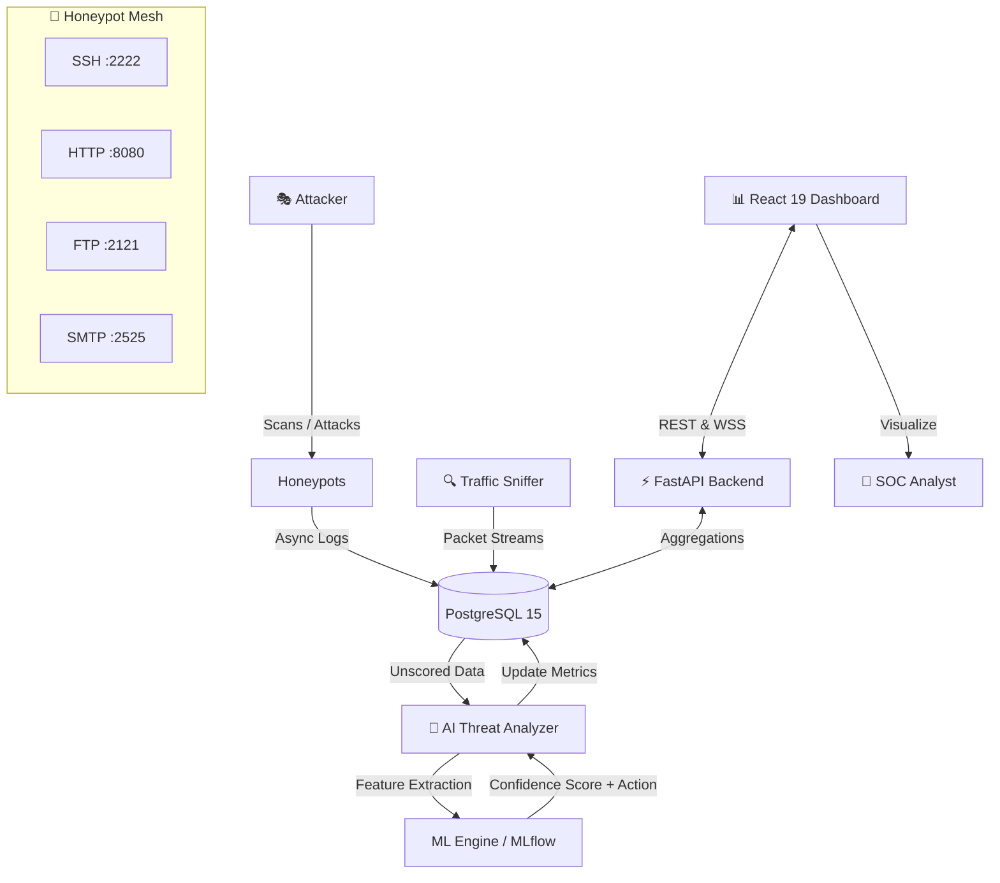

# 🛡️ PhantomNet – AI-Driven Distributed Honeypot Deception Framework

<div align="center">


**An intelligent, distributed honeypot system powered by AI/ML that detects, analyzes, and responds to cyber threats in real-time.**

[Features](#-features) • [Architecture](#%EF%B8%8F-architecture) • [Quick Start](#-quick-start) • [API Reference](#-api-reference) • [Team](#-team-members)

</div>

---

## 🎯 The Vision: Why PhantomNet?

Traditional security perimeters are failing against sophisticated, multi-vector attacks. **PhantomNet** flips the script by deploying a deceptive, highly interactive network mesh that lures attackers, studies their behavior in real-time, and generates actionable threat intelligence using advanced Machine Learning models.

Designed as an enterprise-grade deception framework, PhantomNet seamlessly integrates:
- **High-Fidelity Multi-Protocol Honeypots**
- **Sub-500ms Real-Time AI Threat Analysis**
- **Predictive Cyberpunk-Themed Analytics Dashboard**

> **Status Update (May 2026):** PhantomNet has successfully completed its core optimization phase. We have achieved high concurrency via asynchronous socket operations, integrated batch GeoIP caching for lightning-fast analysis, and finalized robust behavioral detection across all honeypot nodes.

---

## 🌟 Key Features & Innovations

### 🍯 Deceptive Honeypot Mesh
| Protocol | Port | Status | Capabilities |
|----------|------|--------|-------------|
| **SSH** | `2222` | 🟢 Active | Full Auth Simulation, Command Logging, Brute-Force Detection |
| **HTTP** | `8080` | 🟢 Active | Fake Admin Panels, Credential Traps, Flood/DDoS Detection |
| **FTP** | `2121` | 🟢 Active | Directory Traversal Traps, File Access Logging, Log Rotation |
| **SMTP** | `2525` | 🟢 Active | Email Spoofing Detection, Spam Traps |
| **DB** | `3306` | 🔮 Planned | SQLi Honeypot, Credential Theft Detection |

### 🧠 Real-Time AI Threat Engine
- **Algorithmic Core:** `IsolationForest` & `RandomForest` classifiers evaluating traffic continuously.
- **Microsecond Scoring:** Asynchronous, sub-500ms inference pipeline processing 15 distinct feature vectors per packet.
- **Smart Caching:** Built-in Batch GeoIP and IP threat caching to prevent redundant ML invocations.
- **MLOps Integrated:** Full MLflow model registry managing production and staging models.

### 📊 Tactical NOC Dashboard
- **Live Telemetry:** WebSockets streaming real-time attack data with zero latency.
- **Predictive Analytics:** LSTM-V3 forecasting predicts the exact timing and nature of subsequent attacks.
- **Attacker Attribution:** Builds complete behavioral profiles and identifies common exploit toolkits.
- **Geo-Tracking:** Real-world mapping of attack origins backed by high-performance IP resolution.

### ⚡ Optimized for Performance
- **High-Concurrency:** Endpoints like `/analyze-traffic` refactored for asynchronous, non-blocking execution.
- **Impeccable Repository Hygiene:** Fully purged of massive PCAP bloat; optimized `.gitignore` and conflict-free branches ready for deployment.
- **Microservices Architecture:** 7 tightly integrated Docker services ensuring seamless orchestration.

---

## 🏗️ System Architecture

PhantomNet uses a decoupled, event-driven architecture to ensure honeypot compromise never affects the core analysis engine.


```mermaid
graph TD
    Attacker[🎭 Attacker] -->|Scans / Attacks| Honeypots
    
    subgraph Deception Layer ["🍯 Honeypot Mesh"]
        SSH[SSH :2222]
        HTTP[HTTP :8080]
        FTP[FTP :2121]
        SMTP[SMTP :2525]
    end
    
    Honeypots -->|Async Logs| DB[(PostgreSQL 15)]
    Sniffer[🔍 Traffic Sniffer] -->|Packet Streams| DB
    
    DB -->|Unscored Data| Analyzer[🧠 AI Threat Analyzer]
    Analyzer -->|Feature Extraction| ML[ML Engine / MLflow]
    ML -->|Confidence Score + Action| Analyzer
    Analyzer -->|Update Metrics| DB
    
    API[⚡ FastAPI Backend] <-->|Aggregations| DB
    Dashboard[📊 React 19 Dashboard] <-->|REST & WSS| API
    Dashboard -->|Visualize| Admin[👤 SOC Analyst]
```

### Architecture Deep Dives
<details>
<summary>📐 Click here to expand all architectural diagrams</summary>

* **System Architecture**: 
* **Data Flow Diagram**: 
* **Database Schema (ERD)**: 
* **Network Topology**: 
* **CI/CD Pipeline**: 
</details>

---

## 🧰 Technology Stack

### Backend & AI
* **Python 3.11** - Core logic
* **FastAPI + Uvicorn** - High-concurrency async REST/WSS APIs
* **SQLAlchemy 2.0 & PostgreSQL 15** - ORM & Data Warehousing
* **scikit-learn & MLflow** - Anomaly detection and model lifecycle management
* **Paramiko & Scapy** - Protocol simulation and raw packet analysis

### Frontend
* **React 19.2** - Modern functional component UI
* **Vite** - Lightning fast module bundling
* **Tailwind CSS** - Cyberpunk utility-first styling
* **Recharts & WebSockets** - Real-time animated data visualization

### Infrastructure & DevOps
* **Docker & Docker Compose** - Container orchestration
* **GitHub Actions** - CI/CD automated testing pipelines
* **Locust** - Distributed load testing suite

---

## ⚡ Quick Start & Installation

### Prerequisites
* **Docker** (v24+) & **Docker Compose** (v2+)
* **Python** (3.11+)
* **Node.js** (v18+)

### 🐳 The Docker Way (Recommended)
Launch the entire 7-service mesh in under a minute.

```bash
# 1. Clone the repository
git clone https://github.com/sriram21-09/PhantomNet.git
cd PhantomNet

# 2. Deploy services
docker-compose up -d

# 3. Verify health
docker-compose ps
```

### 💻 Local Development Setup

#### Backend Engine
```bash
cd backend
python -m venv venv

# Windows
venv\Scripts\Activate.ps1
# Linux/macOS
source venv/bin/activate

pip install -r requirements.txt

# Start API
uvicorn main:app --host 127.0.0.1 --port 8000 --reload
```

#### Frontend Dashboard
```bash
cd frontend-dev/phantomnet-dashboard
npm install
npm run dev
```

### 🌐 Service Access Points
| Service | URL / Command | Description |
|---------|---------------|-------------|
| **SOC Dashboard** | `http://localhost:3000` | Main User Interface |
| **API Swagger Docs** | `http://localhost:8000/docs` | Interactive REST Endpoints |
| **SSH Trap** | `ssh -p 2222 localhost` | Active SSH Honeypot |
| **HTTP Trap** | `http://localhost:8080` | Active Web Honeypot |
| **FTP Trap** | `ftp localhost 2121` | Active FTP Honeypot |

---

## 📂 Project Structure

```text
PhantomNet/
├── backend/                  # FastAPI Application Core
│   ├── api/                  # REST and WebSocket Routes
│   ├── core/                 # ML Analysis Engine & Integrations
│   ├── models/               # SQLAlchemy DB Schemas
│   └── tests/                # Pytest Suites & Load Tests
├── frontend-dev/             # React 19 Frontend App
│   └── phantomnet-dashboard/ # Main UI Components & Hooks
├── honeypots/                # Custom Python-based Protocol Traps
│   ├── ssh_honeypot.py
│   ├── http_honeypot.py
│   └── ftp_honeypot.py
├── ml/                       # Machine Learning Training Pipelines
│   └── MLflow_Registry/      # Model Tracking & Versioning
├── docs/                     # Architectural Docs & Threat Models
├── docker-compose.yml        # Orchestration Config
└── README.md                 # You are here
```

---

## 🔬 Testing & Validation

PhantomNet is built with rigorous quality assurance standards, achieving **100% test pass rates** in the latest Phase 3 hardening cycle.

```bash
# Run the complete test suite
cd backend
pytest tests/ -v
```

**Recent Validation Highlights:**
* ✅ **Concurrency Handled:** 0% error rate under Locust testing with 50+ concurrent aggressive users.
* ✅ **Sub-500ms Latency:** Refactored async endpoint execution ensures the ML pipeline never blocks the UI.
* ✅ **Data Quality Checked:** GeoIP mapping and structural data integrity validated across thousands of mock attacks.
* ✅ **Repository Hygiene:** All Git histories fully optimized and large PCAP files safely removed to ensure rapid CI/CD deployments.

---

## 📈 Roadmap & Milestones

* **[COMPLETED] Phase 1: Foundation.** DB schema, basic FastAPI, initial SSH traps, React skeleton.
* **[COMPLETED] Phase 2: Intelligence.** Scapy sniffing, ML scoring, Protocol Analytics API, live Cyberpunk dashboard.
* **[COMPLETED] Phase 3: Hardening.** Advanced LSTM-V3 predictions, batch GeoIP, sub-500ms async optimizations, repository pruning.
* **[PLANNED] Phase 4: Enterprise Scale.** 
  * Kubernetes (K8s) Helm chart deployments.
  * Native Firewall (iptables/Windows) active-defense integrations.
  * Federated learning across decentralized edge honeypots.

---

## 🛡️ Security Posture
* **Zero Trust:** Every honeypot is sandboxed within distinct Docker containers with strict resource limits.
* **ORM Protection:** Full immunity to SQL Injection via parameterized SQLAlchemy queries.
* **Sanitized Logging:** All attack payloads are scrubbed of executable context and stored as pure JSON.
* **RBAC Controls:** Strict JWT-based role management (Admin, Analyst, Viewer).

---

## 👥 Meet the Team

| Role | Name | GitHub | Email |
|------|------|--------|-------|
| **Team Lead / Architect** | Kasukurthi Sriram | [@sriram21-09](https://github.com/sriram21-09/) | sriramkasukurthi2109@gmail.com |
| **Security Developer** | Muramreddy Vivekanandareddy | [@VivekanandaReddy2006](https://github.com/VivekanandaReddy2006) | vivekuses2006@gmail.com |
| **AI/ML Developer** | Nattala Vikranth Chakravarthi | [@Vikranth-tech](https://github.com/Vikranth-tech) | nvikranth007@gmail.com |
| **Frontend Developer** | Satti Sai Ram Manideep Reddy | [@sairammanideepreddy2123](https://github.com/sairammanideepreddy2123) | sairammanideepreddy2123@gmail.com |

---

## 🤝 Contributing

We welcome security researchers and developers! Please read our [Contribution Guidelines](docs/CONTRIBUTING.md) before submitting Pull Requests.

```bash
git checkout -b feature/awesome-new-trap
git commit -m "[Security] feat: Added RDP protocol honeypot"
git push origin feature/awesome-new-trap
```

## 📜 License & Acknowledgments

* Designed using guidelines from the **OWASP Honeypot Project**.
* Special thanks to our Faculty Advisor and the open-source communities behind FastAPI, React, and Scikit-Learn.

---
<div align="center">
  <b>Detecting Threats Before They Strike</b><br>
  <i>Built with ❤️ by the PhantomNet Team</i>
</div>