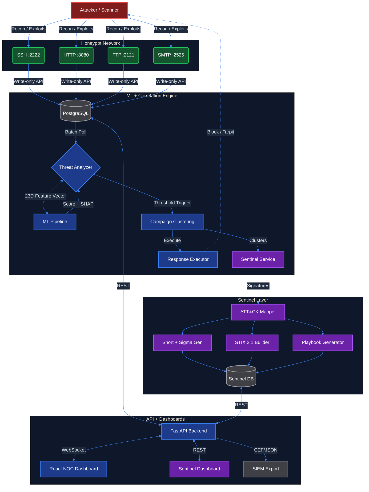

<div align="center">

# 🛡️ PhantomNet
**AI-Powered Honeypot Network with MITRE ATT&CK Mapping, Automated IDS Rule Generation & Incident Response**

*A full-stack cybersecurity platform that deploys deceptive network services, detects attacker behaviour using ML, and automatically generates threat intelligence mapped to the MITRE ATT&CK framework.*

<p align="center">
  
  
  
  
  
</p>

<p align="center">
  
  
  
  
  
  
</p>

<p align="center">
  <a href="#-what-is-phantomnet">What is it?</a> &bull;
  <a href="#-key-features">Features</a> &bull;
  <a href="#-system-architecture">Architecture</a> &bull;
  <a href="#-sentinel-layer--mitre-attck">Sentinel Layer</a> &bull;
  <a href="#-tech-stack">Tech Stack</a> &bull;
  <a href="#-getting-started">Setup</a> &bull;
  <a href="#-usage">Usage</a> &bull;
  <a href="#-project-structure">Structure</a> &bull;
  <a href="#-roadmap">Roadmap</a> &bull;
  <a href="#-team">Team</a>
</p>

</div>

---

## 📌 What is PhantomNet?

Most intrusion detection systems are reactive — they log attacks after the damage is done. Honeypots flip this by *intentionally* deploying fake vulnerable services to attract attackers, study their behaviour, and respond automatically.

**PhantomNet** takes this further. It's a **full-stack active defense platform** built from scratch that:

1. **Deploys containerized honeypots** emulating SSH, HTTP, FTP, and SMTP services that look real to attackers
2. **Captures every interaction** — commands typed, files uploaded, URLs requested, payloads dropped
3. **Scores threats in real-time** using an ML ensemble (Isolation Forest + Random Forest + LSTM) with explainable AI (SHAP)
4. **Clusters attack campaigns** using DBSCAN to group related events from multiple IPs into coordinated attacks
5. **Maps attacks to MITRE ATT&CK** — our Sentinel Layer automatically identifies which ATT&CK techniques an attacker is using
6. **Auto-generates Snort & Sigma IDS rules** and incident response playbooks for every detected campaign
7. **Produces STIX 2.1 threat intelligence** bundles ready for sharing via TAXII feeds
8. **Provides a React dashboard** for SOC analysts to monitor, review, approve/reject playbooks, and export intelligence

### What Makes This Different?

| Traditional Honeypot | PhantomNet |
| :--- | :--- |
| Logs connections passively | Actively scores, clusters, and responds |
| No threat context | Maps every detection to MITRE ATT&CK |
| Manual rule writing | Auto-generates Snort & Sigma rules |
| No intelligence output | Produces STIX 2.1 bundles |
| Basic web UI | Full React dashboard with approval workflows |
| Single protocol | Multi-protocol mesh (SSH, HTTP, FTP, SMTP) |

### Design Principles
- **Zero false positives by design** — legitimate traffic never touches the honeypot mesh, so every interaction is suspicious
- **Isolation-first** — traps run in read-only containers with dropped capabilities; if compromised, the backend stays safe
- **Data-driven** — raw packets are vectorized into 23-dimensional feature vectors for ML inference
- **Intelligence-first** — every detection is enriched with ATT&CK context and confidence scoring before any action

---

## 🚀 Key Features

### 🕸️ Honeypot Network (Deception Mesh)
- **SSH Honeypot** (`:2222`) — Paramiko-based interactive shell that logs commands, captures auth attempts, records bash history
- **HTTP Honeypot** (`:8080`) — Flask server that traps path traversal, SQL injection, XSS, and scanner behaviour
- **FTP Honeypot** (`:2121`) — pyftpdlib service that captures uploaded malware and monitors data transfers
- **SMTP Honeypot** (`:2525`) — aiosmtpd sink that collects phishing emails and oversized C2 payloads

### 🧠 ML Threat Detection Engine
- **Real-time scoring** — sub-15ms inference using serialized Isolation Forest + Random Forest ensemble
- **LSTM forecasting** — predicts volumetric attacks (DDoS) by analyzing temporal connection patterns
- **Campaign clustering** — DBSCAN groups disparate alerts from multiple IPs into coordinated attack campaigns
- **Explainable AI** — SHAP values show analysts *why* a packet scored high (e.g., "payload entropy contributed 45%")

### 🛡️ Sentinel Layer (Month 4 — MITRE ATT&CK Pipeline)
- **12 ATT&CK technique mappings** across 8 tactics (Reconnaissance → Impact)
- **Snort rule auto-generation** with proper classtypes, priorities, MITRE references, and thread-safe SID tracking
- **Sigma rule auto-generation** with ATT&CK technique + tactic tags, proper detection blocks
- **Incident response playbooks** rendered from Jinja2 templates with IOC enrichment, containment steps, escalation procedures
- **STIX 2.1 bundles** with AttackPatterns, Indicators, Relationships, TLP markings
- **Confidence scoring** — 4-signal weighted algorithm (cluster size 35%, ML score 35%, IOC density 20%, multi-protocol bonus 10%)
- **Sentinel Dashboard** — playbook list, approve/reject workflow, multi-format export, pagination, filtering

### 📊 Dashboard & Operations
- **Live NOC** — React 19 + Vite with WebSocket streaming, auto-scrolling event feed, SHAP tooltips
- **Threat Analytics** — DBSCAN cluster visualization, LSTM forecast charts
- **Sentinel Console** — playbook review, approve/reject with analyst attribution, export as Markdown/JSON/STIX
- **Role-based access** — JWT auth with Admin, Analyst, and Viewer roles

---

## 🏗️ System Architecture

The system is split into four isolated layers: the deception mesh (honeypots), the intelligence engine (ML + correlation), the Sentinel pipeline (ATT&CK mapping + rule generation), and the operations layer (API + dashboards).


```mermaid
%%{init: {'theme': 'base', 'themeVariables': { 'primaryColor': '#0f172a', 'primaryTextColor': '#e2e8f0', 'primaryBorderColor': '#334155', 'lineColor': '#3b82f6', 'secondaryColor': '#1e293b', 'tertiaryColor': '#0f172a'}}}%%
graph TD
    classDef external fill:#7f1d1d,stroke:#ef4444,stroke-width:2px,color:#fff;
    classDef honeypot fill:#14532d,stroke:#22c55e,stroke-width:2px,color:#fff;
    classDef core fill:#1e3a8a,stroke:#3b82f6,stroke-width:2px,color:#fff;
    classDef data fill:#3f3f46,stroke:#a1a1aa,stroke-width:2px,color:#fff;
    classDef sentinel fill:#6b21a8,stroke:#a855f7,stroke-width:2px,color:#fff;

    Attacker[Attacker / Scanner]:::external -->|Recon / Exploits| SSH
    Attacker -->|Recon / Exploits| HTTP
    Attacker -->|Recon / Exploits| FTP
    Attacker -->|Recon / Exploits| SMTP

    subgraph DeceptionMesh ["Honeypot Network"]
        SSH(SSH :2222):::honeypot
        HTTP(HTTP :8080):::honeypot
        FTP(FTP :2121):::honeypot
        SMTP(SMTP :2525):::honeypot
    end

    SSH -->|Write-only API| DB[(PostgreSQL)]:::data
    HTTP -->|Write-only API| DB
    FTP -->|Write-only API| DB
    SMTP -->|Write-only API| DB

    subgraph IntelligenceEngine ["ML + Correlation Engine"]
        DB -->|Batch Poll| Analyzer{Threat Analyzer}:::core
        Analyzer <-->|23D Feature Vector| ML[ML Pipeline]:::core
        ML -->|Score + SHAP| Analyzer
        Analyzer -->|Threshold Trigger| Correlation[Campaign Clustering]:::core
        Correlation -->|Clusters| SentinelSvc[Sentinel Service]:::sentinel
        Correlation -->|Execute| Playbook[Response Executor]:::core
    end

    subgraph SentinelPipeline ["Sentinel Layer"]
        SentinelSvc -->|Signatures| MITRE[ATT&CK Mapper]:::sentinel
        MITRE --> RuleGen[Snort + Sigma Gen]:::sentinel
        MITRE --> STIXGen[STIX 2.1 Builder]:::sentinel
        MITRE --> PBGen[Playbook Generator]:::sentinel
        RuleGen --> SentinelDB[(Sentinel DB)]:::data
        STIXGen --> SentinelDB
        PBGen --> SentinelDB
    end

    Playbook -.->|Block / Tarpit| Attacker

    subgraph Operations ["API + Dashboards"]
        API[FastAPI Backend]:::core
        DB <-->|REST| API
        SentinelDB <-->|REST| API
        API <-->|WebSocket| Dashboard[React NOC Dashboard]:::core
        API <-->|REST| SentinelUI[Sentinel Dashboard]:::sentinel
        API -->|CEF/JSON| SIEM[SIEM Export]:::data
    end
```

### How a Detection Flows Through the System

```
1. Attacker connects to SSH honeypot on port 2222
2. Honeypot logs session (commands, auth attempts, payloads)
3. Data written to PostgreSQL via write-only proxy
4. ThreatAnalyzer polls new logs, extracts 23 features, runs ML inference
5. Score > 85 -> CorrelationEngine groups with related events -> Campaign cluster
6. Sentinel pipeline activates:
   a. SignatureEngine identifies attack type (e.g., SSH_AUTH_FAILURE)
   b. MitreMapper maps to T1110.001 (Brute Force: Password Guessing)
   c. RuleGenerator produces Snort + Sigma rules
   d. STIXBuilder creates STIX 2.1 bundle with indicators
   e. PlaybookGenerator renders incident response playbook
   f. ConfidenceScorer calculates severity (CRITICAL/HIGH/MEDIUM/LOW)
7. Everything persisted to sentinel_playbooks table
8. Analyst reviews on Sentinel Dashboard -> approve/reject/export
```

---

## 🛡️ Sentinel Layer & MITRE ATT&CK

The Sentinel Layer is PhantomNet's automated threat intelligence pipeline (built in Month 4). It takes raw honeypot detections and transforms them into structured, actionable intelligence mapped to the MITRE ATT&CK framework.

### ATT&CK Technique Mappings

We map 12 honeypot attack signatures to MITRE ATT&CK techniques across 8 tactics:

| Honeypot Signature | ATT&CK ID | Technique | Tactic | Severity |
| :--- | :---: | :--- | :--- | :---: |
| `SSH_AUTH_FAILURE` | T1110.001 | Brute Force: Password Guessing | Credential Access | HIGH |
| `SSH_HIGH_ACTIVITY` | T1021.004 | Remote Services: SSH | Lateral Movement | MEDIUM |
| `HTTP_SQL_INJECTION` | T1190 | Exploit Public-Facing Application | Initial Access | CRITICAL |
| `HTTP_XSS_ATTEMPT` | T1059.007 | Command and Scripting Interpreter: JavaScript | Execution | HIGH |
| `HTTP_PATH_TRAVERSAL` | T1083 | File and Directory Discovery | Discovery | HIGH |
| `HTTP_SCANNER_BEHAVIOR` | T1046 | Network Service Discovery | Discovery | MEDIUM |
| `FTP_DATA_EXFILTRATION` | T1048.003 | Exfiltration Over Unencrypted Non-C2 Protocol | Exfiltration | CRITICAL |
| `SMTP_LARGE_PAYLOAD` | T1071.003 | Application Layer Protocol: Mail Protocols | Command and Control | HIGH |
| `DISTRIBUTED_BRUTE_FORCE` | T1110.004 | Brute Force: Credential Stuffing | Credential Access | CRITICAL |
| `LOW_AND_SLOW_SCAN` | T1595.001 | Active Scanning: Scanning IP Blocks | Reconnaissance | MEDIUM |
| `MULTI_PROTOCOL_ATTACK` | T1046 | Network Service Discovery | Discovery | HIGH |
| `HIGH_FREQUENCY_ATTACK` | T1498 | Network Denial of Service | Impact | CRITICAL |

### Auto-Generated IDS Rules

Every detection automatically produces production-ready rules:

- **Snort rules** — with `flow:to_server,established`, rate-limiting thresholds, ATT&CK reference URLs, mapped classtypes, severity-based priorities, and auto-incrementing SIDs
- **Sigma rules** — valid YAML with logsource/detection/condition blocks, ATT&CK technique tags (`attack.t1110.001`), tactic tags (`attack.credential_access`), and severity levels

### Incident Response Playbooks

Jinja2-templated Markdown playbooks with full context:

| Attack Pattern | Template | What's Included |
| :--- | :--- | :--- |
| Brute Force / SSH | `brute_force.md.j2` | Lockout thresholds, tarpit config, MFA recommendations |
| SQL Injection | `sqli_attempt.md.j2` | WAF mode, DB engine, input validation audit steps |
| Port Scan / Recon | `port_scan.md.j2` | Scan type, deception mesh deployment guidance |
| Data Exfiltration | `data_exfiltration.md.j2` | DLP mode, data classification, breach notification |
| Any other pattern | `base_playbook.md.j2` | IOC list, ATT&CK context, containment steps |

### STIX 2.1 Output

Every detection produces a standards-compliant STIX 2.1 bundle containing:
- `Identity` — PhantomNet system anchor
- `AttackPattern` — enriched with ATT&CK ExternalReferences and KillChainPhases
- `Indicator` — one per IOC (IP, domain, URL, hash, email)
- `Relationship` — `indicates` links between Indicators and AttackPatterns
- `MarkingDefinition` — TLP markings (WHITE/GREEN/AMBER/RED)

### Confidence Scoring

Each playbook gets a composite confidence score (0.0-1.0) from four signals:

| Signal | Weight | What It Measures |
| :--- | :---: | :--- |
| Cluster Size | 35% | More events in the campaign = higher confidence |
| ML Average Score | 35% | Mean threat score from the ML pipeline |
| IOC Density | 20% | Unique attacker IPs relative to total events |
| Multi-Protocol Bonus | 10% | Bonus if the attack spans SSH + HTTP + FTP etc. |

**Severity mapping:** >=0.80 = CRITICAL, >=0.60 = HIGH, >=0.40 = MEDIUM, <0.40 = LOW

### Sentinel REST API (10 Endpoints)

| Endpoint | Method | What It Does |
| :--- | :---: | :--- |
| `/api/sentinel/playbooks` | GET | List playbooks (paginated, filterable) |
| `/api/sentinel/playbooks/{id}` | GET | Full playbook detail with rules |
| `/api/sentinel/stats` | GET | Pipeline stats (counts, avg score) |
| `/api/sentinel/mitre/mapping` | GET | All 12 ATT&CK mappings |
| `/api/sentinel/generate` | POST | Trigger playbook generation manually |
| `/api/sentinel/playbooks/{id}/approve` | PATCH | Approve a playbook |
| `/api/sentinel/playbooks/{id}/reject` | PATCH | Reject a playbook |
| `/api/sentinel/playbooks/{id}/export` | POST | Export as Markdown/JSON/STIX |
| `/api/sentinel/rules/snort` | GET | List generated Snort rules |
| `/api/sentinel/rules/sigma` | GET | List generated Sigma rules |

---

## 🔧 Tech Stack

| Layer | Technologies | Why We Chose It |
| :--- | :--- | :--- |
| **Backend** | Python 3.11, FastAPI, Uvicorn | Async-native, auto-generated OpenAPI docs, Pydantic validation |
| **ML Engine** | Scikit-Learn, TensorFlow, SHAP, MLflow | Fast model serialization, explainable predictions, experiment tracking |
| **Database** | PostgreSQL 15, SQLAlchemy 2.0, Alembic | ACID compliance, complex joins for threat correlation |
| **Frontend** | React 19.2, Vite, TailwindCSS 4, Recharts | Fast dev builds, WebSocket streaming, data visualization |
| **Networking** | Scapy, Paramiko, pyftpdlib, aiosmtpd | Low-level packet capture, high-fidelity protocol emulation |
| **Sentinel** | Jinja2, stix2, PyYAML | Template rendering, STIX 2.1 compliance, Sigma rule output |
| **DevOps** | Docker, Docker Compose, GitHub Actions | Containerized deployment, automated CI/CD |
| **Monitoring** | Prometheus, Grafana, Logstash | Metrics collection, dashboarding, SIEM log export |

---

## ⚡ Getting Started

### Prerequisites
- Python 3.11+
- Docker Engine 24.0+ & Docker Compose v2.0+
- Node.js 18+ (for frontend development)
- 4 vCPU, 8GB RAM, 50GB disk (minimum)

### Quick Start (Docker)

```bash
# Clone
git clone https://github.com/sriram21-09/PhantomNet.git
cd PhantomNet

# Configure
cp .env.example .env
nano .env  # Set POSTGRES_PASSWORD, JWT_SECRET, API_KEY

# Build & Run
docker-compose -f docker-compose.prod.yml build --no-cache
docker-compose -f docker-compose.prod.yml up -d

# Verify
curl -s http://localhost:8000/api/v1/system/health | jq
```

### Local Development

<details>
<summary><b>Backend</b></summary>

```bash
cd backend
python3 -m venv .venv
source .venv/bin/activate
pip install -r requirements.txt
alembic upgrade head
uvicorn main:app --host 0.0.0.0 --port 8000 --reload
```
</details>

<details>
<summary><b>Frontend</b></summary>

```bash
cd frontend-dev/phantomnet-dashboard
npm install
npm run dev
```
</details>

### Environment Variables

| Variable | Description | Note |
| :--- | :--- | :--- |
| `JWT_SECRET` | Auth signing key | 64-char hex string |
| `API_KEY` | Programmatic API access | Rotate every 90 days |
| `POSTGRES_PASSWORD` | Database password | No URI-breaking special chars |
| `ENABLE_ELK_EXPORT` | Toggle SIEM streaming | Set `true` if ELK is attached |
| `AUTO_RESPONSE` | Playbook kill-switch | Set `false` during tuning |

---

## 📖 Usage

### Dashboard
1. **Live NOC** — real-time event stream with color-coded threat levels and SHAP tooltips
2. **Analytics** — campaign cluster visualization and LSTM volume forecasts
3. **Sentinel** — review auto-generated playbooks, approve/reject, export intelligence

### API Examples

```bash
# Score external traffic through the ML pipeline
curl -X POST "http://localhost:8000/api/v1/threat/analyze" \
     -H "Authorization: Bearer pn_live_xxxxxx" \
     -H "Content-Type: application/json" \
     -d '{"src_ip": "185.150.12.4", "dst_port": 22, "protocol": "TCP",
          "payload_base64": "c3NoLXJzYSAuLi4=", "timestamp": "2026-05-13T10:00:00Z"}'

# Trigger Sentinel pipeline for a detected campaign
curl -X POST "http://localhost:8000/api/sentinel/generate" \
     -H "Content-Type: application/json" \
     -d '{"source_ips": ["192.168.1.100"], "target_ports": [2222],
          "protocols": ["TCP"], "event_count": 150}'
```

---

## 📁 Project Structure

```text
PhantomNet/
├── backend/                        # FastAPI Backend
│   ├── api/                        # REST + WebSocket controllers
│   │   └── sentinel.py             # Sentinel API (10 endpoints)
│   ├── database/                   # SQLAlchemy models & migrations
│   ├── ml_engine/                  # ML inference, SHAP, DBSCAN clustering
│   ├── sentinel/                   # <-- Sentinel Intelligence Layer
│   │   ├── mitre_mapper.py         #   12 ATT&CK technique mappings
│   │   ├── rule_generator.py       #   Snort & Sigma rule generation
│   │   ├── playbook_generator.py   #   Jinja2 playbook rendering
│   │   ├── stix_enhanced.py        #   STIX 2.1 bundle builder
│   │   ├── sentinel_service.py     #   Orchestration (full pipeline)
│   │   ├── confidence_scoring.py   #   4-signal confidence scoring
│   │   ├── models.py               #   SentinelPlaybook ORM (23 columns)
│   │   └── templates/              #   Jinja2 templates (.md.j2, .yaml.j2)
│   ├── services/                   # ThreatAnalyzer, CorrelationEngine
│   ├── tests/                      # Pytest suites (94% coverage)
│   └── main.py                     # ASGI entrypoint
├── frontend-dev/phantomnet-dashboard/
│   └── src/
│       ├── pages/SentinelDashboard.jsx
│       └── components/sentinel/    # ApprovalControls, PlaybookViewer
├── honeypots/                      # Protocol emulation services
│   ├── ssh/   ├── http/   ├── ftp/   └── smtp/
├── ml_models/                      # Serialized .pkl models (Git LFS)
├── playbooks/                      # YAML response playbooks
├── docker-compose.prod.yml
└── requirements.txt
```

---

## 🔒 Security Model

- **Container isolation** — honeypots run with `--cap-drop=ALL`, `--security-opt=no-new-privileges`, read-only root filesystems
- **Write-only data diode** — traps push logs via restricted API proxy; zero database credentials on the trap side
- **Input validation** — Pydantic v2 schemas reject malformed payloads at the API edge
- **Secret management** — no hardcoded secrets; everything injected via Docker environment variables
- **RBAC** — JWT-based roles: Admin (full access), Analyst (view + review), Viewer (read-only)

---

## 🗺️ Roadmap

| Phase | Period | What We Built | Status |
| :---: | :--- | :--- | :---: |
| **Month 1** | Weeks 1-4 | Honeypot network, PostgreSQL schemas, FastAPI backend, React dashboard | Done |
| **Month 2** | Weeks 5-8 | ML pipeline (IF + RF + LSTM), WebSocket streaming, YAML playbooks, SHAP | Done |
| **Month 3** | Weeks 9-12 | Campaign clustering (DBSCAN), correlation engine, SIEM export | Done |
| **Month 4** | Weeks 13-16 | **Sentinel Layer** — ATT&CK mapping, Snort/Sigma rules, STIX 2.1, playbook generator, Sentinel dashboard, confidence scoring | Done |
| **Next** | — | Kubernetes scaling, ClickHouse migration, RL-based topology mutation | Planned |

---

## 📚 Documentation

- [System Architecture & API Specs](docs/system_architecture.md)
- [ML Pipeline & Model Tuning Guide](docs/ml_pipeline.md)
- [Response Playbooks Syntax Guide](docs/playbooks.md)
- [Vulnerability Disclosure Policy](SECURITY.md)

---

## 👥 Team

Built by a team of four as a cybersecurity engineering project:

| Name | Focus Area | GitHub |
| :--- | :--- | :--- |
| **Kasukurthi Sriram** | Architecture, Security Design & Sentinel Pipeline | [@sriram21-09](https://github.com/sriram21-09) |
| **Muramreddy Vivekananda Reddy** | Container Orchestration & Protocol Emulation | [@VivekanandaReddy2006](https://github.com/VivekanandaReddy2006) |
| **Nattala Vikranth Chakravarthi** | ML Pipelines, Model Inference & Explainable AI | [@Vikranth-tech](https://github.com/Vikranth-tech) |
| **Satti Sai Ram Manideep Reddy** | UI/UX, WebSocket Streaming & Frontend | [@sairammanideepreddy2123](https://github.com/sairammanideepreddy2123) |

---

<div align="center">
  
  <p>Copyright 2026 PhantomNet Team</p>
  <i>"Turn your network into a weapon against the adversary."</i>
</div>
