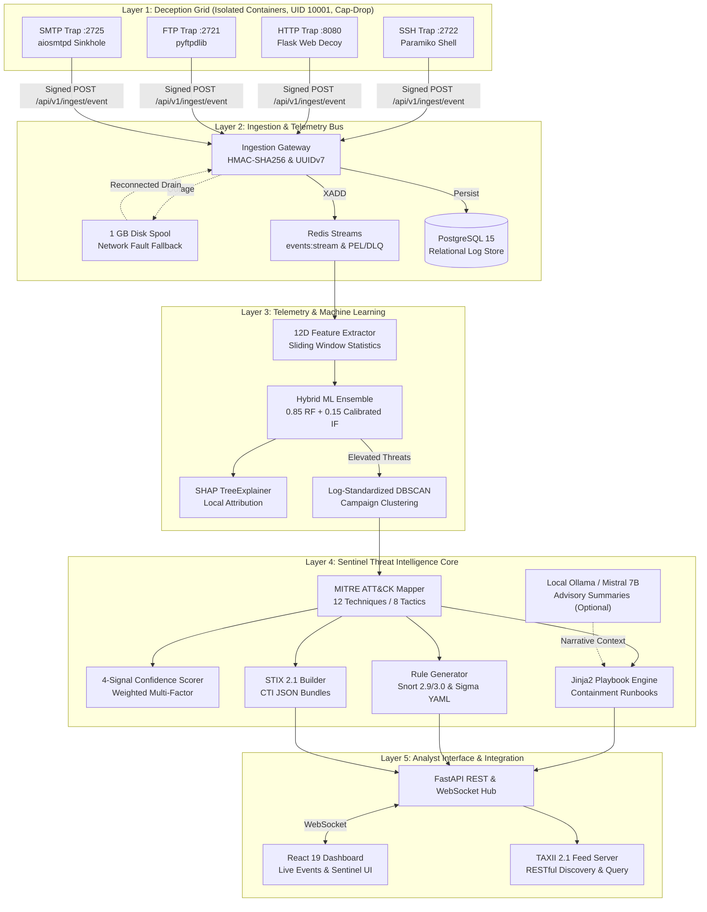
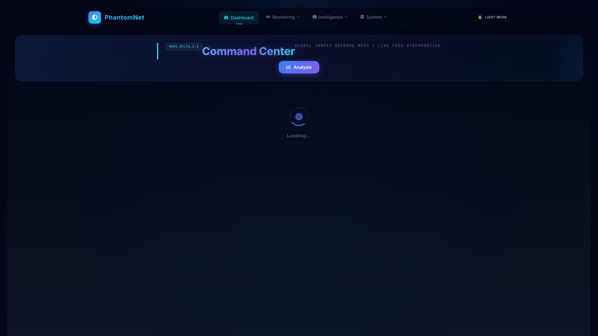
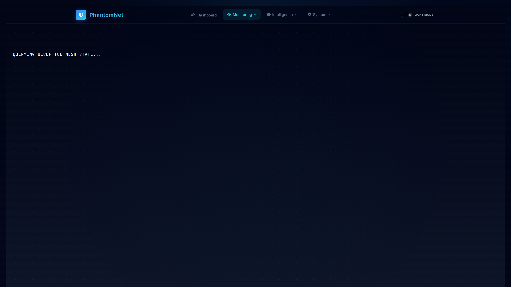
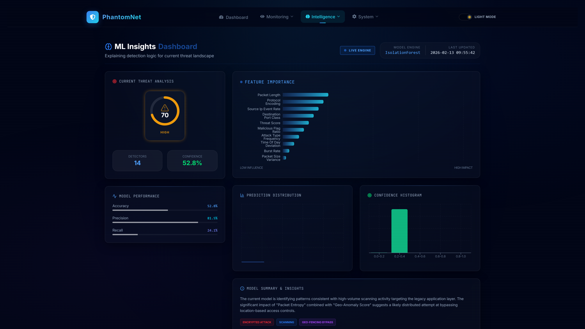
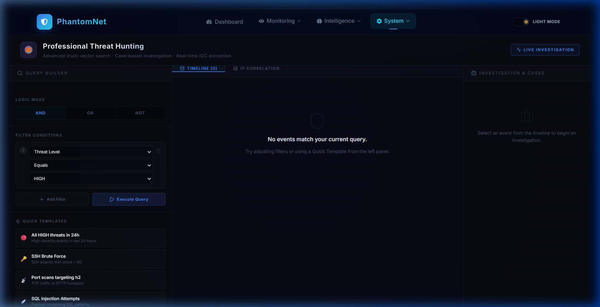

# PhantomNet: An AI-Driven Distributed Honeypot Deception Framework

<p align="center">
  <a href="https://github.com/sriram21-09/PhantomNet"></a>
  
  
  
  
  
  
  
</p>

> **PhantomNet is a student-developed cybersecurity engineering project that explores distributed honeypot deception, security-event ingestion, machine-learning-based threat detection, campaign correlation, explainability, and automated threat-intelligence generation.**  
> *Built to study how deception telemetry can improve security detection and investigation.*

---

## Table of Contents

- [1. Project Summary](#1-project-summary)
- [2. Why PhantomNet?](#2-why-phantomnet)
- [3. What It Does](#3-what-it-does)
- [4. System Architecture](#4-system-architecture)
- [5. Core Components](#5-core-components)
  - [Honeypot Deception Grid](#honeypot-deception-grid)
  - [Event Ingestion & Buffering Pipeline](#event-ingestion--buffering-pipeline)
  - [Machine Learning Detection Pipeline](#machine-learning-detection-pipeline)
  - [Campaign Correlation](#campaign-correlation)
  - [Sentinel Threat Intelligence Core](#sentinel-threat-intelligence-core)
  - [Analyst Dashboard](#analyst-dashboard)
- [6. Experimental Evaluation](#6-experimental-evaluation)
- [7. Security Design](#7-security-design)
- [8. Technology Stack](#8-technology-stack)
- [9. Quick Start Guide](#9-quick-start-guide)
- [10. Testing & Verification](#10-testing--verification)
- [11. Known Limitations](#11-known-limitations)
- [12. Documentation Index](#12-documentation-index)
- [13. Project Roadmap](#13-project-roadmap)
- [14. Engineering Team](#14-engineering-team)
- [15. License](#15-license)

---

## 1. Project Summary

PhantomNet was developed as a university cybersecurity capstone and research engineering project. It studies how deploying containerized, medium-interaction honeypots across multiple network protocols can capture high-fidelity adversary interaction telemetry, stream that data into an audited machine learning pipeline, group distributed probes into coordinated attack campaigns, and generate actionable defensive countermeasures.

| Aspect | Implementation Details |
| :--- | :--- |
| **Project Type** | Student Cybersecurity Research & Engineering Project |
| **Primary Goal** | Capture, score, correlate, and convert honeypot telemetry into defensive artifacts |
| **Deception Traps** | SSH (:2722), HTTP (:8080), FTP (:2721), SMTP (:2725) |
| **Backend Framework**| FastAPI (Python 3.11), SQLAlchemy, Alembic |
| **Data Layer** | PostgreSQL 15 (relational storage), Redis 7 (Streams buffer, PEL/DLQ), local disk spool |
| **ML Engine** | Supervised Random Forest + Unsupervised Isolation Forest, Log-Standardized DBSCAN, SHAP |
| **Threat Mapping** | Deterministic MITRE ATT&CK mapping (12 techniques across 8 enterprise tactics) |
| **Defensive Artifacts**| Synthesized Snort 2.9/3.0 rules, Sigma YAML rules, STIX 2.1 bundles, TAXII 2.1 feed server |
| **Analyst UI** | React 19, Vite, Tailwind CSS, Recharts, WebSocket live feeds |
| **Deployment** | Docker Compose with non-root user execution and Linux capability dropping |

---

## 2. Why PhantomNet?

Defensive network engineering faces persistent operational challenges when monitoring perimeter probing and multi-vector scanning:

1. **Passive Decoy Silos**: Traditional honeypots effectively observe untrusted traffic because authorized users rarely contact decoy listeners. However, standard deployments often operate as passive log sinks—collecting connection strings into flat files without automated feature extraction, real-time ML scoring, or multi-source correlation.
2. **Investigation Overhead**: Security analysts spend substantial manual effort inspecting raw PCAPs, identifying adversary Tactics, Techniques, and Procedures (TTPs), mapping activity to security frameworks, and authoring defensive detection signatures. This creates a time lag between observing an intrusion attempt and deploying countermeasures.
3. **Distributed Scanning**: Modern scanning tools distribute probes across numerous source IP addresses to evade basic threshold-based rate limiting. Without spatial clustering, these distributed probes appear as disconnected, low-severity events.
4. **Telemetry Privacy**: Forwarding internal network event logs and packet captures to commercial cloud AI APIs creates data privacy risks, exposing internal IP schemes and network metadata to external third-party services.

PhantomNet investigates an integrated, self-hosted approach: deploying isolated decoys, sanitizing and buffering telemetry, applying a calibrated ML model to score threat severity, clustering distributed activities using spatial density algorithms, and deterministically generating detection rules and threat intelligence bundles.

---

## 3. What It Does

PhantomNet executes an end-to-end telemetry and analysis pipeline:

1. **Decoy Engagement**: An external scanner or probe interacts with an exposed decoy service (SSH, HTTP, FTP, or SMTP).
2. **Ingestion & Sanitization**: The honeypot redacts cleartext credentials, signs the event with HMAC-SHA256, and posts it to the ingestion gateway.
3. **Queue Buffering**: The gateway validates the signature, assigns an RFC 9562 UUIDv7 identifier, commits the record to PostgreSQL, and pushes it to Redis Streams (`events:stream`).
4. **Feature Extraction**: Consumer workers extract a 12-dimensional continuous feature vector from sliding-window flow statistics.
5. **Ensemble Scoring**: A calibrated hybrid ensemble (0.85 Random Forest + 0.15 Isolation Forest) calculates threat severity and suppresses false alarms. For elevated alerts, SHAP computes local feature attribution weights.
6. **Campaign Correlation**: Elevated threat events are clustered using log-standardized DBSCAN ($\epsilon=0.80, \text{min\_samples}=4$) to group multi-IP probes into discrete campaigns.
7. **Defensive Artifact Synthesis**: The Sentinel core deterministically maps observed attack patterns to MITRE ATT&CK techniques, computes a 4-signal confidence score, compiles Snort 2.9/3.0 rules and Sigma YAML rules, renders Jinja2 containment runbooks, and exports STIX 2.1 bundles.
8. **Analyst Review & Distribution**: Correlated findings stream in real time to the React 19 dashboard via WebSockets, and intelligence is made available through the TAXII 2.1 server.

---

## 4. System Architecture

PhantomNet decouples deception listeners, data ingestion, analytics, intelligence synthesis, and the user interface into five modular layers:


```mermaid
flowchart TD
    subgraph Layer1["Layer 1: Deception Grid (Isolated Containers, UID 10001, Cap-Drop)"]
        SSH["SSH Trap :2722<br/>Paramiko Shell"]
        HTTP["HTTP Trap :8080<br/>Flask Web Decoy"]
        FTP["FTP Trap :2721<br/>pyftpdlib"]
        SMTP["SMTP Trap :2725<br/>aiosmtpd Sinkhole"]
    end

    subgraph Layer2["Layer 2: Ingestion & Telemetry Bus"]
        Gateway["Ingestion Gateway<br/>HMAC-SHA256 & UUIDv7"]
        Spool["1 GB Disk Spool<br/>Network Fault Fallback"]
        RedisStream["Redis Streams<br/>events:stream & PEL/DLQ"]
        Postgres[("PostgreSQL 15<br/>Relational Log Store")]
    end

    subgraph Layer3["Layer 3: Telemetry & Machine Learning"]
        Extractor["12D Feature Extractor<br/>Sliding Window Statistics"]
        Ensemble["Hybrid ML Ensemble<br/>0.85 RF + 0.15 Calibrated IF"]
        SHAP["SHAP TreeExplainer<br/>Local Attribution"]
        DBSCAN["Log-Standardized DBSCAN<br/>Campaign Clustering"]
    end

    subgraph Layer4["Layer 4: Sentinel Threat Intelligence Core"]
        Mitre["MITRE ATT&CK Mapper<br/>12 Techniques / 8 Tactics"]
        Scorer["4-Signal Confidence Scorer<br/>Weighted Multi-Factor"]
        Rules["Rule Generator<br/>Snort 2.9/3.0 & Sigma YAML"]
        STIX["STIX 2.1 Builder<br/>CTI JSON Bundles"]
        Playbook["Jinja2 Playbook Engine<br/>Containment Runbooks"]
        LLM["Local Ollama / Mistral 7B<br/>Advisory Summaries (Optional)"]
    end

    subgraph Layer5["Layer 5: Analyst Interface & Integration"]
        API["FastAPI REST & WebSocket Hub"]
        Dashboard["React 19 Dashboard<br/>Live Events & Sentinel UI"]
        TAXII["TAXII 2.1 Feed Server<br/>RESTful Discovery & Query"]
    end

    SSH & HTTP & FTP & SMTP -->|Signed POST /api/v1/ingest/event| Gateway
    Gateway -.->|Outage| Spool
    Spool -.->|Reconnected Drain| Gateway
    Gateway -->|XADD| RedisStream
    Gateway -->|Persist| Postgres
    RedisStream --> Extractor
    Extractor --> Ensemble
    Ensemble --> SHAP
    Ensemble -->|Elevated Threats| DBSCAN
    DBSCAN --> Mitre
    Mitre --> Scorer
    Mitre --> Rules
    Mitre --> STIX
    Mitre --> Playbook
    LLM -.->|Narrative Context| Playbook
    Playbook & Rules & STIX --> API
    API <-->|WebSocket| Dashboard
    API --> TAXII
```

---

## 5. Core Components

### Honeypot Deception Grid

All decoy listeners are implemented in modular Python scripts and containerized with defense-in-depth isolation controls:

- **SSH Trap (`Host :2722` / `Container :2222`)**: Emulated terminal using [Paramiko](https://www.paramiko.org/). Captures usernames, passwords, keystroke timing, executed bash commands, download URLs, and honeyfile interactions.
- **HTTP Trap (`:8080`)**: Web decoy using [Flask](https://flask.palletsprojects.com/). Emulates vulnerable endpoints and administrative panels, capturing SQL injection strings, path traversals, XSS attempts, user-agents, and scanner signatures.
- **FTP Trap (`Host :2721` / `Container :2121`)**: Deceptive FTP daemon using [pyftpdlib](https://github.com/giampaolo/pyftpdlib). Emulates anonymous and credentialed authentication, capturing command sequences, passive data connections (`:30000-30020`), and uploaded payloads.
- **SMTP Trap (`Host :2725` / `Container :2525`)**: Asynchronous mail sinkhole using [aiosmtpd](https://aiosmtpd.readthedocs.io/). Captures client hostnames, envelope addresses, email headers, body content, and multipart payload sizes.

**Container Security Controls**:
- Decoy containers execute under a dedicated non-root service account (`UID 10001:10001`).
- Docker Compose drops all Linux capabilities (`cap_drop: ALL`).
- Container root filesystems are mounted read-only (`read_only: true`), with ephemeral scratch space restricted to memory-backed `tmpfs` mounts.
- Deception listeners reside on an isolated internal bridge (`honeypot_net`, `internal: true`) that lacks network routes to PostgreSQL or Redis.

### Event Ingestion & Buffering Pipeline

- **HMAC Origin Authentication**: Envelopes sent to `/api/v1/ingest/event` require an `X-Honeypot-Signature` (HMAC-SHA256 of the request body) and an `X-Honeypot-Timestamp` header. Requests outside a 300-second window are rejected to prevent replay attacks.
- **Idempotent Ingestion**: Ingested events carry an RFC 9562 UUIDv7. PostgreSQL enforces a `UNIQUE(event_id)` constraint, preventing duplicate event creation during network retries.
- **Redis Streams & Consumer Groups**: Events are queued in Redis Streams (`events:stream`). Consumer workers track unacknowledged deliveries in the Pending Entries List (PEL). Stalled messages are reclaimed via `XCLAIM`, and messages exceeding three delivery attempts route to `events:dlq`.
- **Local Disk Spooling**: During network partitions or gateway unavailability, honeypot daemons buffer events to a bounded 1 GB local disk spool (`/tmp/spool`) and automatically drain the backlog upon reconnection.

### Machine Learning Detection Pipeline

#### Feature Engineering & Reconciliation
Earlier repository documentation claimed a 23-dimensional feature space, which represented unbuilt documentation debt rather than executable code. Early prototype scripts used 15 socket features that suffered from circular target leakage (`threat_score`, $R^2=0.998$) and direct label proxies (`is_malicious`).

During forensic remediation, these were replaced with an audited `FeatureExtractor` (`backend/ml/feature_extractor.py`) enforcing a **12-dimensional continuous flow schema** ([FEATURE_SPEC.md](FEATURE_SPEC.md)):

| Index | Feature Name | Data Type | Physical Unit | Permitted Range | Ingestion Source |
| :---: | :--- | :---: | :---: | :---: | :--- |
| **0** | `packet_size` | `float64` | Bytes | $[0, 65535]$ | Packet length header |
| **1** | `flow_duration` | `float64` | Seconds | $[0.0, 86400.0]$ | Flow duration tracker |
| **2** | `packet_rate` | `float64` | Packets/sec | $[0.0, 10^7]$ | Sliding window rate |
| **3** | `byte_rate` | `float64` | Bytes/sec | $[0.0, 10^9]$ | Sliding window rate |
| **4** | `syn_ratio` | `float64` | Ratio | $[0.0, 1.0]$ | TCP control flags ratio |
| **5** | `ack_ratio` | `float64` | Ratio | $[0.0, 1.0]$ | TCP control flags ratio |
| **6** | `payload_entropy` | `float64` | Bits/byte | $[0.0, 8.0]$ | Shannon entropy of payload |
| **7** | `failed_logins` | `float64` | Integer count | $[0, 10^5]$ | Windowed auth failure counter |
| **8** | `port_diversity` | `float64` | Integer count | $[1, 65535]$ | Unique destination ports visited |
| **9** | `inter_arrival_mean` | `float64` | Seconds | $[0.0, 3600.0]$ | Mean inter-arrival time $\Delta t$ |
| **10** | `window_size_mean` | `float64` | Bytes | $[0, 65535]$ | Mean TCP advertised window |
| **11** | `ttl_mean` | `float64` | Hop count | $[0, 255]$ | Mean IPv4 TTL / IPv6 Hop Limit |

All 12 features are computed solely from transport headers and windowed stream statistics. No post-detection attributes or labels enter the feature matrix.

#### Threat Detection Models
- **Supervised Random Forest**: 100 decision trees (`RandomForestClassifier`, max depth 12) trained on labeled flow records, producing class probability $P_{\text{RF}} \in [0.0, 1.0]$.
- **Unsupervised Isolation Forest**: Evaluates statistical deviation from baseline traffic patterns (`IsolationForest`, 100 estimators, contamination 0.05), producing a calibrated anomaly score $S_{\text{IF}} \in [0.0, 1.0]$.
- **Hybrid Ensemble Formula**: Combines both models to balance supervised pattern recognition with anomaly suppression:
  $$S_{\text{composite}} = 0.85 \times P_{\text{RF}} + 0.15 \times S_{\text{IF}}$$
- **Explainability (SHAP)**: For elevated alerts, `TreeExplainer` calculates local additive feature attributions ($\sum_{i=1}^{12} \phi_i + \phi_0 = f(x)$) with verified mathematical local additivity ($|\sum \phi_i + \phi_0 - f(x)| < 1.42 \times 10^{-6}$), allowing analysts to inspect the specific flow dimensions driving the alert.

### Campaign Correlation

Standard Euclidean DBSCAN originally collapsed to 100% noise because destination ports ($0–65535$) and packet lengths ($0–65535$) overwhelmed small-scale features like event rates ($0–10$).

The remediated clustering pipeline (`backend/ml_engine/campaign_clustering.py`) applies:
- Logarithmic scaling: $\log(1 + \text{length})$ and $\log(1 + \text{dst\_port})$.
- Behavioral inputs: `burst_rate_10s`, `packet_size_variance`, `inter_arrival_std`, and `payload_entropy`.
- Standardized Euclidean scaling: `StandardScaler()` with hyper-parameters calibrated to $\epsilon = 0.80$ and $\text{min\_samples} = 4$.

In benchmark evaluation, this configuration isolated the 3 evaluated attack vectors (SSH brute force, web SQLi, and FTP scans) with 95.04% homogeneity, zero cross-campaign false merges, and a 17.0% natural outlier/noise rate.

### Sentinel Threat Intelligence Core

- **Deterministic MITRE ATT&CK Mapping**: Maps 12 attack signatures to enterprise ATT&CK techniques across 8 tactics:
  - `SSH_AUTH_FAILURE` $\to$ **T1110.001** (Password Guessing)
  - `SSH_HIGH_ACTIVITY` $\to$ **T1021.004** (Remote Services: SSH)
  - `HTTP_SQL_INJECTION` $\to$ **T1190** (Exploit Public-Facing Application)
  - `HTTP_XSS_ATTEMPT` $\to$ **T1059.007** (JavaScript Interpreter)
  - `HTTP_PATH_TRAVERSAL` $\to$ **T1083** (File & Directory Discovery)
  - `HTTP_SCANNER_BEHAVIOR` $\to$ **T1046** (Network Service Discovery)
  - `FTP_DATA_EXFILTRATION` $\to$ **T1048.003** (Exfiltration Over Non-C2 Protocol)
  - `SMTP_LARGE_PAYLOAD` $\to$ **T1071.003** (Mail Protocols)
  - `DISTRIBUTED_BRUTE_FORCE` $\to$ **T1110.004** (Credential Stuffing)
  - `LOW_AND_SLOW_SCAN` $\to$ **T1595.001** (Active Scanning: IP Blocks)
  - `MULTI_PROTOCOL_ATTACK` $\to$ **T1046** (Network Service Discovery)
  - `HIGH_FREQUENCY_ATTACK` $\to$ **T1498** (Network Denial of Service)
- **4-Signal Confidence Scoring**:
  $$\text{Confidence} = 0.35 \times S_{\text{cluster}} + 0.35 \times S_{\text{ML}} + 0.20 \times S_{\text{IOC}} + 0.10 \times S_{\text{protocol}}$$
  Severity tiers: `CRITICAL` ($\ge 0.80$), `HIGH` ($\ge 0.60$), `MEDIUM` ($\ge 0.40$), `LOW` ($< 0.40$).
- **Defensive Rule Synthesis**: Generates syntax-valid Snort 2.9/3.0 rules with flow tracking and Sigma YAML detection signatures.
- **Threat Sharing**: Builds OASIS STIX 2.1 JSON bundles with TLP markings and serves collections through a native TAXII 2.1 REST server (`/taxii2/`).
- **Optional Local LLM**: Integrates containerized Ollama running Mistral 7B for advisory text summaries. Operates purely locally with no cloud data transmission; deterministic Jinja2 templates provide complete offline fallback.

### Analyst Dashboard

The analyst interface is built as a single-page React 19 application (`frontend-dev/phantomnet-dashboard/`):

| Operations Overview & Telemetry | Honeypot Node Status Monitor |
| :---: | :---: |
|  |  |
| *Real-time event stream, threat breakdown, and system counters* | *Listener statuses across SSH, HTTP, FTP, and SMTP containers* |

| ML Threat Analytics & Feature Space | Threat Hunting Workbench |
| :---: | :---: |
|  |  |
| *12D feature distributions, anomaly curves, and SHAP weights* | *Query builder, IOC watchlist, case management, and history* |

- **Real-Time Telemetry**: WebSocket client receiving event records with automatic reconnection.
- **Sentinel Playbook Review**: Queue supporting single and batch approval/rejection workflows with reviewer attribution.
- **Interactive ATT&CK Heatmap**: Visual matrix tracking technique coverage across 8 enterprise tactics.
- **Threat Hunting**: Structured parameter search, case evidence association (`InvestigationCase`), and IOC watchlists.
- **Multi-Format Export**: Generates PDF runbooks, raw JSON, Snort rule text, and STIX 2.1 bundles directly from the UI.

---

## 6. Experimental Evaluation

> **Evaluation Context**: The measurements below describe the evaluated benchmark configuration on the project's curated dataset and should not be interpreted as a guarantee of performance on unseen real-world networks.

### Dataset & Methodology
- **Benchmark Dataset**: `data/remediated_dataset_v3.csv` (SHA-256: `390f653966410e70a386ffbfaf6ab381ff9e647a2c4da179a2ad37d46d7bb363`).
- **Sample Distribution**: 5,000 total socket events (3,500 Benign / 1,500 Attack flows).
- **Validation Protocol**: 30 independent stratified Monte Carlo splits (80% train / 20% test, $N_{\text{test}}=1,000$). Verified zero target or label leakage; maximum single-feature predictive accuracy is bounded at $\le 73.6\%$.

### Classification Results (N=30 Independent Splits)

| Model Architecture | Accuracy | Precision | Recall | F1-Score | ROC-AUC | False Positive Rate (FPR) |
| :--- | :---: | :---: | :---: | :---: | :---: | :---: |
| **Standalone Random Forest** | 93.27% ± 0.61% | 97.11% ± 1.08% | **79.96% ± 2.20%** | **0.8768 ± 0.0126** | **0.9827 ± 0.0024** | 1.03% ± 0.40% |
| **Standalone Isolation Forest** | 73.32% ± 1.09% | 66.99% ± 6.07% | 22.04% ± 2.73% | 0.3308 ± 0.0343 | 0.6465 ± 0.0204 | 4.70% ± 1.14% |
| **Calibrated Hybrid Ensemble**<br>*(0.85 RF + 0.15 Calibrated IF)* | **92.73% ± 0.62%** | **97.82% ± 0.95%** | 77.50% ± 2.30% | 0.8646 ± 0.0132 | 0.9808 ± 0.0029 | **0.75% ± 0.34%** |
| **Statistical Delta vs RF** | *-0.54%* | **+0.71% ($p < 10^{-8}$)** | *-2.46% ($p < 10^{-6}$)* | *-0.0122* | *-0.0019* | **-0.28% ($p = 1.73 \times 10^{-6}$)** |

### Precision / Recall Trade-Off Analysis
The hybrid ensemble is designed to act as an **alert-noise suppression filter**. Incorporating the calibrated Isolation Forest reduces the False Positive Rate from 1.03% to 0.75% (Wilcoxon signed-rank test $W = 0.0, p = 1.73 \times 10^{-6}$) and increases precision to 97.82%.

However, this involves an empirical detection trade-off: recall drops from 79.96% to 77.50%. Approximately 22.5% of low-signal or borderline anomalies fall below the detection threshold. The earlier claim of universal ensemble superiority across all metrics is refuted; the ensemble trades recall to achieve higher precision.

### Runtime Latency Observations

Measurements recorded across benchmark runs (`latency_observations.csv`):
- **In-Memory Rule Scoring**: **0.071 ms** (fast-path signature and threshold lookups).
- **12D Feature Extraction**: **0.065 ms** (sliding window feature calculation).
- **Full Ensemble Tree Inference**: **28.3 ms** (complete Random Forest and Isolation Forest tree evaluations).
- **E2E Autonomous Pipeline Loop**: **< 45 ms** (batch of 15 events from raw packet ingestion to STIX/Sigma export).
- **Sustained Ingestion Load**: **500 eps sustained** with 0 observed event loss (p95 acknowledgment latency: **11.09 ms**; measured headroom ceiling: 6,646.9 eps).

---

## 7. Security Design

PhantomNet incorporates defense-in-depth isolation controls:

1. **Container Hardening**: Deception containers run as non-root (`UID 10001`), drop all Linux capabilities (`cap_drop: ALL`), disable privilege escalation (`no-new-privileges: true`), and mount root filesystems read-only.
2. **Network Segmentation**: Deception listeners reside on an isolated bridge (`honeypot_net`, `internal: true`) without access to PostgreSQL or Redis.
3. **Gateway Origin Authentication**: Ingested envelopes require HMAC-SHA256 signatures and integer epoch timestamps within a 300-second window.
4. **Credential Sanitization**: Cleartext passwords submitted during authentication attempts are redacted at the gateway before database persistence.
5. **Authentication & RBAC**: REST endpoints enforce JWT authentication with role hierarchy: `Admin`, `Analyst`, and `Viewer`. Refresh tokens are managed in cryptographic families; token reuse invalidates the entire family.
6. **Active Defense Guardrails**: The experimental IP blocking endpoint (`POST /active-defense/block/{ip}`) requires an `Admin` role and an `X-Step-Up-Token` header. It rejects block requests targeting RFC 1918 private subnets, loopbacks, or multicast addresses to prevent self-denial of service.
7. **Tamper-Resistant Audit Ledger**: Administrative actions are logged to an append-only audit table secured by SHA-256 cryptographic hash chaining.

---

## 8. Technology Stack

Versions verified from repository manifests (`requirements.txt` and `package.json`):

| Subsystem | Technology | Verified Version | Purpose in PhantomNet |
| :--- | :--- | :---: | :--- |
| **Backend Framework** | [FastAPI](https://fastapi.tiangolo.com/) | `0.124.0` | Asynchronous REST routing, WebSocket streaming, dependency injection |
| **ASGI Server** | [Uvicorn](https://www.uvicorn.org/) | `0.38.0` | High-throughput asynchronous server running uvloop |
| **Relational Database** | [PostgreSQL](https://www.postgresql.org/) | `15-alpine` | Primary relational event and configuration storage |
| **ORM & Migrations** | [SQLAlchemy](https://www.sqlalchemy.org/) / [Alembic](https://alembic.sqlalchemy.org/) | `2.0.44` / `1.18.3` | Declarative models and schema migration lifecycle |
| **Streaming Buffer** | [Redis](https://redis.io/) | `7-alpine` | Stream event buffering (`events:stream`), consumer groups, PEL, and DLQ |
| **Machine Learning** | [Scikit-Learn](https://scikit-learn.org/) | `1.8.0` | Supervised `RandomForestClassifier` and calibrated `IsolationForest` |
| **Explainable AI (XAI)**| [SHAP](https://shap.readthedocs.io/) | `>=0.46.0` | `TreeExplainer` calculating local additive feature contributions |
| **Numerical Processing**| [NumPy](https://numpy.org/) / [Pandas](https://pandas.pydata.org/) | `2.3.5` / `2.3.3` | Matrix operations, sliding window statistics, and statistical tests |
| **SSH Decoy** | [Paramiko](https://www.paramiko.org/) | `4.0.0` | Interactive SSH protocol emulation and keystroke session recording |
| **HTTP Decoy** | [Flask](https://flask.palletsprojects.com/) | `3.1.2` | Web vulnerability decoy services and exploit payload trapping |
| **FTP Decoy** | [pyftpdlib](https://github.com/giampaolo/pyftpdlib) | `>=2.0.1` | Passive FTP daemon handling authentication and dropped file trapping |
| **SMTP Decoy** | [aiosmtpd](https://aiosmtpd.readthedocs.io/) | `>=1.4.6` | Asynchronous SMTP sinkhole trap logging headers and mail envelopes |
| **Threat Intelligence** | [stix2](https://github.com/oasis-open/cti-python-stix2) | `>=3.0.2` | OASIS STIX 2.1 JSON intelligence bundle packaging |
| | [taxii2-client](https://github.com/oasis-open/cti-taxii-client) | `>=2.3.0` | TAXII 2.1 client testing and feed verification |
| | [PyYAML](https://pyyaml.org/) / [Jinja2](https://jinja.palletsprojects.com/) | `6.0.3` / `3.1.6` | Sigma rule serialization and incident playbook rendering |
| **Frontend Framework** | [React](https://react.dev/) | `19.2.0` | Component UI with concurrent rendering and real-time state |
| **Frontend Tooling** | [Vite](https://vitejs.dev/) | `7.2.5` | Bundler with HMR and production asset compilation |
| **Styling & Icons** | [Tailwind CSS](https://tailwindcss.com/) / [Lucide](https://lucide.dev/) | `4.1.18` / `0.575.0` | Responsive layout system and vector icons |
| **Visual Analytics** | [Recharts](https://recharts.org/) / [React-Leaflet](https://react-leaflet.js.org/) | `3.7.0` / `5.0.0` | Threat progression charts, radar plots, and GeoIP mapping |
| **Container Engine** | [Docker](https://www.docker.com/) / Compose | `24.0+` / `v2.20+` | Multi-container isolation, capability dropping, and volume mounts |

---

## 9. Quick Start Guide

### Prerequisites
- **Docker Engine**: Version `24.0+` with **Docker Compose** `v2.20+`
- **Python**: Version `3.11+` *(for native development)*
- **Node.js**: Version `20.0+` with `npm 10.0+` *(for frontend development)*
- **Hardware Minimum**: 4 vCPU cores, 8 GB RAM, 20 GB free disk space *(16 GB RAM recommended if running local Ollama LLM)*

---

### Option A: Docker Compose Deployment (Recommended)

1. **Clone the Repository**:
   ```bash
   git clone https://github.com/sriram21-09/PhantomNet.git
   cd PhantomNet
   ```

2. **Configure Environment Variables**:
   ```bash
   cp .env.example .env
   ```
   > [!WARNING]
   > Open `.env` and replace default development secrets before running containers:
   > - `POSTGRES_PASSWORD`: Strong password for the database.
   > - `JWT_SECRET`: Random 64-character hex string for signing session tokens.
   > - `HONEYPOT_SECRET_KEY`: Random shared secret for HMAC-SHA256 origin authentication.

3. **Build and Launch Containers**:
   ```bash
   docker compose build
   docker compose up -d
   ```

4. **Verify Container Health**:
   ```bash
   docker compose ps
   ```

5. **Exposed Network Ports**:
   - **React Dashboard**: `http://localhost:3000`
   - **FastAPI Core & API Docs**: `http://localhost:8000` (Swagger UI at `http://localhost:8000/docs`)
   - **SSH Honeypot**: `localhost:2722` (Maps to container port 2222)
   - **HTTP Honeypot**: `http://localhost:8080` (Maps to container port 8080)
   - **FTP Honeypot**: `localhost:2721` (Passive ports: `30000-30020`)
   - **SMTP Honeypot**: `localhost:2725` (Maps to container port 2525)
   - **Ollama LLM (Optional)**: `http://localhost:11434`

---

### Option B: Native Local Development

```bash
# Backend Setup
python -m venv .venv
source .venv/bin/activate       # On Linux / macOS (.venv\Scripts\Activate.ps1 on Windows)
pip install -r requirements.txt
cp .env.example .env
alembic -c backend/alembic.ini upgrade head
cd backend && uvicorn main:app --host 0.0.0.0 --port 8000 --reload

# Frontend Setup (in separate terminal)
cd frontend-dev/phantomnet-dashboard
npm install && npm run dev
```

---

### Health Probes
```bash
# Check process liveness
curl -s http://localhost:8000/health/live | jq

# Check readiness (evaluates PostgreSQL, Redis, and degraded state)
curl -s http://localhost:8000/health/ready | jq

# High-level system health summary
curl -s http://localhost:8000/api/v1/system/health | jq
```

---

## 10. Testing & Verification

The repository test suite covers API authentication, feature contracts, machine learning validation, container hardening, and end-to-end pipeline execution:

```bash
# Run the complete test suite
pytest

# 1. API Security & RBAC Tests
pytest tests/api/test_auth.py tests/api/test_rbac.py tests/api/test_websocket_auth.py

# 2. Authoritative 12D Feature Schema Contract Tests
pytest tests/ml/test_remediated_feature_extractor.py tests/ml/test_feature_schema_contract.py

# 3. Machine Learning Walk-Forward Validation & Adversarial Tests
pytest tests/ml/test_walk_forward_benchmark.py tests/ml/test_adversarial.py

# 4. Container Hardening & Network Isolation Probes
pytest tests/ops/test_container_hardening.py tests/ops/test_network_isolation.py

# 5. End-to-End Autonomous SOAR Pipeline Test (14/14 automated stages)
pytest tests/e2e/test_full_pipeline_e2e.py

# 6. Sustained Ingestion Load Benchmark (500 eps sustained)
pytest tests/load_tests/test_sustained_500eps.py
```

---

## 11. Known Limitations

1. **Synthetic & Semi-Synthetic Benchmark Data**: The evaluation dataset (`data/remediated_dataset_v3.csv`) contains 5,000 flow records derived from controlled attack simulations and benign background traffic. While verified free from label leakage, model generalization on uncurated live enterprise traffic remains subject to distribution shift.
2. **Detection Recall Trade-Off**: Because the hybrid ensemble is tuned to minimize false alarms, approximately 22.5% of borderline or low-signal anomalies fall below the alert threshold and are deferred.
3. **Medium-Interaction Emulation Scope**: Built-in honeypots emulate application-layer protocols (SSH shells, web endpoints, FTP commands, SMTP envelopes). They do not emulate kernel vulnerabilities, binary memory corruption, or industrial control system (SCADA/ICS) protocols.
4. **Hardware Requirements for Local LLM**: Running the local Ollama instance with Mistral 7B requires at least 16 GB of host RAM for responsive inference. On resource-constrained systems, the pipeline operates in degraded mode using structured Jinja2 templates.
5. **Experimental Status of LSTM**: The deep learning sequence predictor (`backend/ml_engine/lstm_model.py`) is an unvalidated research prototype and is not part of the primary classification pipeline.
6. **Heuristic Origin of Thresholds**: Certain scoring constants (such as the 0.85/0.15 ensemble weighting and the 0.80 DBSCAN radius) were selected empirically for the benchmark dataset and may require recalibration on different network environments.

---

## 12. Documentation Index

For in-depth architectural specifications and implementation guides, refer to the following repository documentation:

- [System Architecture Guide](docs/system_architecture.md) — Architectural layers, data diode design, and thread models.
- [REST API Reference & OpenAPI Specification](docs/api_documentation_v2.md) — Endpoint specifications for ingestion, Sentinel, admin, and WebSockets.
- [TAXII 2.1 & STIX Interoperability Guide](docs/taxii_interoperability.md) — Server discovery, collections, and STIX 2.1 schemas.
- [Canonical Feature Contract Specification](FEATURE_SPEC.md) — Mathematical definitions for the authoritative 12D feature schema.
- [Model Card](MODEL_CARD.md) — Quantitative model metrics, evaluation procedures, and limitations.
- [Research Claims Forensic Audit](RESEARCH_CLAIMS_AUDIT.md) — Comprehensive audit reconciling historical claims against empirical artifacts.
- [Claim-to-Evidence Traceability Matrix](CLAIM_EVIDENCE_MATRIX.md) — Chain of custody connecting experimental claims to evidence files.
- [Docker Operations & Deployment Guide](docs/DOCKER_GUIDE.md) — Multi-container topology, port mappings, and volume mounts.
- [Contributing Guidelines](docs/CONTRIBUTING.md) — Branch conventions, coding standards, and pull request requirements.
- [Security Policy](SECURITY.md) — Vulnerability reporting and disclosure guidelines.

---

## 13. Project Roadmap

- **Additional Protocol Emulators**: Implementing medium-interaction listeners for Remote Desktop Protocol (RDP, port 3389) and Server Message Block (SMB, port 445).
- **Graph Neural Network (GNN) Campaign Correlation**: Exploring GNN architectures to model multi-hop lateral movement across distributed sensor grids.
- **Inbound TAXII 2.1 Polling**: Adding client-side TAXII polling to subscribe to external threat intelligence feeds directly.
- **Kubernetes Helm Packaging**: Developing Helm charts with horizontal pod autoscaling for the ingestion gateway and consumer workers.
- **Dynamic Threshold Adaptation**: Investigating rolling baseline estimation to automatically adapt classification thresholds to long-term network drift.

---

## 14. Engineering Team

PhantomNet was developed as a university cybersecurity capstone and research engineering project by a team of four students:

| Name | Role | Primary Engineering Responsibilities | GitHub Profile |
| :--- | :--- | :--- | :--- |
| **Kasukurthi Sriram** | **Team Lead & System Architect** | System architecture, FastAPI ingestion gateway, Sentinel autonomous pipeline, MITRE ATT&CK mapping, STIX/TAXII core | [@sriram21-09](https://github.com/sriram21-09) |
| **Muramreddy Vivekananda Reddy** | **Security & Infrastructure Engineer** | Multi-protocol honeypot listeners, Docker container hardening, network segmentation, and Snort/Sigma rule synthesis | [@VivekanandaReddy2006](https://github.com/VivekanandaReddy2006) |
| **Nattala Vikranth Chakravarthi** | **AI/ML & Threat Detection Engineer** | Authoritative 12D feature extractor, Random Forest / Isolation Forest ensemble, DBSCAN clustering, and empirical benchmarks | [@vikranthN101](https://github.com/vikranthN101) |
| **Satti Sai Ram Manideep Reddy** | **Frontend & UI/UX Engineer** | React 19 dashboard, WebSocket live telemetry feeds, Sentinel review workbench, and visual analytics | [@sairammanideepreddy2123](https://github.com/sairammanideepreddy2123) |

---

## 15. License

This project is open-source and distributed under the terms of the **MIT License**. See repository documentation and headers for full licensing terms.
