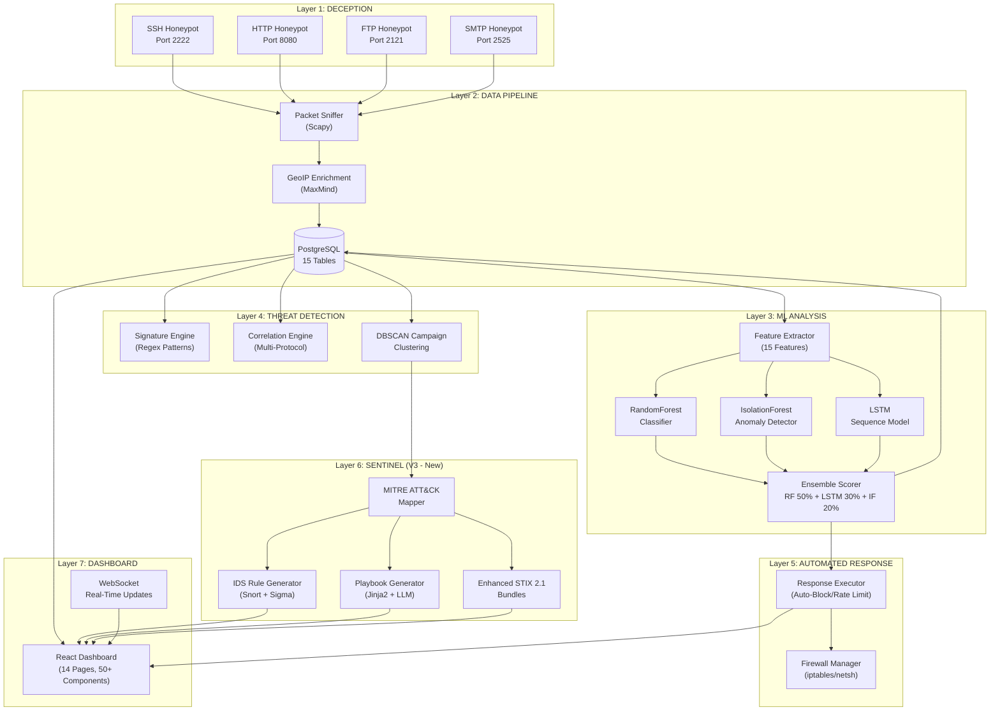
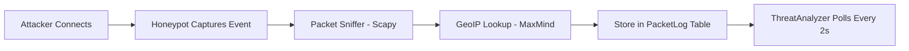
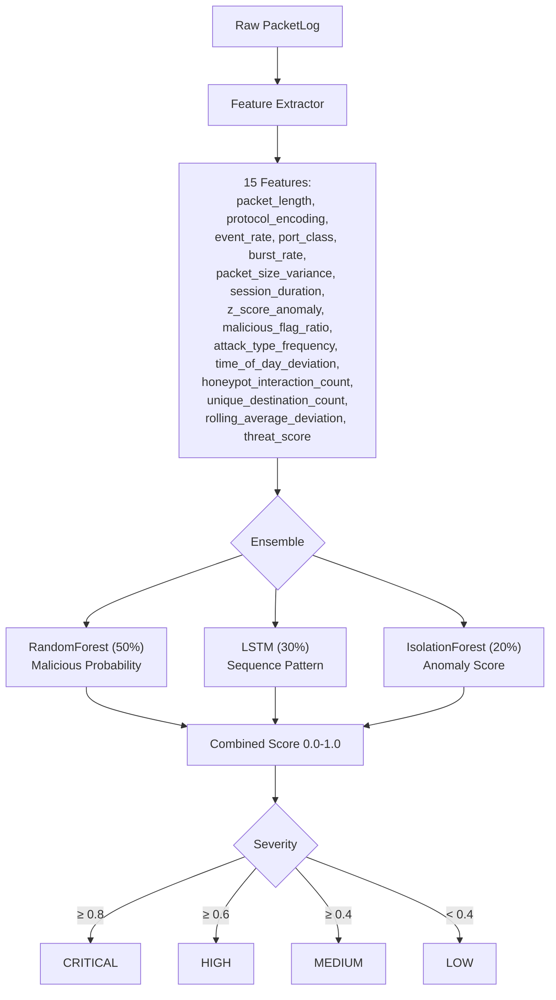
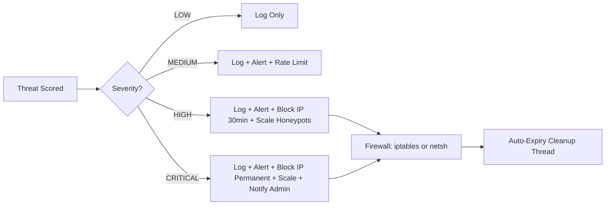
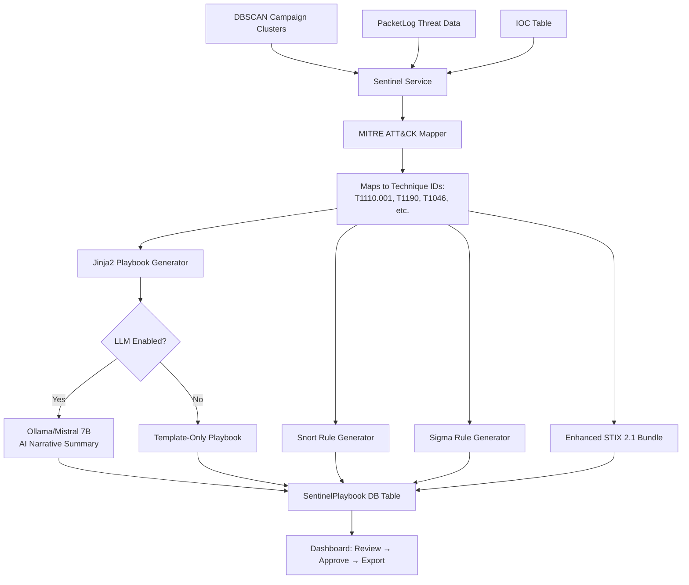
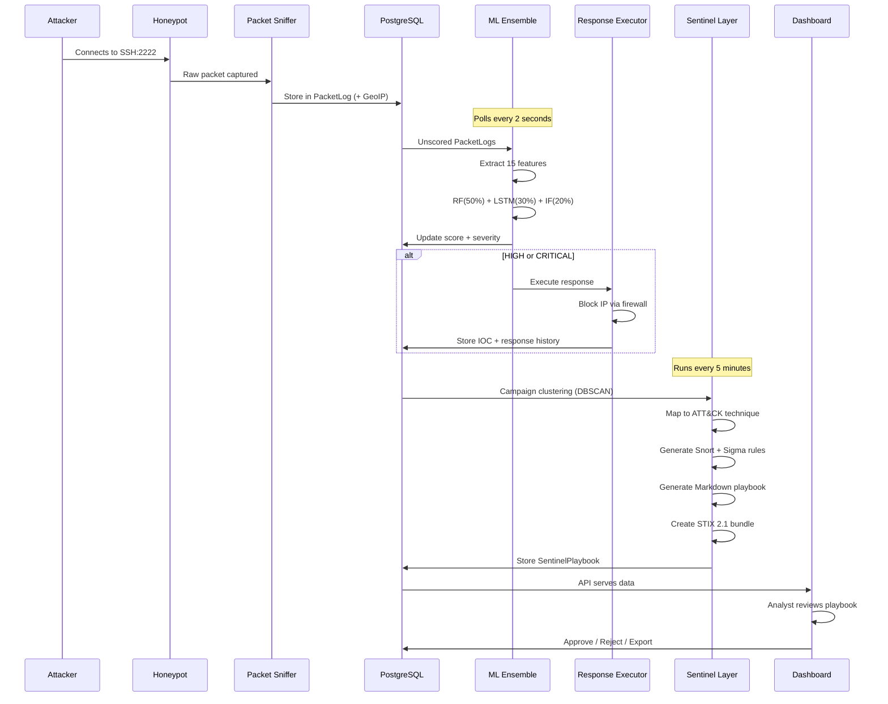
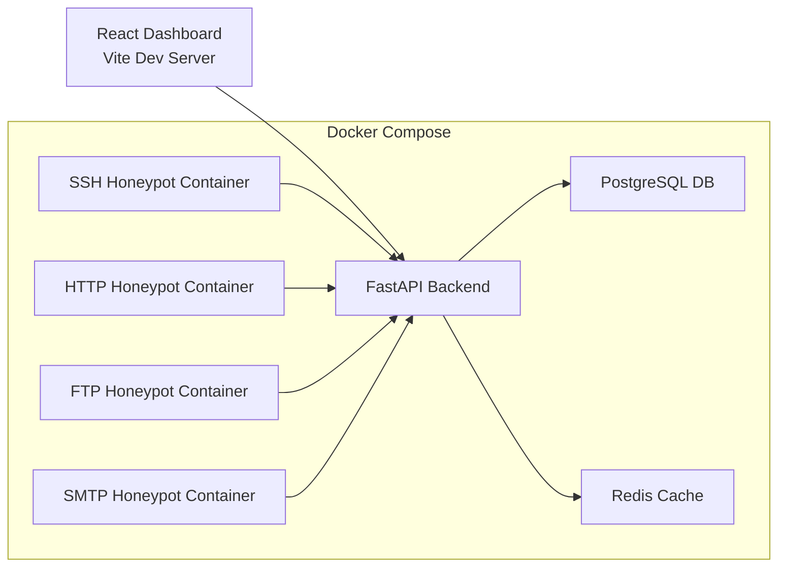
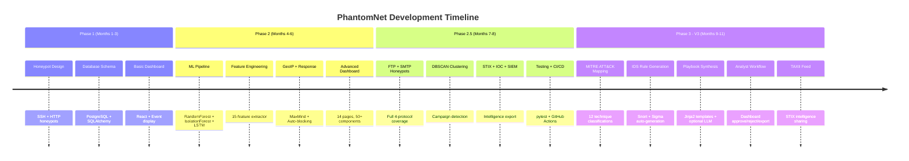
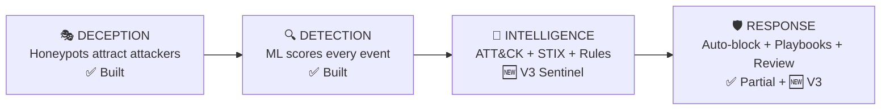

# PhantomNet — Complete Project Document

---

## 1. Project Identity

**Name**: PhantomNet
**Type**: AI-Driven Cyber Deception & Threat Intelligence Platform
**Duration**: 8+ months (B.Tech Final Year Capstone)
**Team**: 4 developers
**Cost**: ₹0 — fully open-source, runs locally

**One-line pitch**: PhantomNet detects attacks across 4 honeypot protocols, scores them with an ML ensemble, maps them to MITRE ATT&CK, auto-generates IDS rules and response playbooks, and lets analysts review and export STIX 2.1 threat intelligence — all from one platform.

---

## 2. What Problem It Solves

Traditional security tools are **reactive** — they detect attacks after damage is done. Honeypots are **proactive** — they attract attackers to decoy systems to study behavior before real infrastructure is hit.

Most honeypot projects stop at **logging**. PhantomNet goes further:

| Most Honeypots | PhantomNet |
|---|---|
| Log connections | Log + Score + Classify + Respond |
| Show dashboards | Show dashboards + Generate defense artifacts |
| Manual analysis | AI-powered automated analysis |
| No response | Auto-block + Auto-generate IDS rules + Playbooks |

---

## 3. High-Level Architecture

---

## 4. Layer-by-Layer Breakdown

### Layer 1: Honeypots (Deception)

Four fake services that look like real targets to attackers:

| Honeypot | Port | Technology | What It Captures |
|---|---|---|---|
| **SSH** | 2222 | Paramiko | Login attempts, usernames, passwords, commands |
| **HTTP** | 8080 | Custom Flask | URL requests, payloads, admin panel probes, scanners |
| **FTP** | 2121 | pyftpdlib | File access, directory traversal, data downloads |
| **SMTP** | 2525 | Custom | Email headers, spam content, spoofing attempts |

All honeypots log to the database via `db_logger.py`. Each runs in its own Docker container.

### Layer 2: Data Pipeline

- **Packet Sniffer** (`traffic_sniffer.py`): Captures raw network packets using Scapy, extracts src/dst IP, ports, protocol, length
- **GeoIP** (`geoip_service.py`): Maps attacker IPs to country, city, latitude, longitude using MaxMind GeoLite2
- **Database**: PostgreSQL with SQLAlchemy ORM, 15 tables (details in Section 6)

### Layer 3: ML Pipeline

- **Contextual adjustments**: Night-time attacks get higher scores, certain honeypot types have adjusted thresholds
- **Batch scoring**: Processes multiple events in one inference call for performance
- **Prediction caching**: Redis or in-memory cache to avoid re-scoring the same IP patterns

### Layer 4: Threat Detection

Three detection engines running in parallel:

| Engine | What It Detects | Method |
|---|---|---|
| **Signature Engine** | SQL injection, XSS, path traversal, SSH brute force, FTP exfiltration, SMTP large payload, scanner behavior | Regex pattern matching |
| **Correlation Engine** | Multi-protocol attacks (same IP hitting SSH+HTTP), high-frequency floods | Cross-table event correlation |
| **Campaign Clustering** | Coordinated attacks from multiple IPs targeting same services | DBSCAN spatial clustering on feature vectors |

### Layer 5: Automated Response

- Cross-platform: Linux (iptables) and Windows (netsh)
- IP whitelist protection prevents blocking trusted addresses
- IOC auto-extraction: HIGH/CRITICAL IPs automatically stored in IOC table
- PCAP capture triggered for HIGH/CRITICAL events

### Layer 6: Sentinel Layer (V3 — New)

**12 ATT&CK Mappings**:

| Detection | ATT&CK ID | Technique | Tactic |
|---|---|---|---|
| SSH brute force | T1110.001 | Password Guessing | Credential Access |
| SSH high activity | T1021.004 | Remote Services: SSH | Lateral Movement |
| SQL injection | T1190 | Exploit Public-Facing App | Initial Access |
| XSS attempt | T1059.007 | JavaScript Execution | Execution |
| Path traversal | T1083 | File/Dir Discovery | Discovery |
| Scanner behavior | T1046 | Network Service Discovery | Discovery |
| FTP exfiltration | T1048.003 | Exfil Over Unencrypted | Exfiltration |
| SMTP large payload | T1071.003 | App Layer: Mail | Command & Control |
| Distributed brute force | T1110.004 | Credential Stuffing | Credential Access |
| Low-and-slow scan | T1595.001 | Scanning IP Blocks | Reconnaissance |
| Multi-protocol attack | T1046 | Network Service Discovery | Discovery |
| High-frequency flood | T1498 | Network DoS | Impact |

**Generated Artifacts**: For each campaign, the system produces:
1. Snort IDS rule (deployable on real firewalls)
2. Sigma detection rule (translatable to Splunk/Elastic/QRadar)
3. STIX 2.1 bundle (shareable threat intelligence)
4. Markdown playbook (human-readable response steps)
5. Optional AI narrative (LLM-generated summary)

**Analyst Workflow**: Draft → Review → Approve/Reject → Export

### Layer 7: Dashboard

14 pages, 50+ React components:

| Page | Purpose |
|---|---|
| **Dashboard** | Overview: live metrics, recent events, threat gauges, stats widgets |
| **Events** | Real-time event stream with WebSocket updates, filtering, search |
| **Threat Analysis** | Deep dive: threat scores, attack attribution, timelines |
| **Threat Hunting** | Advanced search with AND/OR/NOT logic, IOC management, saved queries |
| **Topology** | Live network graph showing attacker → honeypot connections |
| **Geo Stats** | World map heatmap of attacker origins using Leaflet |
| **Analytics** | Protocol distribution charts, trend analysis, attacker patterns |
| **Advanced NOC** | Network operations center view with predictive analytics |
| **PCAP Analysis** | Upload/analyze packet captures, protocol breakdown |
| **Feature Analysis** | ML feature vector visualization, feature importance |
| **Anomaly Dashboard** | IsolationForest anomaly scores, anomaly alerts |
| **Admin Panel** | User management (RBAC), system config, JWT auth |
| **Sentinel** *(V3)* | Playbook list, ATT&CK mapping view, approve/reject/export |
| **About** | Project info, team, architecture |

---

## 5. Complete Data Flow (End-to-End)

---

## 6. Database Schema (15 + 1 Tables)

| Table | Purpose | Key Columns |
|---|---|---|
| **PacketLog** | Core event storage | src_ip, dst_ip, ports, protocol, threat_score, threat_level, GeoIP fields, detected_signatures *(V3)* |
| **Alert** | System alerts | level, type, source_ip, description, is_resolved |
| **TrafficStats** | Aggregate stats | total_packets, active_connections |
| **AttackSession** | Session grouping | attacker_ip, start_time, threat_score |
| **Event** | Honeypot-level events | session_id, honeypot_type, raw_data, pcap_path, GeoIP |
| **HoneypotNode** | Registered honeypots | node_id, ip_address, status, honeypot_type, policy_id |
| **Policy** | Configuration policies | name, description, config JSON |
| **ScheduledReport** | Auto-reports | template_type, frequency, schedule_time, recipients |
| **InvestigationCase** | Case management | title, status, priority, assigned_to |
| **CaseEvidence** | Evidence links | case_id, event_id, event_type, notes |
| **IOC** | Indicators of Compromise | type (IP/Domain/Hash), value, threat_level, is_watchlist |
| **SearchHistory** | Saved hunt queries | query_json, result_count |
| **PcapCapture** | Packet captures | file_path, packet_count, analysis_status, threat_patterns |
| **User** | Authentication | username, email, hashed_password, role (Admin/Analyst/Viewer) |
| **SystemConfig** | App settings | key, value, category |
| **SentinelPlaybook** *(V3)* | Generated playbooks | mitre_technique_id, snort_rules, sigma_rules, stix_bundle, playbook_markdown, status (draft/approved/rejected) |

---

## 7. API Inventory (30+ Existing + 10 New)

| Category | Endpoints | Purpose |
|---|---|---|
| **Health** | `/api/health` | System status |
| **Events** | `/api/events`, `/api/latest-events` | Event data + filtering |
| **Stats** | `/api/stats`, `/api/protocol-breakdown` | Traffic statistics |
| **Honeypots** | `/api/honeypots` | Honeypot status (async port checks) |
| **Traffic** | `/api/traffic` | Real-time traffic data |
| **Threat Scoring** | `/api/threat/score` | Score a single event |
| **Protocol Analytics** | `/api/analytics/ssh`, `/api/analytics/http`, `/api/analytics/trends` | Per-protocol analysis |
| **Attack Attribution** | `/api/v1/attribution/*` | IP profiling, campaign linking |
| **Predictive** | `/api/v1/predictive/forecast`, `/risk-assessment`, `/next-attack` | ML-powered predictions |
| **Admin** | `/api/admin/login`, `/users`, `/config`, `/backup` | JWT auth, RBAC, settings |
| **Threat Hunting** | `/api/hunting/search`, `/api/hunting/iocs` | Advanced search + IOC CRUD |
| **Cases** | `/api/cases/*` | Investigation case management |
| **Reports** | `/api/reports/*` | Scheduled report generation |
| **PCAP** | `/api/pcap/*` | Packet capture upload/analysis |
| **Response** | `/api/response/history`, `/blocked`, `/unblock`, `/policy` | Response management |
| **GeoIP** | `/api/geoip/*` | Geographic enrichment |
| **Topology** | `/api/topology/*` (WebSocket) | Live network graph updates |
| **Realtime** | `/api/realtime/*` (WebSocket) | Live event streaming |
| **ML Metrics** | `/api/model/metrics` | Model performance stats |
| **Prometheus** | `/metrics` | Prometheus-format metrics |
| **Campaigns** | `/api/v1/advanced/campaigns` | DBSCAN clustering results |
| **Explainability** | `/api/v1/events/{id}/explanation` | SHAP feature explanations |
| **Sentinel** *(V3)* | `/api/sentinel/playbooks`, `/generate`, `/approve`, `/reject`, `/export`, `/stats`, `/rules`, `/mitre/mapping` | Playbook management |
| **TAXII** *(V3)* | `/taxii2/*` | STIX threat intel feed |

---

## 8. Technology Stack

| Layer | Technologies |
|---|---|
| **Backend** | Python 3.11, FastAPI, Uvicorn, SQLAlchemy 2.0 |
| **Database** | PostgreSQL 15 |
| **ML** | scikit-learn (RandomForest, IsolationForest, DBSCAN), LSTM, SHAP |
| **Frontend** | React 19, Vite, Tailwind CSS 4, Recharts, Leaflet, React Flow |
| **Networking** | Scapy, Paramiko (SSH), pyftpdlib (FTP), asyncssh |
| **Security** | JWT (PyJWT), bcrypt, RBAC, passlib |
| **Intelligence** | stix2, pymisp, MaxMind GeoIP2, Jinja2 *(V3)* |
| **AI** *(V3)* | Ollama + Mistral 7B (optional, local, free) |
| **Infrastructure** | Docker Compose (7 services), GitHub Actions CI/CD |
| **Monitoring** | Prometheus metrics, Redis caching, MLflow tracking |
| **Testing** | pytest, load testing (50 concurrent, 0% error) |

---

## 9. Infrastructure

---

## 10. Security & Middleware

| Component | What It Does |
|---|---|
| **JWT Auth** | Token-based login, role-based access (Admin/Analyst/Viewer) |
| **RBAC** | Admins manage users/config, Analysts hunt/investigate, Viewers read-only |
| **CORS** | Configured for frontend origin |
| **Rate Limiting** | API request throttling |
| **Security Logging** | All requests logged with metadata |
| **Profiling** | Performance profiling middleware |
| **Metrics** | Prometheus-compatible metrics collection |
| **Caching** | Response caching for expensive queries |

---

## 11. Project Evolution

---

## 12. What Makes PhantomNet Unique

| Feature | T-Pot | Cowrie | HoneyAgents | PhantomNet |
|---|---|---|---|---|
| Multi-protocol honeypots | ✅ | SSH only | ✅ | ✅ (4 protocols) |
| ML threat scoring | ❌ | ❌ | ❌ | ✅ (3-model ensemble) |
| MITRE ATT&CK mapping | ❌ | ❌ | ❌ | ✅ (12 techniques) |
| Auto IDS rule generation | ❌ | ❌ | ❌ | ✅ (Snort + Sigma) |
| Playbook auto-generation | ❌ | ❌ | ❌ | ✅ (Jinja2 + LLM) |
| Human-in-the-loop review | ❌ | ❌ | ❌ | ✅ |
| STIX 2.1 export | ❌ | ❌ | ❌ | ✅ |
| Auto-response (firewall) | ❌ | ❌ | ✅ | ✅ |
| Campaign clustering | ❌ | ❌ | ❌ | ✅ (DBSCAN) |
| Full SOC lifecycle | ❌ | ❌ | ❌ | ✅ |

---

## 13. Project Numbers

| Metric | Value |
|---|---|
| Git commits | 610+ |
| Source files | 337+ |
| Code size | ~1.3 MB |
| Backend Python files | 189 |
| React components | 50+ |
| Dashboard pages | 14 (15 with Sentinel) |
| API endpoints | 30+ (40+ with Sentinel) |
| Database tables | 15 (16 with SentinelPlaybook) |
| Docker services | 7 |
| ML features | 15 |
| ATT&CK mappings | 12 |
| Honeypot protocols | 4 |
| Test coverage | Integration + load (50 concurrent, 0% error) |

---

## 14. SOC Lifecycle Coverage

PhantomNet is one of the only student projects that covers all four layers of the SOC lifecycle in a single integrated platform.

---

## 15. The Complete Pitch

PhantomNet is an AI-driven cyber deception and threat intelligence platform. It deploys four protocol-specific honeypots (SSH, HTTP, FTP, SMTP) that capture attacker behavior in real time. Every event passes through an ML ensemble — RandomForest, IsolationForest, and LSTM — that scores threat severity on a 0-100 scale. HIGH and CRITICAL threats are auto-blocked via firewall rules. The Sentinel Layer classifies detections against the MITRE ATT&CK framework, auto-generates Snort and Sigma IDS rules for real-world deployment, synthesizes structured incident response playbooks with containment steps and IOC checklists, and packages everything as STIX 2.1 threat intelligence bundles. An analyst review dashboard enables human-in-the-loop verification before any generated artifact is exported. The entire platform runs at zero cost on local infrastructure with optional AI narrative enhancement via Ollama. PhantomNet covers the complete security operations lifecycle — deception, detection, intelligence, and response — in a single integrated system.
