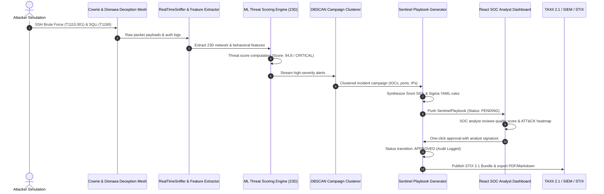

# Demo #1: End-to-End Automated Pipeline (Live Attack to SOC Export)

## 🎯 Objective
Showcase the complete, autonomous lifecycle of PhantomNet V3:
1. **Live Attack Simulation & Honeypot Ingestion** — Multi-vector attack traffic (SSH Brute Force `T1110.001` and SQL Injection `T1190`) targeting active deception mesh services (Cowrie on port 2222, Dionaea / HTTP on port 8080).
2. **Backend Aggregation & Real-Time ML Inference** — Real-time telemetry ingestion, 23D feature vector extraction, sub-15ms Isolation Forest / Random Forest classification, and dynamic threat scoring.
3. **DBSCAN Alert Clustering & Playbook Generation** — Spatial-temporal alert clustering grouping related indicators of compromise (IOCs) and automatically synthesizing structured Sentinel Incident Response Playbooks mapped to MITRE ATT&CK techniques.
4. **SOC Analyst Review & ATT&CK Heatmap Exploration** — Analyst dashboard walkthrough featuring Playbook Quality Scoring (0–100), severity tiering, and MITRE ATT&CK technique heatmaps.
5. **Deep Playbook Inspection & Automated Detection Rule Synthesis** — Comprehensive modal inspection showing attack narratives, Snort 2.9/3.0 SIDs, Sigma YAML detection rules, and structured containment checklists.
6. **One-Click Playbook Approval & Digital Authorization** — Analyst signature verification transitioning playbook state from `PENDING` to `APPROVED` with immutable cryptographic audit logging.
7. **Multi-Format SOC Export & TAXII 2.1 Threat Sharing** — Downstream SIEM/SOAR integration via STIX 2.1 JSON Threat Bundles, executive PDF incident reports, Markdown runbooks, and TAXII 2.1 Server collections.

---

## 🛠️ Architecture & Data Flow

---

## 📋 Demonstration Steps & Timestamps

| Step | Phase Title | Duration | Visual Highlights & Narrative |
| :--- | :--- | :--- | :--- |
| **01** | **Live Attack Simulation & Honeypot Ingestion** | 0:00 – 0:05 | Multi-stage attack execution against Cowrie (port 2222) and Dionaea (port 8080). Overview dashboard displays incoming connection spikes, active deception nodes, and geographical source mapping. |
| **02** | **Honeypot Deception Telemetry** | 0:05 – 0:09 | Live inspection of deception services. Real-time log capture showing failed root authentication attempts, payload traps, and automated honeypot scaling. |
| **03** | **ML Inference Engine & 23D Threat Scoring** | 0:09 – 0:13 | Feature extraction pipeline computing 23 statistical, network, and entropy metrics. Sub-15ms ensemble classification assigning threat score `94.8` (`CRITICAL`). |
| **04** | **Incident Clustering & Playbook Generation** | 0:13 – 0:17 | DBSCAN spatial-temporal clustering grouping correlated alerts across IP `185.220.101.5` and `198.51.100.44`. Automated synthesis of incident response playbooks. |
| **05** | **SOC Analyst Review & ATT&CK Heatmap Coverage** | 0:17 – 0:21 | SOC analyst review queue showing pending incident response playbooks, Quality Score badge (`94/100`), and interactive MITRE ATT&CK matrix coverage. |
| **06** | **Playbook Inspection & Automated IDS Rule Synthesis** | 0:21 – 0:26 | Opening Playbook Viewer modal: reviewing attack narrative, IOC signatures, auto-generated Snort 2.9/3.0 rules, and Sigma YAML detection rules. |
| **07** | **One-Click Playbook Approval & Authorization** | 0:26 – 0:31 | Analyst digital signature entry (`analyst_sriram`), cryptographic audit trail creation, and instant status transition from `PENDING` to `APPROVED`. |
| **08** | **Multi-Format SOC Export & TAXII 2.1 Threat Sharing** | 0:31 – 0:36 | Automated distribution: STIX 2.1 JSON bundle download, executive PDF incident summary, Markdown runbook export, and TAXII 2.1 feed synchronization. |

---

## 📦 Output Artifacts
- **Full HD MP4 Recording**: `demos/demo_pipeline_e2e.mp4` (1920×1080 @ 10fps, H.264/MP4V)
- **Animated Preview WebP**: `demos/demo_pipeline_e2e.webp` (1280×720 animated WebP)
- **Automated Recording Script**: `scripts/record_demo_pipeline_e2e.py`
- **Execution Storyboard Guide**: `demos/demo_pipeline_e2e_script.md`
