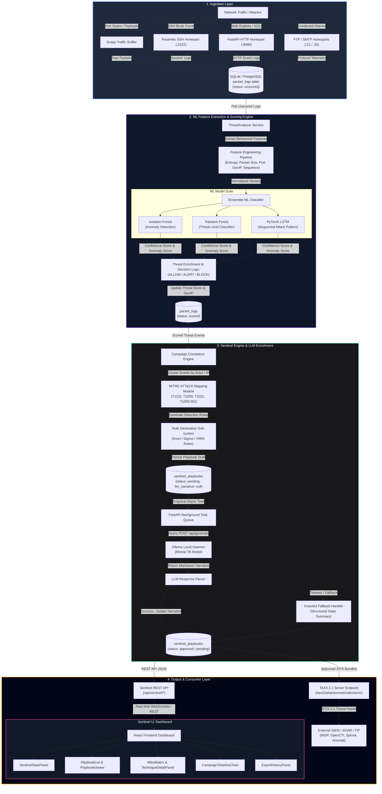
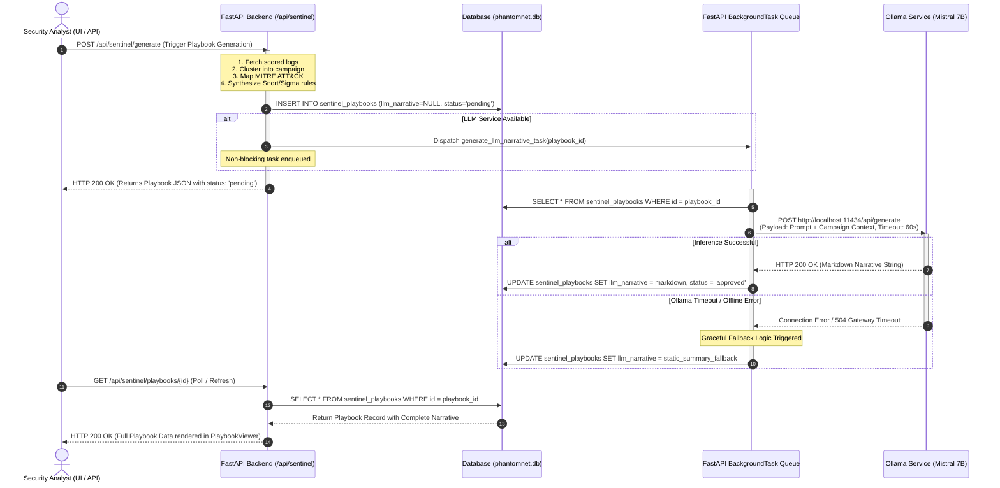
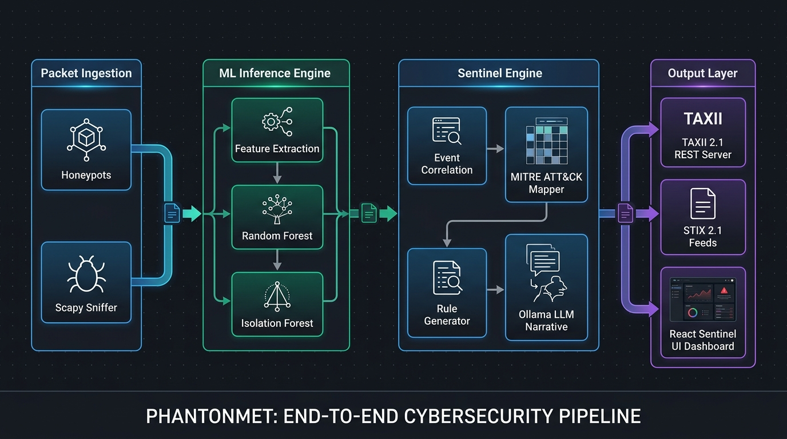
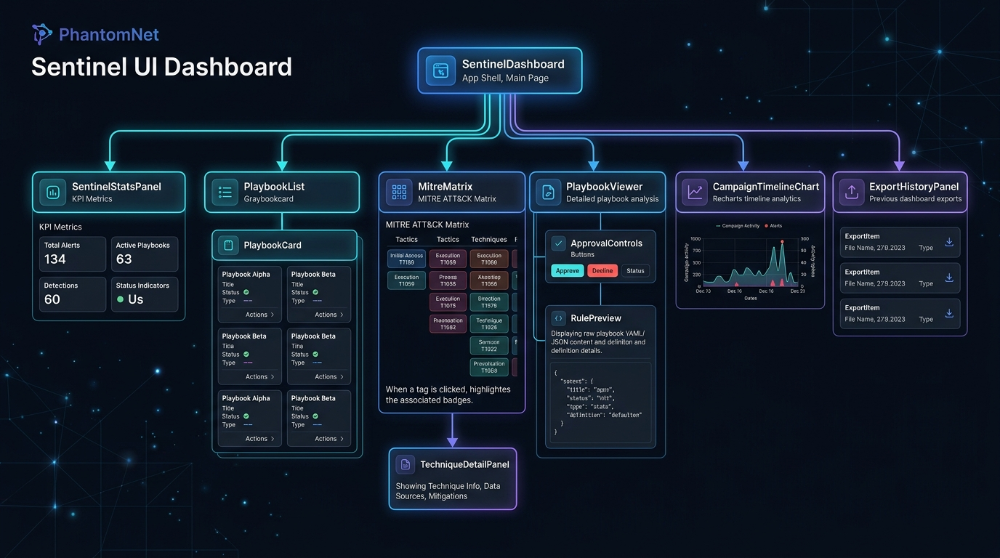

# PhantomNet Pipeline & Frontend Component Architecture

This document provides a comprehensive technical overview and visual architecture maps for the **PhantomNet Active Defense Platform**. It covers the complete end-to-end data pipeline—from raw packet capture to ML threat inference, Sentinel event correlation, LLM-backed narrative enrichment, TAXII 2.1 threat intelligence feeds, and the React Sentinel UI hierarchy.

---

## 1. End-to-End System Pipeline Architecture

The end-to-end data processing pipeline transforms raw network packets and honeypot interactions into actionable threat intelligence, automated response playbooks, and standardized STIX 2.1 feeds.



---

## 2. Frontend Component Hierarchy Architecture

The Sentinel frontend application is built as a modular React component tree using Vite, Tailwind CSS, and Recharts. The architecture isolates state management, modal dialogs, and real-time visualization widgets.

```mermaid
graph TD
    Root["App.jsx (Main Router & Layout)"] -->|Mounts Page| SD["SentinelDashboard.jsx (Main Container Page)"]

    subgraph CoreContext["State & Notification Context"]
        SD --- Toast["ToastContainer & useToast Hook"]
        SD --- GlobalState["Filter State / Active Playbook / Selected Technique"]
    end

    subgraph HeaderSection["1. Header & KPI Metrics"]
        SD --> SSP["SentinelStatsPanel.jsx"]
        SSP --> KPI1["Playbook Counter Widget"]
        SSP --> KPI2["Critical Threat Gauge"]
        SSP --> KPI3["MITRE Coverage % Badge"]
        SSP --> KPI4["Rule Count Summary"]
        SSP --> KPI5["LLM Status Indicator"]
    end

    subgraph ControlsSection["2. Toolbar & View Selector"]
        SD --> Toolbar["Dashboard Action Bar"]
        Toolbar --> ViewTabs["View Tabs: Playbooks | MITRE Matrix | Timeline | TAXII Feeds"]
        Toolbar --> SearchFilter["SearchInput & TacticFilter Dropdown"]
        Toolbar --> ActionBtns["Batch Export & Refresh Buttons"]
    end

    subgraph MainContent["3. Primary Views & Interactive Modules"]
        SD --> PL["PlaybookList.jsx (Grid / List View)"]
        PL --> PC["PlaybookCard.jsx (Individual Playbook Summary Card)"]
        PC --> MT1["MitreTag.jsx (Technique Badge)"]
        PC --> StatusBadge["Status Badge (Approved / Pending / Draft)"]
        PC --> ActionTrigger["View Details / Compare / Promote Actions"]

        SD --> MM["MitreMatrix.jsx (ATT&CK Matrix Grid)"]
        MM --> MT2["MitreTag.jsx (Grid Cell Badge)"]
        MM --> TDP["TechniqueDetailPanel.jsx (Side Drawer)"]
        TDP --> TechRules["Rule Preview (Snort / Sigma)"]
        TDP --> TechPlaybooks["Associated Playbook List"]

        SD --> CTC["CampaignTimelineChart.jsx (Recharts Timeline)"]
        CTC --> SeveritySpikes["Severity Spike Annotations"]
        CTC --> AttackVolume["Attack Volume Bar / Area Chart"]

        SD --> EHP["ExportHistoryPanel.jsx (TAXII & STIX Log)"]
        EHP --> StixDownload["STIX 2.1 Bundle Downloader"]
        EHP --> TaxiiStatus["TAXII Server Sync Status"]
    end

    subgraph InspectionModals["4. Detailed Inspection & Modal Overlay Layer"]
        SD --> PV["PlaybookViewer.jsx (Full Screen Playbook Drawer)"]
        PV --> AC["ApprovalControls.jsx (Approve / Reject / Promote Workflow)"]
        PV --> RP["RulePreview.jsx (Syntax Highlighting & Rule Copying)"]
        PV --> LLMNarrative["AI LLM Narrative Display Component"]

        SD --> PCM["PlaybookCompareModal.jsx (Side-by-Side Comparison)"]
        PCM --> DiffViewer["Playbook Indicator & Rule Diff View"]
    end

    %% Visual Styling
    style Root fill:#0f172a,stroke:#64748b,stroke-width:2px,color:#fff
    style SD fill:#1e293b,stroke:#3b82f6,stroke-width:3px,color:#fff
    style HeaderSection fill:#020617,stroke:#10b981,stroke-width:2px,color:#fff
    style ControlsSection fill:#18181b,stroke:#a855f7,stroke-width:2px,color:#fff
    style MainContent fill:#0f172a,stroke:#38bdf8,stroke-width:2px,color:#fff
    style InspectionModals fill:#1e1b4b,stroke:#f43f5e,stroke-width:2px,color:#fff
```



### Component Responsibility Matrix

| Component | File Path | Primary Responsibilities | Key Child Components / Dependencies |
| :--- | :--- | :--- | :--- |
| **`SentinelDashboard`** | [`SentinelDashboard.jsx`](../../frontend-dev/phantomnet-dashboard/src/pages/SentinelDashboard.jsx) | Main view container, state orchestration, layout grid | `SentinelStatsPanel`, `PlaybookList`, `MitreMatrix`, `PlaybookViewer` |
| **`SentinelStatsPanel`** | [`SentinelStatsPanel.jsx`](../../frontend-dev/phantomnet-dashboard/src/components/sentinel/SentinelStatsPanel.jsx) | KPI stats header, critical threat metrics, coverage indicators | SVG gauges, metric counter cards |
| **`PlaybookList`** | [`PlaybookList.jsx`](../../frontend-dev/phantomnet-dashboard/src/components/sentinel/PlaybookList.jsx) | Filterable, sortable list and grid of playbooks | `PlaybookCard` |
| **`PlaybookCard`** | [`PlaybookCard.jsx`](../../frontend-dev/phantomnet-dashboard/src/components/sentinel/PlaybookCard.jsx) | Compact card rendering playbook status, threat score, indicators | `MitreTag` |
| **`MitreMatrix`** | [`MitreMatrix.jsx`](../../frontend-dev/phantomnet-dashboard/src/components/sentinel/MitreMatrix.jsx) | Interactive 12-tactic MITRE ATT&CK grid visualization | `MitreTag`, `TechniqueDetailPanel` |
| **`TechniqueDetailPanel`** | [`TechniqueDetailPanel.jsx`](../../frontend-dev/phantomnet-dashboard/src/components/sentinel/TechniqueDetailPanel.jsx) | Side drawer showing detailed technique metadata & rules | `RulePreview` |
| **`PlaybookViewer`** | [`PlaybookViewer.jsx`](../../frontend-dev/phantomnet-dashboard/src/components/sentinel/PlaybookViewer.jsx) | Deep inspection modal/drawer with AI narrative & response actions | `ApprovalControls`, `RulePreview` |
| **`ApprovalControls`** | [`ApprovalControls.jsx`](../../frontend-dev/phantomnet-dashboard/src/components/sentinel/ApprovalControls.jsx) | Workflow approval buttons (Pending → Approved → Promoted) | API integration hooks |
| **`RulePreview`** | [`RulePreview.jsx`](../../frontend-dev/phantomnet-dashboard/src/components/sentinel/RulePreview.jsx) | Code syntax block with copy/download for Snort, Sigma, YARA | Clipboard API |
| **`CampaignTimelineChart`** | [`CampaignTimelineChart.jsx`](../../frontend-dev/phantomnet-dashboard/src/components/sentinel/CampaignTimelineChart.jsx) | Time-series visualization of attack volume, severity spikes, C2 events | Recharts (`ResponsiveContainer`, `AreaChart`) |
| **`ExportHistoryPanel`** | [`ExportHistoryPanel.jsx`](../../frontend-dev/phantomnet-dashboard/src/components/sentinel/ExportHistoryPanel.jsx) | TAXII 2.1 sync status table & STIX 2.1 JSON bundle downloader | FileSaver / Blob API |

---

## 3. Sentinel Sub-system & Asynchronous LLM Processing Flow

To avoid blocking thread locks in the SQLite database during lengthy LLM inference (5–15 seconds), PhantomNet uses an asynchronous decoupled execution model powered by FastAPI `BackgroundTasks` and an offline fallback parser.



---

## 4. TAXII 2.1 Threat Intelligence Sharing Pipeline

PhantomNet exposes threat intelligence formatted according to the **STIX 2.1** specification over standard **TAXII 2.1** endpoints for SIEM/SOAR integration.

```mermaid
flowchart LR
    subgraph DataStore["PhantomNet Storage"]
        DB[("SQLite Database<br/>sentinel_playbooks table")]
    end

    subgraph TaxiiServer["FastAPI TAXII 2.1 Server Core"]
        EP1["GET /taxii2/<br/>(Discovery Endpoint)"]
        EP2["GET /taxii2/phantomnet/<br/>(API Root Information)"]
        EP3["GET /taxii2/phantomnet/collections/<br/>(Collections Manifest)"]
        EP4["GET /taxii2/phantomnet/collections/{id}/objects/<br/>(STIX Bundle Retrieval)"]

        Transformer["STIX 2.1 Transformer<br/>(stix_enhanced.py)"]
    end

    subgraph Consumers["External Security Platforms"]
        MISP["MISP Threat Sharing Platform"]
        OpenCTI["OpenCTI Knowledge Base"]
        Splunk["Splunk Enterprise Security"]
        CustomApp["taxii2-client / Python Script"]
    end

    DB -->|Query status = 'approved'| EP4
    EP4 --> Transformer
    Transformer -->|Build STIX 2.1 Bundle<br/>(Indicator, Observed Data, Malware, Course of Action)| EP4

    EP1 & EP2 & EP3 & EP4 -->|Media Type: application/taxii+json;version=2.1| MISP
    EP4 -->|STIX 2.1 Bundles| OpenCTI
    EP4 -->|STIX 2.1 Bundles| Splunk
    EP4 -->|JSON Feed| CustomApp

    style DataStore fill:#1e293b,stroke:#64748b,stroke-width:2px,color:#fff
    style TaxiiServer fill:#0f172a,stroke:#10b981,stroke-width:2px,color:#fff
    style Consumers fill:#18181b,stroke:#3b82f6,stroke-width:2px,color:#fff
```

---

## 5. Visual Architecture References

High-resolution visual architecture diagrams generated for documentation and web presentation:

| Diagram Reference | Format | Description | File Path |
| :--- | :--- | :--- | :--- |
| **Pipeline Architecture** | Visual PNG | Complete packet ingestion to UI/TAXII pipeline | [`docs/images/pipeline_architecture_diagram.png`](../images/pipeline_architecture_diagram.png) |
| **Frontend Component Hierarchy** | Visual PNG | Modular layout & component breakdown for Sentinel React UI | [`docs/images/frontend_component_hierarchy_diagram.png`](../images/frontend_component_hierarchy_diagram.png) |

### Visual Pipeline Architecture


### Visual Frontend Component Hierarchy


---
*Documentation updated for PhantomNet Release Candidate 1 (RC1).*
