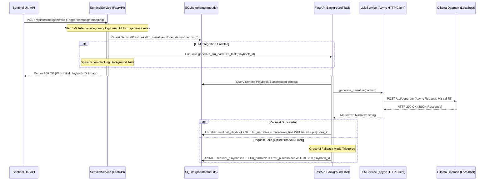

# PhantomNet Sentinel Layer: LLM Pipeline Architecture

This document describes the architectural design, ingestion paths, asynchronous processing flow, communication contracts, and prompt hierarchies for integrating a local Large Language Model (LLM) service into the PhantomNet Sentinel Layer.

---

## 1. Architectural Overview & LLM Ingestion Path

The PhantomNet Sentinel Layer aggregates and correlates security events into campaign clusters. The LLM pipeline enriches these campaign playbooks with human-readable, AI-generated narratives summarizing the attack campaign, technical indicators, and mitigation steps.

### Ingestion Flow Diagram


### Async Flow & Concurrency Considerations
* **SQLite Lock Mitigation:** SQLite does not support concurrent write transactions and will throw lock errors if threads are blocked. Since LLM inference takes 5–15 seconds, executing requests synchronously within the web request thread is prohibited.
* **Background Processing:** All Ollama API calls are dispatched via FastAPI `BackgroundTasks`. The initial playbook record is written instantly to the DB. A background task then handles the LLM HTTP communication. Once complete, a separate, short-lived write transaction updates the specific database row.

---

## 2. Ollama Local API Communications Contract

Communication with the local Ollama daemon uses an asynchronous HTTP client built on `httpx.AsyncClient`.

### Endpoint & Configuration
* **Target URL:** `http://localhost:11434/api/generate` (configurable via `SENTINEL_LLM_HOST`)
* **Method:** `POST`
* **Content-Type:** `application/json`
* **Timeout Constraints:** 
  * Connection Timeout: 5.0 seconds
  * Read Timeout: 60.0 seconds (prevents thread hanging during slow CPU inference)

### Request Payload Schema
```json
{
  "model": "mistral",
  "prompt": "Strict prompt string containing context and system boundaries",
  "stream": false,
  "options": {
    "temperature": 0.15,
    "top_p": 0.9,
    "num_predict": 1024,
    "stop": ["[INST]", "User:", "System:"]
  }
}
```

### Response Payload Schema (Non-streaming)
```json
{
  "model": "mistral",
  "created_at": "2026-07-13T08:00:00.123456Z",
  "response": "### AI Security Summary\n\n**Incident Overview**\nThe campaign...",
  "done": true,
  "context": [1, 2, 3],
  "total_duration": 4567890,
  "load_duration": 123456,
  "prompt_eval_count": 45,
  "prompt_eval_duration": 98765,
  "eval_count": 234,
  "eval_duration": 345678
}
```

---

## 3. Prompt Template Hierarchy

To optimize response quality and avoid hallucination, prompts are structured hierarchically:

```
                  ┌───────────────────────────────┐
                  │      System Instructions      │
                  │   (Persona, Markdown, Rules)   │
                  └───────────────┬───────────────┘
                                  ▼
                  ┌───────────────────────────────┐
                  │      Common Context Block     │
                  │ (IPs, Ports, MITRE, Rules)    │
                  └───────────────┬───────────────┘
                                  ▼
         ┌────────────────────────┼────────────────────────┐
         ▼                        ▼                        ▼
┌─────────────────┐      ┌─────────────────┐      ┌─────────────────┐
│ SSH Brute Force │      │ SQL Injection   │      │   Port Scan     │
│  (Auth logs,    │      │  (SQL payloads, │      │  (Scan patterns,│
│  watchlist, IPs)│      │  URL pathways)  │      │  port sweeps)   │
└─────────────────┘      └─────────────────┘      └─────────────────┘
```

### 1. System Instructions (Common Base)
Every prompt starts with this block:
> You are an expert incident response and threat intelligence analyst. 
> Write a highly technical, professional, and clear executive summary of the threat campaign.
> Use strict Markdown format. Start directly with the markdown header. Do NOT output HTML tags.
> Do NOT use conversational prefixes (such as "Sure, here is your playbook summary:").

### 2. Common Context Block
Telemetry parsed by the Sentinel pipeline is dynamically mapped into the prompt:
* **Campaign Details:** ID, total event count, first/last seen times (standardized in UTC).
* **Attacker Profile:** Source IPs, protocol, destination ports, threat score, calculated confidence score.
* **MITRE ATT&CK Mapping:** Tactic, Technique ID, Technique Name, URL.
* **Generated IDS Rules:** Raw Snort/Sigma rules.

### 3. Service-Specific Directives
* **SSH Brute Force:** Focus on authentication logs, username dictionary sweeps, and source IP watchlists.
* **SQL Injection:** Focus on suspicious SQL keywords (UNION, SELECT, OR 1=1), targeted database type, and Web application pathways.
* **Port Sweep / Port Scan:** Focus on network enumeration patterns, scan velocity, host discoveries, and service profiling.

---

## 4. Fallback Model & Connection Mechanism

### 1. Model Availability & Fallback Chain
Mistral 7B is the primary target model for maximum quality. To maintain operation on hardware-constrained environments:
* **Primary:** `mistral` (7B parameters)
* **Secondary Fallback:** `phi3:3.8b` (3.8B parameters)
* **Tertiary Fallback:** `gemma:2b` (2B parameters)

The fallback list is traversed sequentially. If a higher-tier model is not pulled or fails to initialize, the system attempts the next model in the chain.

### 2. Connection Degradation
If the local Ollama daemon is completely offline, unreachable, or times out after 60 seconds:
1. Catch connection/timeout exceptions.
2. Write a warning to logs: `[LLM Service] Local Ollama daemon unreachable on port 11434. Graceful fallback active.`
3. Set the playbook's `llm_narrative` to the following placeholder:
   ```markdown
   > ⚠️ **AI Summary Unavailable:** The local LLM service is offline or timed out. 
   > Standard template-based playbook documentation remains fully active below.
   ```
4. Complete the playbook generation pipeline cleanly. No exception is re-raised to the orchestrator, preventing server/pipeline crashes.
