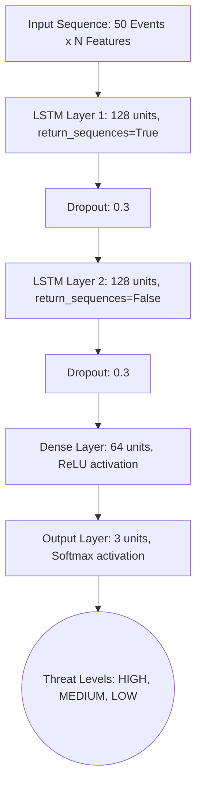

# LSTM Model Architecture for Cybersecurity Sequence-Based Attack Detection

## Overview
This document outlines the Long Short-Term Memory (LSTM) network architecture used in the PhantomNet Active Defense Platform for sequence-based attack prediction and time-series anomaly detection.

Unlike traditional static snapshot machine learning (such as Random Forest), the LSTM model analyzes the historical context of an IP address's behavior by processing sliding windows of up to 50 recent events. This enables the detection of complex kill chain sequences, low-and-slow attacks, and distributed brute-force attempts. 

## Architectural Design

The neural network utilizes the Keras Sequential API and consists of recurrent layers paired with dropout regularization to prevent overfitting on specific attack sequences.

### Layer Breakdown
1. **Input Layer**: 
   - **Shape**: `(50, num_features)`
   - **Description**: Accepts a sequence of the last 50 events originating from a single source IP.

2. **First LSTM Layer**: 
   - **Units**: 128
   - **Return Sequences**: True (Passes the full sequence history to the next recurrent layer).
   - **Function**: Extracts preliminary temporal patterns, such as repeated probe sequences or varying inter-arrival times.

3. **Dropout Layer 1**:
   - **Rate**: 0.3
   - **Function**: Randomly zeros out 30% of the input parameters to prevent memorization of the training set.

4. **Second LSTM Layer**:
   - **Units**: 128
   - **Return Sequences**: False (Outputs only the final summarized state of the sequence).
   - **Function**: Synthesizes the initial sequence embeddings into a high-level representation of the IP's overall campaign.

5. **Dropout Layer 2**:
   - **Rate**: 0.3
   - **Function**: Secondary regularization before classification.

6. **Dense (Fully Connected) Layer**:
   - **Units**: 64
   - **Activation**: ReLU (Rectified Linear Unit)
   - **Function**: Maps the deep sequence representation into an intermediate feature space.

7. **Output Layer (Classification)**:
   - **Units**: 3
   - **Activation**: Softmax
   - **Function**: Produces probabilities (summing to 1.0) forecasting the maximum threat level of the *next* event: `[HIGH, MEDIUM, LOW]`.

## Data Requirements
**Features per event in sequence**:
- Temporal: `inter_arrival_time` (seconds since the last event).
- Contextual: `failed_auth_count`, `unique_ports_accessed`.
- Normalized Metadata: `payload_size_normalized`.
- Categorical (One-Hot Encoded): `protocol` (TCP/UDP/ICMP), `event_type`.

**Targets**:
- The network predicts the threat level of the `t+1` event given events `[t-49 ... t]`.

## Integration
The LSTM is coupled with the existing Random Forest engine using a 40/60 weighted ensemble approach:
- **LSTM Weight**: 40% (provides deep temporal context).
- **Random Forest Weight**: 60% (provides highly accurate immediate snapshot evaluation).
- This ensemble guarantees <100ms inference time while combining traditional tree-based classification and deep sequence learning.
