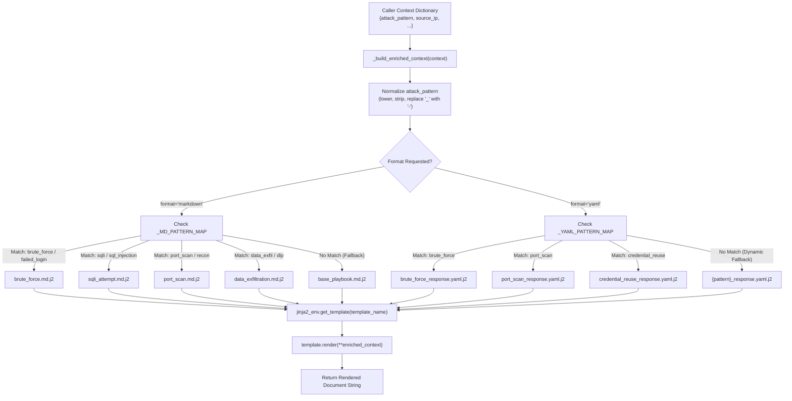

# PhantomNet Sentinel: Jinja2 Playbook Template System

PhantomNet Sentinel features a dynamic, template-driven Incident Response (IR) playbook generation engine (`PlaybookGenerator`). By leveraging **Jinja2 template inheritance** (`` and `` overrides), the system provides consistent, highly structured, and actionable automated response documentation across various attack patterns while avoiding content duplication.

This document serves as the technical reference for the directory structure, template selection logic, available context variables, specialized attack pattern templates, and the step-by-step procedure for extending the system with new attack patterns.

---

## 1. Directory Structure & Overview

All playbook templates reside within the `backend/sentinel/templates/` directory. The template system uses Markdown (`.md.j2`) as its primary output format, while retaining backward compatibility for legacy YAML playbooks (`.yaml.j2`).

```text
backend/sentinel/templates/
├── base_playbook.md.j2                  # Master base template defining all 7 standard sections
├── brute_force.md.j2                    # SSH / credential brute-force response playbook
├── sqli_attempt.md.j2                   # SQL injection attempt web application playbook
├── port_scan.md.j2                      # Port scan and network reconnaissance playbook
├── data_exfiltration.md.j2              # Data exfiltration and DLP incident playbook
├── brute_force_response.yaml.j2         # Legacy YAML playbook: brute force
├── port_scan_response.yaml.j2           # Legacy YAML playbook: port scan
├── credential_reuse_response.yaml.j2    # Legacy YAML playbook: credential reuse / honeytoken
└── distributed_attack_response.yaml.j2  # Legacy YAML playbook: distributed attack
```

### Key Design Principles
- **Inheritance & Modular Overrides**: `base_playbook.md.j2` defines the overarching layout containing 7 standardized blocks (`header`, `summary`, `ioc_table`, `attack_mapping`, `containment`, `artifacts`, `appendix`). Specialized templates extend the base and override only the sections requiring attack-specific customization (typically `header`, `attack_mapping`, `containment`, and `artifacts`).
- **Defensive Defaulting**: All variable expressions use Jinja2 filters like `{{ var | default("default_value") }}`. If caller context omits a parameter, the playbook gracefully falls back to sensible defaults or clear action markers (`<source_ip>`, `Investigate manually`), preventing rendering exceptions.
- **SOAR & SIEM Readiness**: Rendered playbooks embed copy-pasteable CLI commands (`iptables`, `fail2ban-client`, `modsec-ctl`, `nmap`, `aide`), Splunk/SIEM queries, and structured tables ready for immediate human execution or automated SOAR parsing.

---

## 2. Base Template Structure (`base_playbook.md.j2`)

The base template `base_playbook.md.j2` enforces a mandatory **7-section hierarchy** across all generated Markdown playbooks. Every specialized template (`brute_force`, `sqli_attempt`, `port_scan`, `data_exfiltration`) must maintain these 7 sections.

| Section # | Jinja2 Block Name | Section Title | Description & Core Contents |
| :---: | :--- | :--- | :--- |
| **1** | `` | **Header (`# 🛡️ Title`)** | Metadata table including Playbook ID, Version (`1.0.0`), Severity badge (`CRITICAL` / `HIGH` / `MEDIUM` / `LOW`), TLP Classification (`TLP:AMBER`), Attack Pattern, Generation Timestamp, and Event Summary. |
| **2** | `` | **Summary (`## 📋 Summary`)** | Campaign overview quote block, trigger context table (`trigger_type`, `detection_time`, `source_ip`, `target_ip`), affected asset inventory, and CIA incident priority assessment (`Confidentiality`, `Integrity`, `Availability`, `Blast Radius`). |
| **3** | `` | **Indicators of Compromise (`## 🔍 Indicators of Compromise`)** | Structured tables detailing Source IPs (ports, protocols, hit counts, threat intel lookup results), file hashes (`SHA256`), and domain/URL indicators (`resolved_ip`, `category`). |
| **4** | `` | **MITRE ATT&CK Mapping (`## 🎯 MITRE ATT&CK Mapping`)** | Matrix mapping technique IDs (`Txxxx`), technique names, tactics, sub-techniques, and actionable descriptions. Includes direct hyperlinks to MITRE ATT&CK enterprise pages. |
| **5** | `` | **Containment Steps (`## 🚨 Containment Steps`)** | Ordered, phase-by-phase actionable checklist with checkboxes (`- [ ]`). Groups steps into **Phase 1: Immediate Isolation**, **Phase 2: Investigation**, and **Phase 3: Remediation/Hardening**. Embeds CLI syntax and rollback notes. |
| **6** | `` | **Artifacts & Rule References (`## 📁 Artifacts & Rule References`)** | Detection rule catalog (`RULE-ID`, name, source, status), log source index paths (`/var/log/auth.log`, `netflow-*`), evidence collection directory structure, and pre-built SIEM/Splunk search queries. |
| **7** | `` | **Appendix (`## 📎 Appendix`)** | Escalation contact matrix (`Incident Commander`, `CISO`, `Network Team`, `Forensics Team`), step-by-step rollback procedures, target SLAs (`TTD < 2m`, `TTR < 10m`, `TTC < 30m`), and machine-readable YAML context block. |

---

## 3. Available Jinja2 Context Variables

When calling `PlaybookGenerator.generate(context)`, variables from the dictionary are passed directly into the template along with automatic context enrichments from `_build_enriched_context()`.

### Global Standard Variables (Available across all templates)

| Variable Name | Type | Default Value | Description |
| :--- | :--- | :--- | :--- |
| `title` | `str` | `"Incident Response Playbook"` | Document title displayed at the top of Section 1. |
| `playbook_id` | `str` | `"PB-" ~ attack_pattern \| upper` | Unique playbook tracking identifier (e.g., `PB-BRUTE-FORCE`). |
| `version` | `str` | `"1.0.0"` | Playbook version string. |
| `severity` | `str` | `"HIGH"` | Alert severity: `"CRITICAL"`, `"HIGH"`, `"MEDIUM"`, or `"LOW"`. |
| `classification`| `str` | `"TLP:AMBER"` | Traffic Light Protocol classification (`TLP:RED`, `TLP:AMBER`, `TLP:GREEN`). |
| `attack_pattern`| `str` | `"unknown"` | Normalised attack pattern identifier (e.g., `brute_force`, `sqli_attempt`). |
| `generated_at` | `str` | Auto ISO-8601 UTC | Timestamp of playbook generation (`YYYY-MM-DDTHH:MM:SSZ`). |
| `generator_version`| `str`| `"2.0.0"` | PlaybookGenerator engine version (`__version__`). |
| `owner` | `str` | `"SOC"` | Team responsible for handling the playbook (`Security Operations Centre`). |
| `status` | `str` | `"ACTIVE"` | Execution lifecycle status (`ACTIVE`, `COMPLETED`, `ARCHIVED`). |
| `event_summary` | `str` | `"N/A"` | Human-readable overview or title of the trigger event/alarm. |
| `campaign_id` | `str` | `"CAMP-UNKNOWN"` | Identifier of the parent campaign grouping multiple events. |
| `trigger_type` | `str` | `"threshold_breach"` | Detection trigger classification (`threshold_breach`, `siem_rule`, `ml_anomaly`). |
| `detection_time`| `str` | `generated_at` | Time when the initial detection rule or sensor triggered. |
| `time_range` | `str` | `"N/A"` | Evaluated time span for the detection window (`2026-07-10 10:00 - 10:05`). |
| `source_ip` | `str` | `"N/A"` | Primary attacker or source IP address (`192.168.1.100`). |
| `source_ips` | `list` | `[source_ip]` | List of all deduplicated source IPs participating in the campaign. |
| `target_ip` | `str` | `"N/A"` | Targeted host IP or server (`10.0.1.50`). |
| `target_port` | `int` | `22` / `80` / `443` | Primary targeted destination port number. |
| `target_ports` | `list` | `[target_port]` | List of unique destination ports targeted (`[22, 2222]`). |
| `protocol` / `protocols` | `str` / `list` | `"TCP"` / `["TCP"]` | Network transport protocols (`TCP`, `UDP`, `ICMP`). |
| `affected_assets`| `list` | `[target_ip]` | List of hostnames, containers, or IP addresses affected. |
| `iocs` | `list` | `[]` | List of dicts (`ip`, `ports`, `protocol`, `hit_count`, `threat_intel`, `first_seen`, `last_seen`). |
| `ioc_hashes` | `list` | `[]` | List of dicts (`type`, `value`) for file artifacts (`SHA256`, `MD5`). |
| `ioc_domains` | `list` | `[]` | List of dicts (`domain`, `resolved_ip`, `category`) for external C2/exfil domains. |
| `attack_techniques`| `list`| Auto MITRE dicts | List of dicts (`id`, `name`, `tactic`, `subtechnique`, `description`). |
| `containment_steps`| `list`| Auto Phase steps | List of dicts (`name`, `description`) if custom containment is injected. |
| `detection_rules`| `list` | `[]` | List of dicts (`id`, `name`, `source`, `threshold`, `status`). |
| `evidence_paths` | `list` | Auto default paths | List of absolute/relative file paths where PCAP/forensics are collected. |
| `rollback_steps` | `list` | Auto default steps | List of dicts (`name`, `description`) for undoing isolation/blocking actions. |
| `ic_name` / `ic_contact` | `str` | `"On-call SOC Lead"` | Name and contact string (`soc-oncall@phantomnet.local`) for Incident Commander. |
| `ciso_name` / `ciso_contact` | `str` | `"CISO"` | Name and contact (`ciso@phantomnet.local`) for executive escalation. |
| `ticket_system` / `ticket_project` | `str` | `"Jira"` / `"SEC"` | Ticketing system and project key for issue tracking. |
| `audit_period_hours` | `int` | `48` / `72` | Lookback hours for pulling authentication, DB, or proxy logs during investigation. |

---

## 4. Specialized Attack Pattern Templates

Each specialized template overrides blocks `#1 (header)`, `#4 (attack_mapping)`, `#5 (containment)`, and `#6 (artifacts)` from `base_playbook.md.j2` to inject deep, domain-specific guidance.

### 4.1 SSH / Credential Brute Force (`brute_force.md.j2`)
- **Primary Trigger**: SSH password guessing, credential stuffing, password spraying (`T1110.001`, `T1110.003`, `T1110.004`).
- **Key Overrides & Features**:
  - **Header**: Adds `SSH Port`, `Attacker IP`, and `Failed Logins` (`breaches in timeframe`).
  - **Containment (4-Phase Structure)**:
    - `Phase 1 · Immediate IP Blocking (T+0 → T+5m)`: `iptables` and SDN flow rules, `fail2ban-client` ban, and SSH tarpit (`tc qdisc` latency injection).
    - `Phase 2 · SSH Key Rotation (T+5 → T+20m)`: Audits `.ssh/authorized_keys`, regenerates server host keys (`ssh-keygen -A`), checks SSH agent loaded keys, and disables password authentication (`PasswordAuthentication no`).
    - `Phase 3 · Authentication Log Review (T+20 → T+60m)`: Queries `journalctl -u ssh` / `/var/log/auth.log`, lists all targeted usernames (`targeted_usernames`), and verifies zero successful logins (`Accepted password/publickey`).
    - `Phase 4 · Account Lockout & Password Policy Review (T+60m → Close)`: Verifies `pam_faillock`/`pam_tally2` deny thresholds, locks compromised accounts (`passwd -l`), enforces password complexity (`minlen=16`, `remember=12`, `PASS_MAX_DAYS=90`), and enforces Google Authenticator MFA (`libpam-google-authenticator`).
  - **Artifacts**: Embeds 4 Splunk queries (Brute Force threshold, Password spray rate `>5 accounts in 60s`, Post-compromise lateral movement via `session_id`, and `fail2ban` ban events).
- **Template-Specific Variables**:
  `ssh_port` (`22`), `failed_logins_threshold` (`20`), `timeframe` (`"5 minutes"`), `block_duration` (`"3600"`), `tarpit_delay_ms` (`5000`), `targeted_usernames` (`list`), `key_rotation_hosts` (`list`), `lockout_policy_threshold` (`5`), `min_password_length` (`16`), `mfa_systems` (`list`), `ssh_allow_list` (`list`), `escalate_to_ciso` (`bool`).

### 4.2 SQL Injection Attempt (`sqli_attempt.md.j2`)
- **Primary Trigger**: Web application SQL injection vectors (`T1190`, `T1059.007`, `T1005`, `T1565.001`).
- **Key Overrides & Features**:
  - **Header**: Adds `HTTP Method` (`GET`/`POST`), `Target Endpoint`, `Database Host`, `DB Engine` (`MySQL`/`PostgreSQL`/`MSSQL`), `Database Name`, and `WAF Vendor` / `WAF Mode`.
  - **Containment (4-Phase Structure)**:
    - `Phase 1 · Immediate Triage & Traffic Block (T+0 → T+10m)`: Blocks IP via `iptables`/`modsec-ctl`, isolates raw access logs, captures database error/slow queries (`mysqldumpslow`), records `payload_sample`, terminates active attacker DB sessions (`KILL QUERY`, `pg_terminate_backend`), and enables `503 Maintenance` mode on Nginx.
    - `Phase 2 · WAF Review & Hardening (T+10 → T+45m)`: Audits ModSecurity (`SecRuleEngine On`) / AWS WAF logs (`SQLInjectionRule`), injects custom `@detectSQLi` ModSecurity rules, enforces Nginx rate limiting (`limit_req_zone`), and audits Content-Security-Policy / CORS headers.
    - `Phase 3 · Input Validation Audit (T+45m → T+3h)`: Maps injection points using `sqlmap`, regex searches codebase for raw string concatenations (`"SELECT ... " + var`), converts all queries to parameterised statements (`PreparedStatement`, `db.query(..., [id])`, `%s`/`?` placeholders), and enables ORM strict mode (`SQLAlchemy text() bindparams`).
    - `Phase 4 · Database Integrity Check & Recovery (T+3h → Close)`: Inspects binary logs (`mysqlbinlog`, `pg_audit`, `fn_dblog`) for unauthorized `INSERT/UPDATE/DELETE/DROP/CREATE`, checks `affected_tables`, scans web root for dropped web shells (`*.php`/`*.jsp`/`*.aspx`), verifies `xp_cmdshell` / UDF status, restores from backup (`backup_path`), and rotates app DB user passwords with least-privilege revocation (`REVOKE FILE/SUPER`).
  - **Artifacts**: Embeds 5 Splunk queries (`UNION SELECT` / `INFORMATION_SCHEMA` regex, DB error spike `>10 errors/min`, blind SQLi time delays `>5000ms`, WAF rule hits, and post-compromise DB audit activity).
- **Template-Specific Variables**:
  `target_url`, `db_host`, `db_engine`, `db_name`, `waf_vendor`, `waf_mode` (`"detection"`/`"prevention"`), `payload_sample`, `http_method` (`"GET"`), `response_code` (`500`), `affected_tables` (`list`), `affected_endpoints` (`list`), `backup_path`, `app_framework` (`"Django"`/`"Node.js"`/`"Spring"`), `orm_in_use` (`bool`), `dba_contact`, `pen_test_required` (`bool`).

### 4.3 Port Scan / Network Reconnaissance (`port_scan.md.j2`)
- **Primary Trigger**: Active IP/port scanning and service discovery (`T1595.001`, `T1595.002`, `T1046`, `T1590.004`).
- **Key Overrides & Features**:
  - **Header**: Adds `Scan Type` (`SYN`/`UDP`/`XMAS`/`FIN`/`FULL`), `Scanner Tool` fingerprint (`nmap`, `masscan`, `zmap`), `Target Subnet`, `Ports Scanned` (`port_count`), `VLAN / Segment`, `Firewall Zone`, and `IDS/IPS Sensor`.
  - **Containment (4-Phase Structure)**:
    - `Phase 1 · Immediate Traffic Control & Evidence Capture (T+0 → T+10m)`: Starts live `tcpdump` PCAP (`-G 300 -W 1`), runs `p0f` and Snort alert lookups to fingerprint scanner tool, applies rate limiting (`limit 5/sec`) followed by perimeter blocking (`iptables`, `phantomnet-sdn flow add --action drop`), deploys `honeypot_count` deception nodes (`phantomnet-honeypot deploy --mode aggressive_deception`), and checks `geo_block_country`.
    - `Phase 2 · Network Segmentation Review (T+10 → T+90m)`: Evaluates NetFlow reachability (`nfdump`), audits cross-zone firewall logs (`network_segments`), checks inter-VLAN ACL trunks (`show ip access-lists`), tightens `iptables` FORWARD policies, enables port security (ARP spoofing mitigation), and checks whether the scanner IP is internal (`RFC1918` isolation vs external breach).
    - `Phase 3 · Exposed Service Audit (T+90m → T+4h)`: Runs ground-truth `nmap -sS -sU --top-ports 1000` scan from trusted host (`ndiff` vs baseline), cross-references `exposed_services` with CMDB allow-list (`allowed_ports`), stops/disables non-essential open ports (`23 Telnet`, `21 FTP`, `161 SNMPv1`, external `3389 RDP` / `3306 MySQL`), hardens server banners (`server_tokens off;`, `Banner none`), enables `tcp_syncookies`, and adds custom Snort/Suricata rules (`sid:9000100`).
    - `Phase 4 · Deception Enhancement & Hardening (T+4h → Close)`: Submits scanner IP to VirusTotal/AbuseIPDB/Shodan/Shadowserver, promotes honeypots to high-interaction mode, deploys `netcat` listeners (`open_bait_ports`) to capture follow-on exploitation payloads, enables outbound SYN rate limiting (`10/min`), and updates asset inventory.
  - **Artifacts**: Embeds 5 Splunk queries (SYN scan rate `>50 ports/min`, sequential port access patterns `>10 sequential ports/30s`, honeypot interaction hit rates, IDS scan alerts, and cross-segment firewall policy violations).
- **Template-Specific Variables**:
  `target_subnet`, `scan_type` (`"SYN"`), `ports_scanned`, `port_count` (`int`), `port_count_threshold` (`50`), `honeypot_count` (`3`), `honeypot_type` (`"deception_mesh"`), `deception_mode` (`"aggressive_deception"`), `capture_duration` (`"300s"`), `vlan_id`, `firewall_zone`, `network_segments` (`list`), `exposed_services` (`list`), `allowed_ports` (`["80", "443", "22"]`), `iids_sensor`, `scanner_tool_fingerprint`, `sdn_enabled` (`bool`).

### 4.4 Data Exfiltration (`data_exfiltration.md.j2`)
- **Primary Trigger**: Unauthorized data transfers, C2 exfiltration, or DLP threshold violations (`T1041`, `T1048.003`, `T1567.002`, `T1074.001`, `T1071.004`).
- **Key Overrides & Features**:
  - **Header**: Adds `Exfil Vector` (`HTTP`/`HTTPS`/`DNS`/`FTP`/`SMTP`/`USB`/`CLOUD_STORAGE`), `Destination IP/Domain/Country`, `Volume Exfiltrated` (`exfil_bytes_hr`), `Exfil Duration`, `Data Classification` (`CONFIDENTIAL`/`SECRET`/`TOP_SECRET`), `DLP Vendor/Mode/Policy`, and warning badges (`Breach Notification REQUIRED`, `Legal Hold REQUIRED`, `INSIDER THREAT SUSPECTED`, `C2 CHANNEL SUSPECTED`).
  - **Containment (5-Phase Structure)**:
    - `Phase 1 · Immediate Isolation & Traffic Block (T+0 → T+15m)`: **CRITICAL WARNING:** Do NOT reboot or power off live system (`source_ip`) to preserve memory forensics (`lime.ko`, `winpmem.exe`). Isolates host network via `iptables -I OUTPUT -s <ip> -j DROP` / `phantomnet-sdn isolate --preserve-mgmt`, blocks destination IP/domain at perimeter and `/etc/hosts` DNS sinkhole, restricts outbound UDP/TCP 53 to internal DNS if `dns` exfil, enforces transparent HTTP proxy redirect (`port 3128`), disables USB storage modules (`rmmod usb_storage`, registry `USBSTOR`), starts live `tcpdump` capture on path, dumps network sessions (`ss -antp`, `lsof -i`, `ps auxf`), revokes cloud IAM sessions (`aws iam delete-access-key`, `gcloud iam service-accounts keys delete`, `az ad user revoke-sign-in-sessions`), and initiates Insider Threat / C2 protocol (`dpo_contact`, `legal_contact`).
    - `Phase 2 · DLP Review & Policy Hardening (T+15m → T+90m)`: Queries Symantec DLP REST API / Microsoft Purview `Get-DlpDetailReport`, performs root-cause analysis on missed exfiltration, enables Squid proxy SSL bump inspection (`ssl_bump`) if `encryption_used`, switches DLP policy to `BlockWithNotify` (`Set-DlpCompliancePolicy`), audits endpoint DLP agents (`sc query "Vontu Endpoint Agent"`), removes non-business proxy allowances, enforces strict VLAN egress filtering, and sinkholes personal cloud storage (`dropbox.com`, `drive.google.com`, `wetransfer.com`).
    - `Phase 3 · File Integrity Verification (T+90m → T+4h)`: Finds files accessed (`-atime -72`) across `sensitive_paths` (`/home|/var/www|/etc|/data`), searches for recently staged compression archives (`*.zip`, `*.tar*`, `*.rar`, `*.7z`), computes SHA256 hashes for `affected_files` (`aide --check`), reviews FIM alert checksums (Wazuh / `auditd` `ausearch -k sensitive_data_access` / Windows Event `4663`), checks for data wiping (`shred`, `dd if=/dev/zero`), and checks BitLocker/LUKS encryption at rest (`lsblk -o crypto`, `manage-bde`).
    - `Phase 4 · Outbound Traffic Analysis (T+4h → T+8h)`: Reconstructs NetFlow / IPFIX (`nfdump`) outbound volume against `baseline_bytes_per_day`, builds minute-by-minute `tshark` time sequence to destination (`tshark -r ... -T fields ... -Y "ip.dst == <dest>"`), checks DNS subdomain entropy via Python script (`entropy > 3.5` for `iodine`/`dnscat`), extracts HTTP POST objects (`--export-objects`), reviews SMTP attachment logs, and queries AWS CloudTrail `PutObject` / GCP `storage.objects.create` for cloud storage exfiltration.
    - `Phase 5 · Data Classification & Impact Assessment (T+8h → Close)`: Confirms classification across `affected_data_types` (`PII`, `PCI`, `PHI`, `Intellectual Property`), executes SQL queries to count unique subjects/records, determines mandatory notification deadlines (`GDPR Art. 4` 72h, `HIPAA §164.402` 60d, `PCI-DSS` immediate, `CCPA`, `NIS2` 24h/72h), activates immutable disk forensic imaging (`dd ... | chattr +i`), evaluates business/reputational/financial impact, rebuilds source host from golden image (`sha256sum` check first), rotates all keys/tokens, and produces formal breach report (`Jira SEC`).
  - **Artifacts**: Embeds 5 Splunk queries (NetFlow outbound volume spikes `>10MB/hr`, daily baseline Z-score deviation `z_score > 3`, DNS tunnelling high-entropy domain parsing, large HTTP POST transfers `>10MB`, and file-access audit trails).
- **Template-Specific Variables**:
  `destination_ip`, `destination_domain`, `exfil_vector` (`"https"`/`"dns"`/`"usb"`/`"cloud_storage"`), `exfil_bytes` (`int`), `exfil_bytes_hr` (`"2.4 GB"`), `exfil_duration`, `data_classification` (`"CONFIDENTIAL"`), `affected_systems` (`list`), `affected_data_types` (`list`), `affected_files` (`list`), `dlp_vendor`, `dlp_mode` (`"monitor"`/`"block"`), `dlp_policy_name`, `destination_country`, `breach_notif_required` (`bool`), `legal_hold_required` (`bool`), `insider_threat` (`bool`), `c2_suspected` (`bool`), `cloud_provider` (`"AWS"`/`"GCP"`/`"Azure"`), `cloud_bucket`, `baseline_bytes_per_day` (`"10 MB"`), `dpo_contact`, `legal_contact`, `forensic_image_path` (`"/dev/sda"`), `encryption_used` (`bool`).

---

## 5. Template Selection Logic (`playbook_generator.py`)

The `PlaybookGenerator.generate(context, format="markdown")` method applies a systematic pattern-matching and context-enrichment pipeline to produce the final playbook document.



### 5.1 Pattern Mapping (`_MD_PATTERN_MAP` vs `_YAML_PATTERN_MAP`)
The engine inspects `context.get("attack_pattern", "unknown")`. It normalizes the string by converting to lowercase and stripping leading/trailing whitespace. For matching against `_MD_PATTERN_MAP`, the exact string or its hyphen/underscore variants (`brute_force` vs `brute-force`) are compared against pre-configured tuples of substrings:

```python
_MD_PATTERN_MAP = [
    (("brute_force", "brute-force", "failed_login", "ssh_brute"), "brute_force.md.j2"),
    (("sqli", "sql_injection", "sqli_attempt", "sql-injection"), "sqli_attempt.md.j2"),
    (("port_scan", "port-scan", "scan", "recon", "reconnaissance"), "port_scan.md.j2"),
    (("data_exfil", "exfiltration", "dlp", "data_theft"), "data_exfiltration.md.j2"),
]
```
If `format="markdown"` and no tuple matches, the generator defaults to `base_playbook.md.j2`.

If `format="yaml"`, the generator checks `_YAML_PATTERN_MAP`. If no match is found, it attempts to dynamically resolve `{pattern}_response.yaml.j2`. If that template file does not exist on disk (`TemplateNotFound`), it catches the exception and falls back to a minimal YAML skeleton generated in memory.

### 5.2 Context Enrichment Pipeline (`_build_enriched_context`)
Before passing the context dictionary into `template.render(**ctx)`, `PlaybookGenerator._build_enriched_context(context)` automatically derives and injects missing fields:
1. **Time & Versioning**: If `generated_at` is omitted, it injects the current UTC timestamp `datetime.now(timezone.utc).strftime("%Y-%m-%dT%H:%M:%SZ")`. It sets `generator_version` to `__version__`.
2. **Normalized Identifiers**: If `playbook_id` is omitted, it constructs `PB-{ATTACK_PATTERN_UPPER}` (`PB-BRUTE-FORCE`).
3. **MITRE ATT&CK Auto-Populate**: If `attack_techniques` is not provided in `context`, the method checks `_DEFAULT_ATTACK_TECHNIQUES[attack_pattern]`. If pre-defined techniques exist for the pattern (e.g., `T1110` for brute force or `T1041` for exfiltration), they are injected automatically.
4. **Containment Steps Auto-Populate**: If `containment_steps` is not provided, the method checks `_DEFAULT_CONTAINMENT[attack_pattern]` and injects standard Phase 1 checklist steps as dictionaries `[{"name": f"Step {i}", "description": step}]`.

---

## 6. Step-by-Step Guide: Adding a New Attack Pattern Template

To introduce a new specialized attack pattern (for example, **Ransomware / Encryption Activity** (`ransomware`)), follow this exact 4-step workflow:

### Step 1: Create the Jinja2 Template File (`sentinel/templates/ransomware.md.j2`)
Create `backend/sentinel/templates/ransomware.md.j2` extending `base_playbook.md.j2`. Override the `header`, `attack_mapping`, `containment`, and `artifacts` blocks with ransomware-specific checks:

```jinja2
{# backend/sentinel/templates/ransomware.md.j2 #}



# ☣️ {{ title | default("Ransomware / Encryption Activity – Incident Response Playbook") }}

---

| Field | Value |
|---|---|
| **Playbook ID** | `{{ playbook_id | default("PB-RANSOMWARE-001") }}` |
| **Severity** | 🔴 **CRITICAL** |
| **Ransom Note Found** | `{{ note_filename | default("HOW_TO_DECRYPT.txt") }}` |
| **Encrypted Extension**| `{{ file_extension | default(".locked") }}` |
| **Source Host / IP** | `{{ source_ip | default("N/A") }}` |
| **Generated At** | `{{ generated_at | default("N/A") }}` |

---



## 🎯 MITRE ATT&CK Mapping – Ransomware

| Technique ID | Technique Name | Tactic | Sub-technique | Description |
|---|---|---|---|---|
| [T1486](https://attack.mitre.org/techniques/T1486/) | **Data Encrypted for Impact** | Impact | — | Adversary encrypts data on target systems to interrupt availability and demand ransom. |
| [T1490](https://attack.mitre.org/techniques/T1490/) | **Inhibit System Recovery** | Impact | — | Adversary deletes volume shadow copies (`vssadmin delete shadows`) to prevent rollback. |
| [T1059](https://attack.mitre.org/techniques/T1059/) | **Command and Scripting Interpreter** | Execution | [T1059.001](https://attack.mitre.org/techniques/T1059/001/) – PowerShell | Scripts used to spread encryption engine across network shares. |

---



## 🚨 Containment Steps – Ransomware Response

> **⚡ CRITICAL: Do NOT power off hosts if memory forensics is required, but immediately disconnect network cables or isolate via SDN.**

### Phase 1 · Critical Network Isolation (T+0 → T+5m)
- [ ] **Isolate affected host (`{{ source_ip | default("<ip>") }}`) at switch/SDN layer immediately**:
  ```bash
  phantomnet-sdn isolate --host {{ source_ip | default("<source_ip>") }} --strict
  ```
- [ ] **Disable network shares (`SMB/NFS`) across the segment** to prevent worm-like lateral spread:
  ```bash
  Get-SmbShare | Where-Object {$_.Name -ne "IPC$"} | Disable-SmbShare -Confirm:$false
  ```
- [ ] **Block outbound C2/extortion domains at firewall**:
  ```bash
  iptables -I OUTPUT -d {{ c2_ip | default("0.0.0.0") }} -j DROP
  ```

### Phase 2 · Forensics & Shadow Copy Audit (T+5m → T+60m)
- [ ] **Check volume shadow copy status before remediation**:
  ```cmd
  vssadmin list shadows
  wmic shadowcopy list brief
  ```
- [ ] **Preserve ransom note (`{{ note_filename | default("note.txt") }}`) and sample encrypted file (`*{{ file_extension | default(".locked") }}`)** for offline decryption tool matching (NoMoreRansom Project).

### Phase 3 · Recovery & Restoration (T+60m onward)
- [ ] **Verify offline backup integrity** before attaching to network (`{{ backup_path | default("/backups/offline") }}`).
- [ ] **Re-image host (`{{ source_ip | default("<ip>") }}`) and restore from verified immutable backup**.

---



## 📁 Artifacts & Rule References – Ransomware

### Detection Rules
| Rule ID | Rule Name | Source | Status |
|---|---|---|---|
| `RULE-RANSOM-001` | High-Rate File Modification Spike | `FIM/EDR` | ✅ Active |
| `RULE-RANSOM-002` | Volume Shadow Copy Deletion (`vssadmin`) | `WinEvent 4688` | ✅ Active |

### SIEM Detection Queries
```splunk
index=wineventlog EventCode=4688 ProcessName="*vssadmin.exe*" OR ProcessName="*wbadmin.exe*" OR ProcessName="*bcdedit.exe*"
  | regex CommandLine="(?i)(delete.*shadows|recoveryenabled.*no|resize.*shadowstorage)"
  | table _time, ComputerName, SubjectUserName, ProcessName, CommandLine
```
---

```

### Step 2: Register the Pattern in `playbook_generator.py`
Open `backend/sentinel/playbook_generator.py` and locate `_MD_PATTERN_MAP`. Add a tuple mapping your keywords (`ransomware`, `crypto`, `extortion`) to your new template (`ransomware.md.j2`):

```python
    _MD_PATTERN_MAP: List[tuple] = [
        (("brute_force", "brute-force", "failed_login", "ssh_brute"), "brute_force.md.j2"),
        (("sqli", "sql_injection", "sqli_attempt", "sql-injection"), "sqli_attempt.md.j2"),
        (("port_scan", "port-scan", "scan", "recon", "reconnaissance"), "port_scan.md.j2"),
        (("data_exfil", "exfiltration", "dlp", "data_theft"), "data_exfiltration.md.j2"),
        # NEW PATTERN ADDITION:
        (("ransomware", "crypto", "extortion", "ransom"), "ransomware.md.j2"),
    ]
```

### Step 3: Add Default ATT&CK Techniques & Containment Steps
In `playbook_generator.py`, update `_DEFAULT_ATTACK_TECHNIQUES` and `_DEFAULT_CONTAINMENT` so callers without explicit technique details get accurate auto-enrichment:

```python
    _DEFAULT_ATTACK_TECHNIQUES["ransomware"] = [
        {"id": "T1486", "name": "Data Encrypted for Impact", "tactic": "Impact",
         "subtechnique": "—", "description": "Adversary encrypts data on target systems."},
        {"id": "T1490", "name": "Inhibit System Recovery", "tactic": "Impact",
         "subtechnique": "—", "description": "Adversary deletes volume shadow copies."},
    ]

    _DEFAULT_CONTAINMENT["ransomware"] = [
        "Isolate affected host at switch/SDN layer immediately",
        "Disable network shares across the segment to prevent lateral spread",
        "Block outbound C2 extortion domains at perimeter",
        "Audit volume shadow copy preservation status",
        "Preserve ransom note and encrypted file sample for NoMoreRansom analysis",
        "Restore host from immutable offline backup after re-imaging",
    ]
```

### Step 4: Verify with Automated Tests
Run the pytest test suite to confirm template validity, zero unrendered Jinja tags, and full section completeness across all templates:

```bash
pytest tests/test_template_section_review.py -v
```

---

## 7. Rendered Example Output (`brute_force` Playbook)

Below is an authentic, fully rendered Markdown output generated by `PlaybookGenerator.generate()` for a critical SSH Brute Force incident.

```markdown
# 🔐 SSH Brute Force – Incident Response Playbook

---

| Field              | Value |
|--------------------|-------|
| **Playbook ID**    | `PB-SSH-BRUTE-FORCE` |
| **Version**        | `1.0.0` |
| **Severity**       | 🔴 **CRITICAL** |
| **Classification** | `TLP:AMBER` |
| **Attack Pattern** | `brute_force` · `ssh_credential_stuffing` |
| **SSH Port**       | `22` |
| **Target Host**    | `10.0.1.50` |
| **Attacker IP**    | `192.168.1.100` |
| **Failed Logins**  | `35` breaches in `5 minutes` |
| **Generated At**   | `2026-07-10T12:00:00Z` |
| **Generated By**   | `PhantomNet Sentinel – PlaybookGenerator v2.0.0` |
| **Owner**          | `Security Operations Centre (SOC)` |
| **Status**         | `ACTIVE` |
| **Ticket System**  | `Jira · SEC` |
| **Event Summary**  | **Critical SSH Brute Force Threshold Exceeded on Core Router** |

---

## 📋 Summary

> **Campaign Overview:** An automated detection triggered this playbook. Review the IOC table and ATT&CK mapping below before executing containment steps.

### Trigger Context

| Property            | Value |
|---------------------|-------|
| **Trigger Type**    | `threshold_breach` |
| **Trigger Condition** | `N/A` |
| **Detection Time**  | `2026-07-10T12:00:00Z` |
| **Time Range**      | `N/A` |
| **Event Summary**   | **Critical SSH Brute Force Threshold Exceeded on Core Router** |
| **Source IP**       | `192.168.1.100` |
| **Target IP**       | `10.0.1.50` |
| **Honeypot Node**   | `N/A` |

### Affected Assets

- `10.0.1.50`

### Incident Priority

| Dimension       | Assessment |
|-----------------|------------|
| **Confidentiality Impact** | High |
| **Integrity Impact**       | Medium |
| **Availability Impact**    | Medium |
| **Blast Radius**           | Localised to honeypot segment |

---

## 🔍 Indicators of Compromise (IOCs)

### Source IPs

| IP Address | Port(s) | Protocol | Hit Count | Threat Intel | First Seen | Last Seen |
|------------|---------|----------|-----------|--------------|------------|-----------|
| `192.168.1.100` | `22` | `TCP` | `1` | ❓ Pending lookup | `2026-07-10T12:00:00Z` | `2026-07-10T12:00:00Z` |

### Additional IOC Hashes

> ⚠️ No file hashes collected yet. Run forensic scan to enumerate artefacts.

### Domain / URL IOCs

> ℹ️ No domain IOCs captured for this incident.

---

## 🎯 MITRE ATT&CK Mapping – SSH Brute Force

| Technique ID | Technique Name | Tactic | Sub-technique | Description |
|---|---|---|---|---|
| [T1110](https://attack.mitre.org/techniques/T1110/) | **Brute Force** | Credential Access | [T1110.001](https://attack.mitre.org/techniques/T1110/001/) – Password Guessing | Adversary systematically guesses SSH passwords against `10.0.1.50`. |
| [T1110](https://attack.mitre.org/techniques/T1110/) | **Brute Force** | Credential Access | [T1110.003](https://attack.mitre.org/techniques/T1110/003/) – Password Spraying | Low-and-slow spraying across multiple accounts to evade lockouts. |
| [T1110](https://attack.mitre.org/techniques/T1110/) | **Brute Force** | Credential Access | [T1110.004](https://attack.mitre.org/techniques/T1110/004/) – Credential Stuffing | Reuse of previously breached credential pairs against SSH service. |
| [T1078](https://attack.mitre.org/techniques/T1078/) | **Valid Accounts** | Defense Evasion, Persistence | [T1078.003](https://attack.mitre.org/techniques/T1078/003/) – Local Accounts | Compromised credentials may grant persistent access to the host. |
| [T1021](https://attack.mitre.org/techniques/T1021/) | **Remote Services** | Lateral Movement | [T1021.004](https://attack.mitre.org/techniques/T1021/004/) – SSH | Brute-forced credentials may be used for lateral movement via SSH. |
| [T1133](https://attack.mitre.org/techniques/T1133/) | **External Remote Services** | Initial Access, Persistence | — | SSH exposed to internet enables persistent external access if compromised. |
| [T1562](https://attack.mitre.org/techniques/T1562/) | **Impair Defenses** | Defense Evasion | [T1562.001](https://attack.mitre.org/techniques/T1562/001/) – Disable or Modify Tools | Attacker may attempt to disable auth logging or fail2ban post-compromise. |

> 📖 Reference: [MITRE ATT&CK – Brute Force (T1110)](https://attack.mitre.org/techniques/T1110/)

---

## 🚨 Containment Steps – SSH Brute Force Response

> **⚡ Execute all phases in order. Tick every checkbox. If ANY step fails, escalate to the on-call SOC lead immediately.**

---

### 🔴 Phase 1 · Immediate IP Blocking `(T+0 → T+5 min)`

> Goal: Cut off the attacker **before** any credential succeeds.

- [ ] **Block attacker IP on perimeter firewall**
  Apply DROP rule for all traffic from `192.168.1.100` on **all** egress/ingress interfaces.
  Duration: `3600s`. Rollback tag: `unblock_192.168.1.100`.

  ```bash
  # iptables (Linux host)
  iptables -I INPUT -s 192.168.1.100 -j DROP
  iptables -I OUTPUT -d 192.168.1.100 -j DROP

  # Schedule auto-unblock (rollback safety net)
  at now + 60 minutes <<< \
    "iptables -D INPUT -s 192.168.1.100 -j DROP"
  ```

- [ ] **Block attacker IP on SDN controller** (PhantomNet network layer)
  Push flow rule via PhantomNet SDN API to drop packets from `192.168.1.100` network-wide.

- [ ] **Enable SSH tarpit** – Delay attacker connections by `5000ms` to waste attacker resources and gather more telemetry.

  ```bash
  # sshd_config – add tarpit (OpenSSH with EndlessSH or equivalent)
  # Alternative: tc-based delay
  tc qdisc add dev eth0 root handle 1: prio
  tc filter add dev eth0 parent 1: protocol ip u32 \
    match ip src 192.168.1.100/32 \
    action delay latency 5000ms
  ```

- [ ] **Rate-limit SSH on host** – Apply `fail2ban` immediate ban for `192.168.1.100`:

  ```bash
  fail2ban-client set sshd banip 192.168.1.100
  fail2ban-client status sshd  # verify ban applied
  ```

- [ ] **Verify SSH port `22` is still operational** – Confirm that blocking `192.168.1.100` did not inadvertently break legitimate admin access.

  ```bash
  # From an allowed IP on the SSH allow-list
  ssh -p 22 admin@10.0.1.50 "echo SSH OK"
  ```

- [ ] **Send `HIGH` alert to SOC**
  Message: *"SSH brute force from `192.168.1.100` on port `22` – `35` failures in `5 minutes`. IP blocked for `3600s`."*

---

### 🔑 Phase 2 · SSH Key Rotation `(T+5 → T+20 min)`

> Goal: Eliminate any possibility of compromised key-based access.

- [ ] **Audit all authorised SSH keys on `10.0.1.50`**
  List all keys and verify each against the approved key inventory:

  ```bash
  # Check all user .ssh/authorized_keys files
  find /home /root -name "authorized_keys" -exec cat {} \; 2>/dev/null
  # Check sshd global authorized keys file if configured
  cat /etc/ssh/authorized_keys 2>/dev/null
  ```

  Expected output: Only keys from the approved inventory should be present. **Remove any unknown keys immediately.**

- [ ] **Rotate SSH host keys** – Regenerate the server's host keys to prevent MITM via cached known-hosts entries:

  ```bash
  # Remove old host keys
  rm -f /etc/ssh/ssh_host_*
  # Regenerate all key types
  ssh-keygen -A
  # Restart SSH daemon
  systemctl restart sshd
  # Verify new fingerprints
  ssh-keygen -lf /etc/ssh/ssh_host_ed25519_key.pub
  ```

- [ ] **Identify additional hosts requiring key rotation** – If the attacker had network access beyond `10.0.1.50`, identify all hosts reachable via SSH from it and rotate keys there too.

- [ ] **Rotate service-account SSH keys** – Check for any CI/CD pipelines, automation scripts, or deploy keys using SSH to/from `10.0.1.50` and rotate those credentials:

  ```bash
  # Find processes using SSH agent
  ps aux | grep ssh-agent
  # List keys loaded in SSH agent
  ssh-add -l
  ```

- [ ] **Disable password-based SSH authentication** – Enforce key-only auth to prevent future brute-force:

  ```bash
  # Edit /etc/ssh/sshd_config
  sed -i 's/^#*PasswordAuthentication.*/PasswordAuthentication no/' /etc/ssh/sshd_config
  sed -i 's/^#*ChallengeResponseAuthentication.*/ChallengeResponseAuthentication no/' /etc/ssh/sshd_config
  sed -i 's/^#*PermitRootLogin.*/PermitRootLogin no/' /etc/ssh/sshd_config
  systemctl reload sshd
  # Verify
  sshd -T | grep -E "passwordauthentication|permitrootlogin|challengeresponseauthentication"
  ```

- [ ] **Distribute new public keys to authorised administrators** – Send replacement SSH public keys to all engineers who require access to `10.0.1.50` via secure channel (not email).

---

### 📋 Phase 3 · Authentication Log Review `(T+20 → T+60 min)`

> Goal: Establish full timeline, identify any successful logins, assess lateral movement.

- [ ] **Pull SSH auth logs for the last `48` hours**

  ```bash
  # Linux systems (journald)
  journalctl -u ssh --since "48 hours ago" \
    > /tmp/ssh_audit_192.168.1.100.log

  # Legacy syslog
  grep "sshd" /var/log/auth.log | \
    grep "192.168.1.100" > /tmp/ssh_audit_attacker.log

  # Count failed attempts by username
  grep "Failed password" /var/log/auth.log | \
    awk '{print $9}' | sort | uniq -c | sort -rn | head -20
  ```

- [ ] **Identify all targeted usernames** – List every username the attacker attempted:

  ```bash
  grep "Failed password for" /var/log/auth.log | \
    grep "192.168.1.100" | \
    awk '{print $9}' | sort -u
  ```

- [ ] **Check for ANY successful logins from `192.168.1.100`**

  ```bash
  grep "Accepted" /var/log/auth.log | grep "192.168.1.100"
  # If any results → ESCALATE IMMEDIATELY – treat as active compromise
  ```

  > ⚠️ **If ANY successful login found → escalate to CRITICAL and invoke the Credential Compromise playbook.**

- [ ] **Check for login attempts from other IPs in the same subnet** – Distributed brute-force may use multiple IPs:

  ```bash
  SUBNET="192.168.1"
  grep "Failed password" /var/log/auth.log | grep "$SUBNET" | \
    awk '{print $11}' | sort | uniq -c | sort -rn
  ```

- [ ] **Review SSH session history for lateral movement** – Check bash history and last logins on `10.0.1.50`:

  ```bash
  # Last successful logins
  last -i | head -30
  # Auth log successful connections
  grep "Accepted" /var/log/auth.log | tail -50
  # Check for new cron jobs or persistence mechanisms post any successful login
  crontab -l && ls -la /etc/cron.*/ && ls -la /var/spool/cron/
  ```

- [ ] **SIEM correlation query** – Run in PhantomNet SIEM to find all events from `192.168.1.100`:

  ```splunk
  index=auth-logs src_ip="192.168.1.100" event_type="ssh_login_attempt"
    | stats count as attempts, dc(username) as unique_users,
            values(username) as usernames by src_ip, dest_ip
    | where attempts > 35
    | sort - attempts
  ```

- [ ] **Cross-reference with threat intelligence feeds** – Submit `192.168.1.100` to:
  - [ ] VirusTotal IP lookup
  - [ ] AbuseIPDB
  - [ ] PhantomNet internal threat feed
  - [ ] Shodan (check what services the attacker IP exposes)

- [ ] **Document findings** – Record timeline, targeted accounts, and outcome in the incident ticket.

---

### 🔒 Phase 4 · Account Lockout & Password Policy Review `(T+60 min → Close)`

> Goal: Harden authentication posture to prevent recurrence.

#### 4a. Account Lockout Verification

- [ ] **Verify account lockout policy is active** – Confirm lockout triggers after ≤ `5` failed attempts:

  ```bash
  # Linux PAM – check pam_faillock or pam_tally2
  grep -r "deny=" /etc/pam.d/ | grep -E "faillock|tally"
  # Expected: deny=5

  # Check current lockout configuration
  faillock --user root 2>/dev/null || pam_tally2 --user root 2>/dev/null
  ```

- [ ] **Lock targeted accounts if compromise suspected** – For all accounts targeted by the attacker, apply temporary lock pending investigation:

  ```bash
  # Lock any accounts that received > 5 failed attempts
  awk -F: '{print $1}' /etc/passwd | while read user; do
    count=$(grep "Failed password for $user" /var/log/auth.log \
            | grep "192.168.1.100" | wc -l)
    if [ "$count" -gt 5 ]; then
      passwd -l "$user"
      echo "Locked: $user ($count attempts)"
    fi
  done
  ```

- [ ] **Verify lockout works end-to-end** – After applying policy, attempt `6` bad logins from a test account and confirm the account is locked.

- [ ] **Unlock legitimate accounts** – After investigation clears an account, restore access and force password reset:

  ```bash
  passwd -u <username>          # unlock
  chage -d 0 <username>         # force password change on next login
  ```

#### 4b. Password Policy Review

- [ ] **Enforce minimum password length ≥ `16` characters**

  ```bash
  # /etc/security/pwquality.conf or /etc/pam.d/common-password
  grep -E "minlen|minclass" /etc/security/pwquality.conf
  # Update if needed:
  sed -i 's/^# minlen.*/minlen = 16/' \
    /etc/security/pwquality.conf
  ```

- [ ] **Enforce complexity requirements** – Minimum character classes (upper, lower, digit, symbol):

  ```bash
  grep "minclass\|dcredit\|ucredit\|ocredit\|lcredit" /etc/security/pwquality.conf
  # Recommended: minclass = 4 (or dcredit=-1 ucredit=-1 lcredit=-1 ocredit=-1)
  ```

- [ ] **Enforce password history** – Prevent reuse of last 12 passwords:

  ```bash
  grep "remember" /etc/pam.d/common-password
  # Should contain: remember=12
  ```

- [ ] **Set maximum password age** – Ensure passwords expire within 90 days:

  ```bash
  grep "^PASS_MAX_DAYS" /etc/login.defs
  # Should be ≤ 90. Update if needed:
  sed -i 's/^PASS_MAX_DAYS.*/PASS_MAX_DAYS   90/' /etc/login.defs
  ```

- [ ] **Review password policy documentation** – Confirm policy aligns with corporate standard:
  Reference: `https://wiki.phantomnet.local/security/password-policy`

#### 4c. MFA Enforcement

- [ ] **Enforce MFA on `10.0.1.50`** – Install and configure Google Authenticator PAM or equivalent for all SSH sessions:

  ```bash
  # Install
  apt-get install libpam-google-authenticator -y   # Debian/Ubuntu
  # Configure for target user
  su -c google-authenticator <username>
  # Enable in PAM
  echo "auth required pam_google_authenticator.so" >> /etc/pam.d/sshd
  sed -i 's/ChallengeResponseAuthentication no/ChallengeResponseAuthentication yes/' \
    /etc/ssh/sshd_config
  systemctl reload sshd
  ```

- [ ] **Verify MFA is enforced** – Test that a new SSH login now requires both key and OTP/TOTP.

#### 4d. Incident Close-out

- [ ] **Create incident ticket in `Jira`** – Project: `SEC`
  Summary: *"SSH Brute Force: `192.168.1.100` → `10.0.1.50` – `35` attempts in `5 minutes`"*

- [ ] **Update firewall block-list** – Move temporary block on `192.168.1.100` to permanent watchlist.

- [ ] **Add attacker IP to threat intelligence feed** – Publish IOC to PhantomNet internal feed with tag `ssh_brute_force`.

- [ ] **Schedule post-incident review** – Book 30-minute debrief within 48 hours with SOC team.

- [ ] **Update fail2ban / IDS signatures** – Add attacker user-agent/fingerprint pattern to IDS rule set.

---

## 📁 Artifacts & Rule References – SSH Brute Force

### Detection Rules

| Rule ID | Rule Name | Source | Threshold | Status |
|---------|-----------|--------|-----------|--------|
| `RULE-BF-001` | SSH Failed Login Threshold | `PhantomNet SIEM` | `> 35 in 5 minutes` | ✅ Active |
| `RULE-BF-002` | SSH Password Spray Detection | `PhantomNet SIEM` | `> 5 accounts in 60s` | ✅ Active |
| `RULE-BF-003` | SSH Root Login Attempt | `PhantomNet SIEM` | `Any attempt` | ✅ Active |
| `RULE-BF-004` | SSH from Non-Allow-Listed IP | `PhantomNet SIEM` | `Any attempt` | ✅ Active |
| `RULE-BF-005` | fail2ban Ban Event | `Syslog` | `Ban triggered` | ✅ Active |

### Log Sources

| Source | Path / Index | Key Fields | Retention |
|--------|--------------|------------|-----------|
| **SSH Auth Logs**    | `/var/log/auth.log` | `event_type`, `src_ip`, `username`, `port` | `90 days` |
| **journald (SSH)**   | `journalctl -u ssh` | `MESSAGE`, `_HOSTNAME` | `90 days` |
| **fail2ban Logs**    | `/var/log/fail2ban.log` | `action`, `ip`, `jail` | `90 days` |
| **Firewall Logs**    | `firewall-logs-*` | `src_ip`, `dst_port`, `action` | `90 days` |
| **SIEM Alerts**      | `siem-alerts-*` | `rule_id`, `severity`, `src_ip` | `90 days` |
| **Network Flow**     | `netflow-*` | `src_ip`, `dst_ip`, `dst_port`, `bytes` | `90 days` |

### SIEM Detection Queries

**Query 1 – Brute Force Threshold (primary detection):**
```splunk
index=auth-logs event_type="ssh_login_attempt" src_ip="192.168.1.100"
  | bin _time span=1m
  | stats count as attempts, dc(username) as unique_users,
          values(username) as usernames by _time, src_ip, dest_ip, dest_port
  | where attempts > 35
  | eval risk_score = attempts * 5
  | sort - risk_score
```

**Query 2 – Password Spray Detection:**
```splunk
index=auth-logs event_type="ssh_login_failed"
  | bin _time span=60s
  | stats dc(username) as unique_targets, count as attempts by _time, src_ip
  | where unique_targets > 5 AND attempts > 10
  | table _time, src_ip, unique_targets, attempts
```

**Query 3 – Post-Compromise Lateral Movement Check:**
```splunk
index=auth-logs event_type="ssh_login_success" src_ip="192.168.1.100"
  | table _time, src_ip, dest_ip, username, session_id
  | join session_id [search index=exec-logs | table session_id, command, _time]
```

**Query 4 – Fail2ban Ban Events:**
```splunk
index=syslog source="/var/log/fail2ban.log" action="Ban" ip="192.168.1.100"
  | table _time, ip, jail, action
```

### Evidence Collection Paths

- `reports/incidents/brute_force/192.168.1.100/2026-07-10T12:00:00Z/`
- `captures/ssh_brute_192.168.1.100_2026-07-10T12:00:00Z.pcap`
- `forensics/10.0.1.50/auth_logs_48h.log`
- `forensics/10.0.1.50/authorized_keys_snapshot.txt`
- `forensics/10.0.1.50/sshd_config_snapshot.txt`
- `forensics/10.0.1.50/fail2ban_status.txt`

---

## 📎 Appendix

### Escalation Contacts

| Role | Name | Contact | Escalate When |
|------|------|---------|---------------|
| **Incident Commander** | `On-call SOC Lead` | `soc-oncall@phantomnet.local` | Immediately on CRITICAL |
| **CISO**               | `CISO`            | `ciso@phantomnet.local`     | Severity ≥ HIGH |
| **Network Team**       | `Network Ops`      | `netops@phantomnet.local`    | Isolation / firewall actions |
| **Forensics Team**     | `IR Team`    | `ir@phantomnet.local`  | Evidence collection required |

### Rollback Procedures

1. **Unblock IP** – Remove the block rule for `192.168.1.100` if determined to be a false positive.
2. **Reconnect host** – Re-attach `10.0.1.50` to the network after forensic clearance.
3. **Restore security level** – Revert global security posture to `NORMAL` after threat has been neutralised.

### SLA Targets

| Metric | Target |
|--------|--------|
| **Time to Detect (TTD)**   | `< 2 minutes` |
| **Time to Respond (TTR)**  | `< 10 minutes` |
| **Time to Contain (TTC)**  | `< 30 minutes` |
| **Time to Recover (TTRec)** | `< 4 hours` |

### Context Metadata

```yaml
playbook_id:    "PB-SSH-BRUTE-FORCE"
version:        "1.0.0"
attack_pattern: "brute_force"
severity:       "CRITICAL"
generated_at:   "2026-07-10T12:00:00Z"
source_ip:      "192.168.1.100"
target_ip:      "10.0.1.50"
owner:          "SOC"
classification: "TLP:AMBER"
```

---

*This playbook was auto-generated by **PhantomNet Sentinel** · [https://github.com/sriram21-09/PhantomNet](https://github.com/sriram21-09/PhantomNet)*
```
