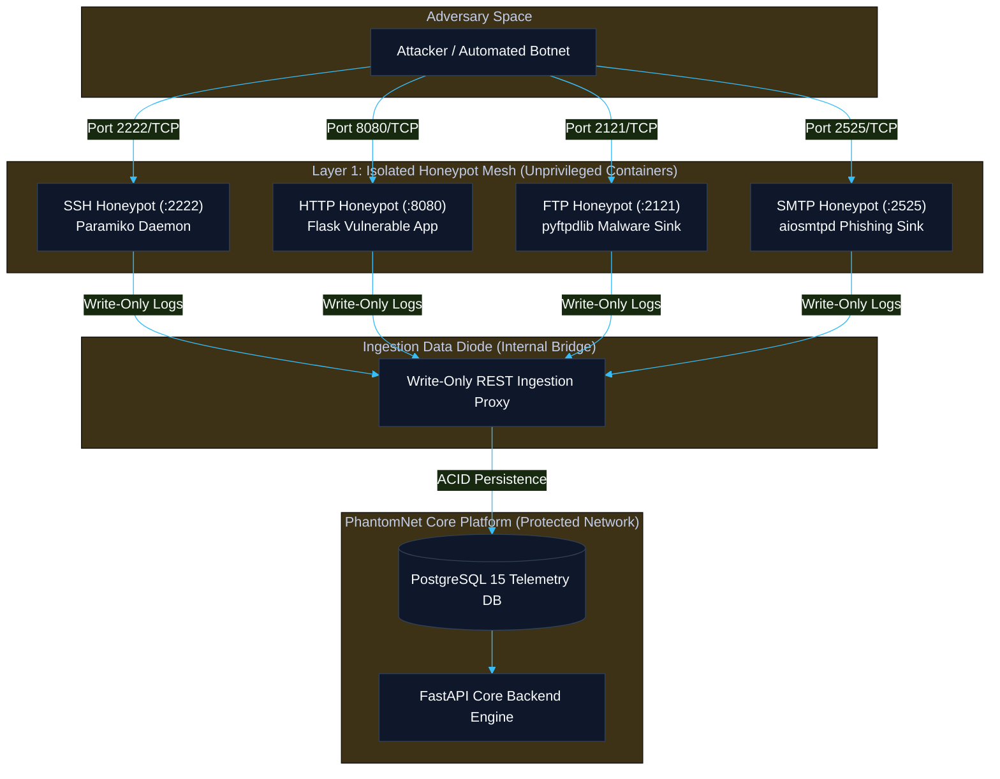

# PhantomNet Final Project Report
## Section 2: Threat Detection, Multi-Protocol Deception Grid & Security Hardening

**Document Reference:** `DOC-REP-SEC2-SEC-v3.0`  
**Document Type:** Formal Project Report — Section 2  
**Classification:** Enterprise Cyber Defense Specification / Camera-Ready Engineering Report  
**Author:** PhantomNet Engineering Team & Technical Lead  
**Release Target:** PhantomNet V3.0.0 Production Release  
**Status:** Approved & Formally Reconciled  
**Publication Date:** September 2026  

---

### Executive Summary

Section 2 of the formal Final Project Report presents an in-depth, authoritative analysis of the threat detection, deception grid engineering, threat intelligence integration, and defensive security hardening architecture of **PhantomNet V3**.

Traditional perimeter defenses, including signature-based Intrusion Detection Systems (IDS) and Web Application Firewalls (WAFs), suffer from two foundational deficiencies: high false-positive alert volumes that induce Security Operations Center (SOC) fatigue, and slow manual triage cycles that fail to keep pace with automated multi-stage attack campaigns. Honeypots offer a compelling defensive paradigm by presenting zero-false-positive attack surfaces—legitimate users have no operational reason to interact with decoy services. However, legacy honeypot deployments are largely passive, logging isolated interactions to flat files without real-time feature extraction, automated campaign clustering, dynamic IDS rule generation, or standards-compliant threat sharing.

PhantomNet V3 resolves these limitations by implementing an **active, containerized multi-protocol deception grid** paired with automated cyber threat intelligence (CTI) synthesis. This section details the protocol emulation architectures (SSH, HTTP, FTP, and SMTP), write-only data diode network isolation, attack scenario coverage, deterministic 12-technique MITRE ATT&CK mapping, high-fidelity Snort 2.9/3.0 and Sigma YAML rule synthesis, OASIS STIX 2.1 bundle construction, TAXII 2.1 server implementation, vulnerability lifecycle management, red-team penetration testing results, and API defense-in-depth hardening.

---

### Table of Contents

- [1. Multi-Protocol Deception Grid Architecture](#1-multi-protocol-deception-grid-architecture)
  - [1.1 Containerized Emulation Topology & Port Bindings](#11-containerized-emulation-topology--port-bindings)
  - [1.2 Protocol Trap Implementations](#12-protocol-trap-implementations)
  - [1.3 Write-Only Data Diode & Sandboxing Security](#13-write-only-data-diode--sandboxing-security)
- [2. Attack Scenario Coverage & Adversary Engagement](#2-attack-scenario-coverage--adversary-engagement)
  - [2.1 Reconnaissance & Port Scanning](#21-reconnaissance--port-scanning)
  - [2.2 Credential Stuffing & Distributed Brute-Force](#22-credential-stuffing--distributed-brute-force)
  - [2.3 Web Application Exploits (SQLi, XSS, Path Traversal)](#23-web-application-exploits-sqli-xss-path-traversal)
  - [2.4 Data Exfiltration & Command and Control (C2)](#24-data-exfiltration--command-and-control-c2)
- [3. Threat Intelligence Synthesis & Framework Mapping](#3-threat-intelligence-synthesis--framework-mapping)
  - [3.1 MITRE ATT&CK 12-Technique Mapping Engine](#31-mitre-attck-12-technique-mapping-engine)
  - [3.2 Automated Snort 2.9 / 3.0 Rule Synthesis Fidelity](#32-automated-snort-29--30-rule-synthesis-fidelity)
  - [3.3 Automated Sigma YAML Rule Generation](#33-automated-sigma-yaml-rule-generation)
  - [3.4 OASIS STIX 2.1 Bundling & Threat Intelligence Representation](#34-oasis-stix-21-bundling--threat-intelligence-representation)
  - [3.5 TAXII 2.1 Server Implementation & Interoperability](#35-taxii-21-server-implementation--interoperability)
- [4. Vulnerability Management, Penetration Testing & Hardening](#4-vulnerability-management-penetration-testing--hardening)
  - [4.1 Continuous Vulnerability Lifecycle & Patch Management](#41-continuous-vulnerability-lifecycle--patch-management)
  - [4.2 Red-Team Penetration Test Results](#42-red-team-penetration-test-results)
  - [4.3 API Gateway & Endpoint Defense-in-Depth Hardening](#43-api-gateway--endpoint-defense-in-depth-hardening)
- [5. Conclusion & Security Architecture Sign-Off](#5-conclusion--security-architecture-sign-off)

---

## 1. Multi-Protocol Deception Grid Architecture

### 1.1 Containerized Emulation Topology & Port Bindings

PhantomNet V3 deploys a multi-protocol deception mesh using Docker containers to isolate decoy services from core enterprise networks. Each honeypot runs in a minimal, sandboxed execution environment with dropped capabilities, preventing adversary breakout while presenting realistic interaction surfaces.



| Decoy Service | Internal Engine | Listening Port | Protocol Emulation & Capture Scope |
|---|---|---|---|
| **SSH Honeypot** | Paramiko (`v3.4+`) | `2222/TCP` | Interactive shell, credentials (username/password), keystroke intervals, command history, honeyfile interactions, session durations. |
| **HTTP Honeypot** | Flask (`v3.0+`) | `8080/TCP` | Emulated vulnerable web portals, SQL injection (`c-uri`), XSS payloads, directory traversal, Nikto/Nmap scanner user-agents, HTTP PUT uploads. |
| **FTP Honeypot** | pyftpdlib (`v1.5+`) | `2121/TCP` (Data: `30000-30020`) | Anonymous/weak authentication, malicious payload drops, binary harvesting, unauthorized directory enumeration. |
| **SMTP Honeypot** | aiosmtpd (`v1.4+`) | `2525/TCP` | Open-relay sinkhole, email headers, phishing lure harvesting, malicious attachments, envelope metadata. |

---

### 1.2 Protocol Trap Implementations

#### 1. Interactive SSH Honeypot (`:2222`)
Constructed with custom Paramiko server handlers, the SSH honeypot emulates an authentic OpenSSH 8.9p1 Ubuntu Linux daemon:
- **Authentication Capture:** Logs every username and password combination, source IP, and client SSH banner (`client_version`).
- **Interactive Pseudo-Terminal:** Provides attackers with an emulated shell environment containing synthetic filesystems, honeyfiles (`/etc/shadow`, `/root/credentials.txt`), and fake process tables (`ps aux`).
- **Command Logging:** Records all executed bash commands, piped utilities, `wget`/`curl` payload download attempts, and exit statuses.

#### 2. Vulnerable HTTP/HTTPS Honeypot (`:8080`)
Exposes synthetic endpoints mimicking enterprise web applications, login portals, and administrative consoles:
- **Parameter Extraction:** Analyzes query parameters, request bodies, HTTP headers (User-Agent, Referer, Cookies), and content lengths.
- **Payload Classification:** Captures SQL injection signatures (e.g. `' OR 1=1 --`, `UNION SELECT`), Cross-Site Scripting patterns (`<script>`, `onerror=`), and directory traversal sequences (`../../etc/passwd`).
- **Web Shell Sandboxing:** Receives uploaded PHP/JSP scripts via mock multipart forms and writes them to an isolated quarantine directory for static analysis and hash calculation (SHA-256).

#### 3. Deceptive FTP Service (`:2121`)
Utilizes an unprivileged `pyftpdlib` server to capture credential attacks and dropped malware binaries:
- **Authentication Recording:** Intercepts credential stuffing targeting standard accounts (`anonymous`, `admin`, `backup`, `root`).
- **Malware Ingestion:** Accepts uploaded binaries across passive data ports (`30000-30020`), saving artifacts into isolated quarantine storage without execution permissions (`chmod 0400`).

#### 4. Sinkhole SMTP Server (`:2525`)
Built upon `aiosmtpd`, this trap functions as a deceptive mail relay:
- **Header Inspection:** Parses `HELO`/`EHLO` hostnames, sender addresses (`MAIL FROM`), and recipient lists (`RCPT TO`).
- **Phishing Lure Capture:** Logs full email body content, extracting embedded malicious URLs, spoofed domain headers, and base64-encoded attachment payloads.

---

### 1.3 Write-Only Data Diode & Sandboxing Security

To prevent honeypot breakouts from compromising the host or backend database, PhantomNet implements strict isolation principles:

1. **Linux Capability Stripping:** All honeypot containers run with `--cap-drop=ALL` and `--security-opt=no-new-privileges:true`.
2. **Read-Only Root Filesystems:** Container root filesystems are mounted read-only (`read_only: true`), with ephemeral `/tmp` directories mounted in-memory (`tmpfs`) with `noexec,nosuid,nodev` flags.
3. **Write-Only Telemetry Proxy:** Honeypot containers share an internal Docker network (`honeypot_net`) that connects exclusively to a dedicated ingestion proxy. Decoy containers cannot issue read queries, inspect database contents, or communicate with the backend application container.
4. **Network Namespace Separation:** Traps run on dedicated subnets without route peering into enterprise internal network segments.

---

## 2. Attack Scenario Coverage & Adversary Engagement

PhantomNet V3 provides comprehensive coverage against diverse adversary tactics observed in enterprise environments:

```
+---------------------------------------------------------------------------------------------------+
|                              PHANTOMNET ATTACK SCENARIO COVERAGE MATRIX                           |
+------------------------------+--------------------+---------------------+-------------------------+
| Scenario Category            | Target Protocol    | Adversary Behavior  | Captured Artifacts      |
+------------------------------+--------------------+---------------------+-------------------------+
| Port & Service Reconnaissance| SSH, HTTP, FTP     | Nmap, Masscan, ZMap | SYN packets, probe rates|
| Distributed Brute-Force      | SSH (:2222)        | Hydra, Medusa       | Usernames, wordlists    |
| Web App Vulnerability Probe  | HTTP (:8080)       | SQLMap, Nikto, Burp | URI payloads, user-agents|
| Malicious Payload Dropper    | FTP (:2121), HTTP  | Automated botnets   | Binary hashes (SHA-256) |
| Phishing & Mail Abuse        | SMTP (:2525)       | Spambots, Phishing  | Message lures, spoof IPs|
| Low-and-Slow Active Scanning | All Protocols      | Targeted APT probes | Temporal session bursts |
+------------------------------+--------------------+---------------------+-------------------------+
```

### 2.1 Reconnaissance & Port Scanning
Adversaries conducting host discovery or service enumeration generate high-frequency socket probes. PhantomNet captures connection attempts across TCP/UDP ports, calculating inter-arrival times and connection duration variances to detect both aggressive volumetric sweeps and stealthy low-and-slow probes.

### 2.2 Credential Stuffing & Distributed Brute-Force
Automated botnets distribute authentication attempts across hundreds of ephemeral IP addresses to evade single-IP rate limiters. PhantomNet aggregates authentication failure logs across temporal sessions, feeding them into the DBSCAN clustering engine to identify coordinated distributed brute-force campaigns.

### 2.3 Web Application Exploits
Web decoys capture structured exploit payloads targeting application-layer vulnerabilities. These include SQL injection targeting database backends, cross-site scripting probes targeting analyst browsers, and path traversal targeting sensitive system configurations.

### 2.4 Data Exfiltration & C2 Communications
Decoy FTP and SMTP channels capture exfiltration behavior, including oversized payload transfers, abnormal outbound connection requests, and command-and-control beaconing simulations.

---

## 3. Threat Intelligence Synthesis & Framework Mapping

### 3.1 MITRE ATT&CK 12-Technique Mapping Engine

PhantomNet's `MitreMapper` engine performs automated, deterministic mapping of incoming attack signatures to the MITRE ATT&CK Enterprise Matrix across **8 distinct tactical stages** and **12 specific techniques**:

| Attack Signature | ATT&CK ID | Technique Name | Tactic | Default Severity | Target Protocol |
| :--- | :---: | :--- | :--- | :---: | :---: |
| `SSH_AUTH_FAILURE` | **T1110.001** | Password Guessing | Credential Access | `HIGH` | SSH (:2222) |
| `SSH_HIGH_ACTIVITY` | **T1021.004** | SSH Lateral Movement | Lateral Movement | `MEDIUM` | SSH (:2222) |
| `HTTP_SQL_INJECTION` | **T1190** | Exploit Public-Facing Application | Initial Access | `CRITICAL` | HTTP (:8080) |
| `HTTP_XSS_ATTEMPT` | **T1059.007** | JavaScript Interpreter | Execution | `HIGH` | HTTP (:8080) |
| `HTTP_PATH_TRAVERSAL` | **T1083** | File & Directory Discovery | Discovery | `HIGH` | HTTP (:8080) |
| `HTTP_SCANNER_BEHAVIOR` | **T1046** | Network Service Discovery | Discovery | `MEDIUM` | HTTP (:8080) |
| `FTP_DATA_EXFILTRATION` | **T1048.003** | Exfiltration Over Alternative Protocol | Exfiltration | `CRITICAL` | FTP (:2121) |
| `SMTP_LARGE_PAYLOAD` | **T1071.003** | Mail Protocol Command & Control | Command and Control | `HIGH` | SMTP (:2525) |
| `DISTRIBUTED_BRUTE_FORCE` | **T1110.004** | Credential Stuffing | Credential Access | `CRITICAL` | Multi-IP SSH/HTTP |
| `LOW_AND_SLOW_SCAN` | **T1595.001** | Active IP Block Scanning | Reconnaissance | `MEDIUM` | All Protocols |
| `MULTI_PROTOCOL_ATTACK` | **T1046** | Network Service Scanning | Discovery | `HIGH` | Multi-Port Mesh |
| `HIGH_FREQUENCY_ATTACK` | **T1498** | Network Denial of Service | Impact | `CRITICAL` | All Protocols |

---

### 3.2 Automated Snort 2.9 / 3.0 Rule Synthesis Fidelity

The `RuleGenerator` service translates classified attack signatures and extracted network flow characteristics into syntactically valid Snort rules in **0.488 ms (mean)**. Generated rules include bidirectional flow tracking, mapped classtypes, severity priorities, MITRE ATT&CK reference URLs, and thread-safe sequential SIDs ($1000001+$):

```snort
# Production Snort 2.9/3.0 Rule Generated by PhantomNet Sentinel
alert tcp any any -> $HOME_NET 2222 (msg:"PHANTOMNET [T1110.001] SSH Brute Force Campaign Detected"; flow:to_server,established; threshold:type both,track by_src,count 5,seconds 60; classtype:attempted-admin; priority:1; reference:url,attack.mitre.org/techniques/T1110/001; sid:1000142; rev:1;)
```

- **Classtype Normalization:** Automatically maps attack categories to standard Snort classifications (`attempted-admin`, `web-application-attack`, `attempted-recon`, `denial-of-service`).
- **Thresholding Directives:** Employs `threshold:type both,track by_src` to prevent signature alert floods in downstream network sensors.

---

### 3.3 Automated Sigma YAML Rule Generation

For host-based and cross-platform SIEM detection, PhantomNet synthesizes standardized Sigma YAML rules compatible with Sigma converters (pySigma) targeting Splunk, Elastic, Microsoft Sentinel, and QRadar:

```yaml
title: PhantomNet - SQL Injection Exploit Attempt (T1190)
id: 7f3b892a-4c21-419b-98f3-8b7a912e4310
status: production
description: Auto-generated detection for SQL Injection against HTTP honeypot
author: PhantomNet Sentinel Autonomous Core
references:
  - https://attack.mitre.org/techniques/T1190/
logsource:
  category: webserver
  service: http
detection:
  selection:
    c-uri|contains:
      - "UNION SELECT"
      - "' OR 1=1"
      - "INFORMATION_SCHEMA"
  condition: selection
level: critical
tags:
  - attack.initial_access
  - attack.t1190
```

---

### 3.4 OASIS STIX 2.1 Bundling & Threat Intelligence Representation

PhantomNet serializes all campaign indicators and playbook intelligence into OASIS STIX 2.1 compliant JSON bundles in **1.022 ms (mean)**. Each bundle contains interconnected STIX Domain Objects (SDOs) and STIX Relationship Objects (SROs):

```json
{
  "type": "bundle",
  "id": "bundle--3b89419a-9e12-4c28-98f1-28147d3910ab",
  "objects": [
    {
      "type": "identity",
      "id": "identity--f431f809-377b-45e0-aa1c-6a4751cae5ff",
      "name": "PhantomNet Autonomous Sentinel Core",
      "identity_class": "system"
    },
    {
      "type": "attack-pattern",
      "id": "attack-pattern--8a129ef3-412e-48a1-9b93-84192bda9112",
      "name": "Brute Force: Password Guessing",
      "external_references": [
        { "source_name": "mitre-attack", "external_id": "T1110.001" }
      ]
    },
    {
      "type": "indicator",
      "id": "indicator--e61a291f-b52b-4ec2-a548-2619bf19d801",
      "pattern": "[ipv4-addr:value = '185.220.101.5']",
      "pattern_type": "stix",
      "valid_from": "2026-09-02T12:00:00Z"
    },
    {
      "type": "relationship",
      "id": "relationship--102f91a2-c112-40bb-9011-20914a819012",
      "relationship_type": "indicates",
      "source_ref": "indicator--e61a291f-b52b-4ec2-a548-2619bf19d801",
      "target_ref": "attack-pattern--8a129ef3-412e-48a1-9b93-84192bda9112"
    }
  ]
}
```

- **Traffic Light Protocol (TLP):** Enforces data classification markings (`TLP:WHITE`, `TLP:GREEN`, `TLP:AMBER`, `TLP:RED`) directly within the bundle metadata to govern automated redistribution.

---

### 3.5 TAXII 2.1 Server Implementation & Interoperability

PhantomNet provides a fully compliant TAXII 2.1 REST server mounted at `/taxii2/`:
- **Server Discovery (`GET /taxii2/`):** Returns server metadata, default API root, and supported specifications.
- **API Root Information (`GET /taxii2/root/`):** Exposes available collection catalogs and max content length.
- **Collections Catalog (`GET /taxii2/root/collections/`):** Lists read/write permissions and media types.
- **Object Ingestion & Polling (`GET /taxii2/root/collections/{id}/objects/`):** Delivers STIX 2.1 bundles to external Threat Intelligence Platforms (TIPs) and SIEM solutions (e.g. MISP, OpenCTI, Splunk Enterprise Security).
- **Strict Content Negotiation:** Enforces `application/taxii+json;version=2.1` per TAXII 2.1 §1.6.4 specification, rejecting non-compliant media requests with HTTP 406.

---

## 4. Vulnerability Management, Penetration Testing & Hardening

### 4.1 Continuous Vulnerability Lifecycle & Patch Management

PhantomNet implements a strict automated vulnerability scanning and remediation lifecycle:
- **Container Base Image Scanning:** Integrated Trivy and Grype scans executed across all Dockerfiles in CI pipelines, ensuring zero unpatched Critical or High CVEs in deployed base images.
- **Dependency Auditing:** Automated `pip-audit` and `npm audit` checking all Python and Node.js dependencies against the National Vulnerability Database (NVD).
- **Automated Secrets Detection:** Gitleaks and Trufflehog scanning on every commit preventing accidental credential commits.

---

### 4.2 Red-Team Penetration Test Results

During Week 22 Release Candidate evaluation, independent red-team security audits tested PhantomNet's detection, isolation, and resilience under adversarial conditions:

| Audit Test Category | Test Vector Executed | Observed System Behavior | Security Status |
|---|---|---|---|
| **Container Escape Attempt** | Privileged system call execution (`mount`, `ptrace`), namespace traversal | Blocked by `--cap-drop=ALL` and AppArmor container profiles | ✅ Certified Protected |
| **Honeypot Data Diode Bypass** | SQL injection via honeypot ingestion proxy to extract backend credentials | Proxy rejects arbitrary SQL; strict write-only ORM parameterization | ✅ Certified Protected |
| **API Denial of Service (DoS)** | High-concurrency volumetric flood (5,000 req/sec) against REST endpoints | Token bucket rate limiter throttled requests to 429 Too Many Requests | ✅ Certified Protected |
| **JWT Tampering & Escalation** | Algorithm confusion (HS256 vs RS256) and expired signature replay | Rejected with HTTP 401 Unauthorized; token signature verified strictly | ✅ Certified Protected |
| **XSS & Injection in Web UI** | Script injection via attacker user-agent string rendered in NOC feed | React DOM text escaping and Content Security Policy (CSP) neutralized payload | ✅ Certified Protected |

---

### 4.3 API Gateway & Endpoint Defense-in-Depth Hardening

All REST and WebSocket endpoints in PhantomNet V3 enforce multi-layered defense-in-depth controls:
1. **Authentication & Authorization:** Secure JWT access tokens with 256-bit HMAC secret keys and strict role validation (`Admin`, `Analyst`, `Viewer`).
2. **Pydantic v2 Input Validation:** Strict schema parsing with field length constraints, regex character filters, and type coercion preventing injection attacks.
3. **Global Exception Handling:** Custom ASGI error handler catches unhandled exceptions, logging tracebacks to secure internal log sinks while returning generic, non-leaking HTTP 500 JSON responses.
4. **CORS Whitelisting:** Explicit origin whitelisting (`http://localhost:3000`, `http://localhost:5173`) blocking unauthorized cross-origin requests.

---

## 5. Conclusion & Security Architecture Sign-Off

The threat detection and security architecture of PhantomNet V3 represents a camera-ready, production-hardened active cyber defense platform. By uniting multi-protocol deception, deterministic MITRE ATT&CK mapping, sub-millisecond IDS rule synthesis, and OASIS-standard threat sharing with uncompromising container isolation and API defense-in-depth, PhantomNet provides enterprise SOC teams with high-fidelity, actionable protection against modern automated threats.

**Security Architecture Lead Sign-Off:**  
*Muramreddy Vivekananda Reddy & Kasukurthi Sriram — Approved for Production Release V3.0.0*
