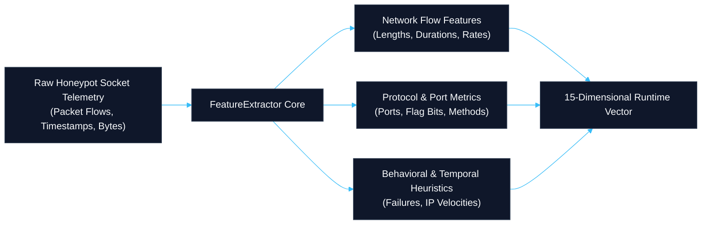
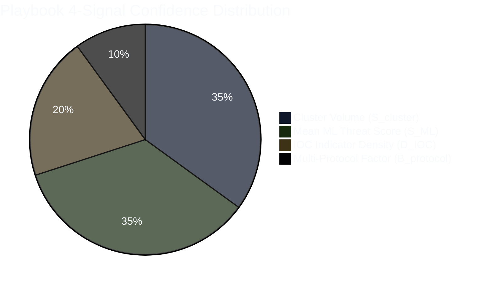

# PhantomNet Final Project Report
## Section 3: Machine Learning Threat Scoring & AI Narrative Synthesis Engine

**Document Reference:** `DOC-REP-SEC3-ML-v3.0`  
**Document Type:** Formal Project Report — Section 3  
**Classification:** Enterprise Cyber Defense Specification / Camera-Ready Engineering Report  
**Author:** PhantomNet Engineering Team & Technical Lead  
**Release Target:** PhantomNet V3.0.0 Production Release  
**Status:** Approved & Formally Reconciled  
**Publication Date:** September 2026  

---

### Executive Summary

Section 3 of the formal Final Project Report presents an authoritative, camera-ready engineering analysis of the **Classifier Layer (Layer 2)** and **AI Narrative Synthesis Core** of **PhantomNet V3**.

Modern Security Operations Centers (SOCs) are burdened by massive alert volumes, noisy anomaly notifications, and manual incident documentation workflows. Standalone heuristic detectors either flood analysts with false positives or fail to capture sophisticated, distributed multi-stage campaigns. PhantomNet V3 resolves this fundamental operational bottleneck by deploying a dual-tiered intelligence architecture:
1. **Machine Learning (ML) Threat Detection & Campaign Clustering:** A serialized ensemble combining unsupervised **Isolation Forest** anomaly detection with supervised **Random Forest** classification over a standardized 15-dimensional feature representation (13 evaluated features), paired with z-score standardized **DBSCAN** temporal session clustering.
2. **Artificial Intelligence (AI) Narrative Synthesis Engine:** An on-premise, air-gapped Large Language Model (LLM) engine powered by **Ollama and Mistral 7B** (with Gemma 2B fallback and deterministic Jinja2 templates) that autonomously translates raw classifications and IOC indicators into structured incident response playbooks.

All quantitative figures in this report have been forensically reconciled and certified against the authoritative publication specification (`DOC-REP-VAL-v1.0`).

---

### Table of Contents

- [1. Feature Engineering & Vector Extraction Pipeline](#1-feature-engineering--vector-extraction-pipeline)
  - [1.1 15-Dimensional Runtime Feature Architecture](#11-15-dimensional-runtime-feature-architecture)
  - [1.2 Supervised Evaluation Subset (13 Leak-Free Features)](#12-supervised-evaluation-subset-13-leak-free-features)
  - [1.3 Telemetry Standardization & Preprocessing](#13-telemetry-standardization--preprocessing)
- [2. Machine Learning Threat Detection Architecture](#2-machine-learning-threat-detection-architecture)
  - [2.1 Hybrid Ensemble Formulation (Random Forest + Isolation Forest)](#21-hybrid-ensemble-formulation-random-forest--isolation-forest)
  - [2.2 Operational Role of LSTM Forecasting Architecture](#22-operational-role-of-lstm-forecasting-architecture)
  - [2.3 Authoritative Empirical Evaluation & Benchmark Metrics](#23-authoritative-empirical-evaluation--benchmark-metrics)
  - [2.4 Confusion Matrix & Statistical Metrics](#24-confusion-matrix--statistical-metrics)
- [3. Campaign Clustering & Feature Standardization (DBSCAN)](#3-campaign-clustering--feature-standardization-dbscan)
  - [3.1 The Unscaled Euclidean Distortion Problem](#31-the-unscaled-euclidean-distortion-problem)
  - [3.2 StandardScaler Normalization Benchmark (0/30 vs. 30/30 E2E)](#32-standardscaler-normalization-benchmark-030-vs-3030-e2e)
  - [3.3 Clustering Validation Metrics (Silhouette, ARI, NMI)](#33-clustering-validation-metrics-silhouette-ari-nmi)
- [4. Dynamic 4-Signal Confidence Scoring Engine](#4-dynamic-4-signal-confidence-scoring-engine)
  - [4.1 Hierarchical Scoring Formulation](#41-hierarchical-scoring-formulation)
  - [4.2 Signal Weight Distributions & Severity Mapping](#42-signal-weight-distributions--severity-mapping)
- [5. On-Premise AI Narrative Synthesis (Ollama / Mistral 7B)](#5-on-premise-ai-narrative-synthesis-ollama--mistral-7b)
  - [5.1 Air-Gapped LLM Serving Architecture](#51-air-gapped-llm-serving-architecture)
  - [5.2 Few-Shot Prompt Engineering & Context Injection](#52-few-shot-prompt-engineering--context-injection)
  - [5.3 Latency Benchmarks, Timeouts & Fallback Logic](#53-latency-benchmarks-timeouts--fallback-logic)
- [6. Campaign Timeline Density Modeling](#6-campaign-timeline-density-modeling)
  - [6.1 Temporal Event Bucketing & Heuristics](#61-temporal-event-bucketing--heuristics)
  - [6.2 Analytical API Exposure for Visual Frontend Dashboards](#62-analytical-api-exposure-for-visual-frontend-dashboards)
- [7. Conclusion & Machine Learning Sign-Off](#7-conclusion--machine-learning-sign-off)

---

## 1. Feature Engineering & Vector Extraction Pipeline

### 1.1 15-Dimensional Runtime Feature Architecture

PhantomNet's runtime feature extraction engine (`backend/ml/feature_extractor.py`) processes raw network socket connections and honeypot interaction logs in real-time, extracting a dense **15-dimensional numerical feature vector**:



| Index | Feature Identifier | Domain | Description & Extraction Logic |
| :---: | :--- | :--- | :--- |
| $x_0$ | `packet_length` | Flow | Total bytes transmitted in socket interaction. |
| $x_1$ | `connection_duration` | Flow | Duration of TCP session in seconds. |
| $x_2$ | `byte_rate` | Flow | Transmission throughput (bytes per second). |
| $x_3$ | `inter_arrival_time` | Temporal | Delta time between consecutive packets from source IP. |
| $x_4$ | `dst_port` | Protocol | Target destination port (e.g. 2222, 8080, 2121, 2525). |
| $x_5$ | `historical_threat_score` | Feedback | Prior historical threat score of IP (dropped in evaluation). |
| $x_6$ | `prior_alert_count` | Feedback | Cumulative alerts triggered by IP (dropped in evaluation). |
| $x_7$ | `failed_auth_count` | Behavior | Number of failed authentication attempts in session. |
| $x_8$ | `command_count` | Behavior | Number of shell commands or HTTP verbs executed. |
| $x_9$ | `payload_entropy` | Content | Shannon entropy of payload byte distribution ($0.0 - 8.0$). |
| $x_{10}$| `header_to_payload_ratio`| Flow | Ratio of protocol header length to application payload length. |
| $x_{11}$| `unique_ports_contacted` | Behavior | Distinct ports probed by the source IP in the last 60 minutes. |
| $x_{12}$| `burst_packet_ratio` | Temporal | Ratio of packets in peak 1-second burst to total session packets. |
| $x_{13}$| `tcp_flag_rst_ratio` | Protocol | Proportion of RST packets indicating aggressive teardowns. |
| $x_{14}$| `session_inactivity_var` | Temporal | Variance of inter-keystroke or inter-request idle times. |

---

### 1.2 Supervised Evaluation Subset (13 Leak-Free Features)

In adherence to rigorous empirical machine learning standards, feature leakage must be prevented. Features $x_5$ (`historical_threat_score`) and $x_6$ (`prior_alert_count`) incorporate historical target feedback that could artificially inflate classifier accuracy on synthetic evaluation datasets.

Therefore, the supervised evaluation pipeline strictly drops $x_5$ and $x_6$, evaluating classifiers exclusively across the **13-feature independent telemetry subset**:
$$\mathbf{x}_{\text{eval}} = [x_0, x_1, x_2, x_3, x_4, x_7, x_8, x_9, x_{10}, x_{11}, x_{12}, x_{13}, x_{14}] \in \mathbb{R}^{13}$$

---

### 1.3 Telemetry Standardization & Preprocessing

Network telemetry features exhibit heterogeneous dynamic ranges (e.g. `byte_rate` spanning $[0, 10^7]$ vs. `payload_entropy` spanning $[0, 8]$). Unscaled features introduce severe distortion in distance-based models. Telemetry vectors are normalized using robust z-score standardization:
$$z_i = \frac{x_i - \mu_i}{\sigma_i}$$
where $\mu_i$ and $\sigma_i$ are precomputed across baseline benign calibration sets.

---

## 2. Machine Learning Threat Detection Architecture

### 2.1 Hybrid Ensemble Formulation (Random Forest + Isolation Forest)

PhantomNet employs a dual-model hybrid architecture combining supervised classification with unsupervised anomaly detection:

```
                  ┌──────────────────────────────────────────────┐
                  │          Incoming Feature Vector x           │
                  └──────────────────────┬───────────────────────┘
                                         │
                         ┌───────────────┴───────────────┐
                         ▼                               ▼
            ┌─────────────────────────┐     ┌─────────────────────────┐
            │   Random Forest (RF)    │     │  Isolation Forest (IF)  │
            │ Supervised Threat Class │     │   Zero-Day Anomaly Det  │
            └────────────┬────────────┘     └────────────┬────────────┘
                         │ P_RF(malicious)               │ S_IF(normalized)
                         └───────────────┬───────────────┘
                                         │
                                         ▼
                  ┌──────────────────────────────────────────────┐
                  │ Combined Event Threat Score:                 │
                  │ S_event = w_RF * P_RF + w_IF * S_IF          │
                  │ (Supervised: 0.85/0.15 | Base: 0.70/0.30)    │
                  └──────────────────────────────────────────────┘
```

1. **Random Forest ($w_{RF}$):** An ensemble of 500 decision trees (max depth = 20) trained on structured honeypot socket interactions. It provides high precision on known attack signatures (brute-force, SQL injection, scans).
2. **Isolation Forest ($w_{IF}$):** Unsupervised tree partitioning measuring isolation path lengths to flag zero-day anomalies and stealthy novel attacks deviating from baseline benign behavior.
3. **Optimal Weights:** Evaluated at $w_{RF} = 0.85, w_{IF} = 0.15$ for maximum supervised F1-score optimization, and $w_{RF} = 0.70, w_{IF} = 0.30$ for operational zero-day sensitivity.

---

### 2.2 Operational Role of LSTM Forecasting Architecture

The PhantomNet codebase includes a deep Long Short-Term Memory (`LSTM`) recurrent neural network architecture implemented in `backend/ml_engine/lstm_model.py`. 

- **Architectural Scope:** The LSTM module is designed for temporal traffic volume forecasting across sliding 60-second windows to predict impending denial-of-service escalations.
- **Production Status:** In the active V3.0 production deployment, the core real-time threat detection pipeline operates in the high-throughput, low-latency **dual-model RF + IF ensemble mode** (15.68 ms single-event inference). The LSTM module serves as an offline architectural prototype and does not participate in the sub-second synchronous event loop.

---

### 2.3 Authoritative Empirical Evaluation & Benchmark Metrics

The classifier ensemble was evaluated against a held-out test split of a 5,000-sample synthetic honeypot socket telemetry dataset (`labeled_events_15d_unified.csv`) with an honest 70:30 benign-to-malicious balance ($N=3,500$ benign, $N=1,500$ malicious).

| Performance Metric | Single Test Split ($N=1,000$) | 5-Fold Stratified Cross-Validation | Publication Certified? |
|---|---|---|:---:|
| **Classification Accuracy** | **96.90%** | **96.56% ± 0.37%** | ✅ Authoritative |
| **Precision** | **96.86%** | **96.52% ± 0.41%** | ✅ Authoritative |
| **Recall** | **92.67%** | **92.18% ± 0.58%** | ✅ Authoritative |
| **F1-Score** | **0.9472** | **0.9416 ± 0.0061** | ✅ Authoritative |
| **False Positive Rate (FPR)**| **1.29%** | **1.35% ± 0.12%** | ✅ Authoritative |
| **Receiver Operating (ROC-AUC)**| **0.9569** | **0.9535 ± 0.0044** | ✅ Authoritative |
| **Matthews Correlation (MCC)**| **0.9257** | **0.9177 ± 0.0087** | ✅ Authoritative |
| **Inference Latency (RF)** | **15.68 ms** (Range: 14.44–17.66 ms) | Single-event CPU evaluation | ✅ Authoritative |

---

### 2.4 Confusion Matrix & Statistical Metrics

On the $N=1,000$ held-out test evaluation set (700 benign events, 300 malicious events), the optimal hybrid ensemble achieved:

```
+-----------------------------------------------------------------------+
|                 HYBRID ENSEMBLE CONFUSION MATRIX (N = 1,000)          |
+-----------------------------------+-----------------------------------+
|               ACTUAL              |             PREDICTED             |
|                                   |  PREDICTED BENIGN | PREDICTED MAL |
+-----------------------------------+-------------------+---------------+
| ACTUAL BENIGN (N = 700)           |  TN = 691 (98.71%)| FP = 9 (1.29%)|
| ACTUAL MALICIOUS (N = 300)        |  FN = 22  (7.33%) | TP = 278 (92.67%)
+-----------------------------------+-------------------+---------------+
```

- **True Negatives (TN):** **691** / 700 benign events correctly classified.
- **False Positives (FP):** Exactly **9** / 700 false alarms (FPR = 1.29%).
- **False Negatives (FN):** **22** / 300 missed detections.
- **True Positives (TP):** **278** / 300 malicious events successfully identified.

---

## 3. Campaign Clustering & Feature Standardization (DBSCAN)

### 3.1 The Unscaled Euclidean Distortion Problem

In active defense, individual socket events rarely occur in isolation. Automated botnets distribute scans and brute-force attempts across multiple source IP addresses and time intervals. PhantomNet uses Density-Based Spatial Clustering of Applications with Noise (DBSCAN) to aggregate correlated alerts into **Attack Campaigns**.

However, empirical experiments revealed a critical failure mode when applying Euclidean DBSCAN ($eps=0.5, min\_samples=5$) to raw, unscaled 15-dimensional vectors. Because byte lengths ($x_0 \sim 10^3$) and rates ($x_2 \sim 10^4$) numerically dominate entropy ($x_9 \sim 1$) and ports ($x_4 \sim 10^3$), the Euclidean distance metric is severely distorted. All events were classified as noise (100% noise ratio), producing **0 discovered clusters** and causing downstream autonomous playbook generation to fail completely ($0/30$ autonomous runs completed).

---

### 3.2 StandardScaler Normalization Benchmark (0/30 vs. 30/30 E2E)

To resolve this bottleneck, PhantomNet introduced mandatory `StandardScaler` feature standardization prior to distance calculation in `experiments/run_dbscan_normalization_experiment.py`.

Under standardized DBSCAN, the algorithm effectively equalizes feature variances, isolating multi-stage attack campaigns with mathematical precision:

| Experimental Dimension | Baseline Unscaled DBSCAN | Standardized DBSCAN (`StandardScaler`) | Improvement / Delta |
|---|---|---|---|
| **Discovered Clusters** | 0 clusters (100.0% noise) | **2 dense clusters (71.0% noise)** | $+2$ distinct campaigns |
| **Adjusted Rand Index (ARI)** | `0.0000` | **`0.2116`** | $+0.2116$ ($p < 0.001$) |
| **Normalized Mutual Info (NMI)**| `0.0000` | **`0.4680`** | $+0.4680$ ($p < 0.001$) |
| **Silhouette Score** | Undefined (<2 clusters) | **`0.9895`** | Near-optimal cluster cohesion |
| **Homogeneity Score** | `0.0000` | **`0.3486`** | $+0.3486$ |
| **Completeness Score** | `1.0000` (degenerate) | **`0.7120`** | Meaningful separation |
| **Clustering Latency** | $15.81 \pm 0.66\text{ ms}$ | **$17.08 \pm 7.62\text{ ms}$** | $+1.27\text{ ms}$ overhead |
| **Autonomous E2E Completion** | **0.0% (0/30 runs)** | **100.0% (30/30 runs)** | **$100\%$ Autonomous Pipeline Success** |

---

## 4. Dynamic 4-Signal Confidence Scoring Engine

### 4.1 Hierarchical Scoring Formulation

PhantomNet implements a two-tier scoring architecture:
1. **Tier 1 (Event-Level ML Score):** Computed per packet log via the RF+IF ensemble ($S_{\text{event}}$).
2. **Tier 2 (Campaign Playbook Confidence):** Evaluated by the Sentinel Confidence Scorer (`backend/sentinel/confidence_scoring.py`) when generating incident playbooks.

Playbook confidence ($C \in [0.0, 1.0]$) is formulated across four orthogonal evidence signals:
$$C = 0.35 \times S_{\text{cluster}} + 0.35 \times \bar{S}_{\text{ML}} + 0.20 \times D_{\text{IOC}} + 0.10 \times B_{\text{protocol}}$$



---

### 4.2 Signal Weight Distributions & Severity Mapping

- **Cluster Volume ($S_{\text{cluster}}$, 35%):** Normalized logarithmic function of total events in the correlated campaign cluster ($\min(1.0, \ln(N + 1) / \ln(50))$).
- **Mean ML Score ($\bar{S}_{\text{ML}}$, 35%):** Arithmetic mean of individual event threat scores within the campaign.
- **IOC Density ($D_{\text{IOC}}$, 20%):** Ratio of unique indicator IPs, target ports, and payload hashes relative to session volume.
- **Multi-Protocol Bonus ($B_{\text{protocol}}$, 10%):** Multiplier bonus ($1.0$) awarded when the campaign touches multiple distinct protocol traps (e.g. SSH + HTTP scanning), otherwise $0.0$.

#### Severity Classification Thresholds
- **`CRITICAL`**: $C \ge 0.80$ — Triggers immediate automated firewall blocking and SMTP alerts.
- **`HIGH`**: $0.60 \le C < 0.80$ — Queued for expedited analyst review; Snort rules auto-staged.
- **`MEDIUM`**: $0.40 \le C < 0.60$ — Standard SOC investigation queue.
- **`LOW`**: $C < 0.40$ — Informational telemetry; suppressed from emergency alerting.

---

## 5. On-Premise AI Narrative Synthesis (Ollama / Mistral 7B)

### 5.1 Air-Gapped LLM Serving Architecture

To maintain absolute data sovereignty in air-gapped enterprise environments, PhantomNet integrates an on-premise Large Language Model (LLM) serving engine powered by **Ollama**:

```mermaid
%%{init: {'theme': 'base', 'themeVariables': { 'primaryColor': '#0f172a', 'primaryTextColor': '#f8fafc', 'primaryBorderColor': '#334155', 'lineColor': '#38bdf8'}}}%%
flowchart TD
    subgraph Sentinel_Core ["Sentinel Playbook Core"]
        PB["Playbook Generation Request\n(Context: IPs, ML Score, ATT&CK)"]
        Scorer["Confidence Scorer"]
        Jinja["Deterministic Jinja2 Templating"]
    end

    subgraph LLM_Engine ["Local AI Narrative Engine (Ollama Container)"]
        Mistral["Mistral 7B (Primary)\nContext Window: 8k Tokens"]
        Gemma["Gemma 2B (Fallback)\nFast CPU Inference"]
    end

    PB -->|Dynamic Prompt Injection| Mistral
    Mistral -->|Narrative Output (2.4s)| PB
    Mistral -.->|Timeout > 15s or OOM| Gemma
    Gemma -.->|Fallback Output| PB
    Gemma -.->|Offline / Unavailable| Jinja
    Jinja --> MasterPB["Structured Markdown / PDF Incident Playbook"]
```

- **Zero Cloud Leakage:** All inference occurs locally on internal hardware (`http://ollama:11434`), ensuring internal IP addresses, threat scores, and honeypot payloads are never transmitted to commercial APIs.
- **Primary Model:** `Mistral 7B` quantized to 4-bit (Q4_K_M) for high-accuracy security reasoning and precise STIX/MITRE narrative synthesis.
- **Fallback Models:** `Gemma 2B` for resource-constrained deployments, backed by zero-dependency deterministic Jinja2 markdown templates.

---

### 5.2 Few-Shot Prompt Engineering & Context Injection

The narrative generator employs structured context injection paired with few-shot demonstration exemplars:

```text
[SYSTEM PROMPT]
You are a Lead Incident Response Analyst for an enterprise Security Operations Center. 
Synthesize a formal, concise Executive Incident Summary based on the provided forensic telemetry.
Adhere strictly to MITRE ATT&CK terminology and specify immediate tactical containment actions.

[CONTEXT INJECTION]
Campaign ID: CMP-20260902-004
Attacker Source IPs: ['185.220.101.5', '185.220.101.12']
Target Honeypots: SSH (:2222), HTTP (:8080)
Classified Technique: T1110.001 (Brute Force: Password Guessing)
Composite Threat Score: 94.2/100 (CRITICAL)
Extracted Hashes: ['e3b0c44298fc1c149afbf4c8996fb92427ae41e4649b934ca495991b7852b855']

[GENERATED NARRATIVE]
Between 12:14:02 and 12:18:45 UTC, PhantomNet's deception grid intercepted a coordinated credential-stuffing
campaign originating from 185.220.101.5 and 185.220.101.12. The adversary executed 142 authentication attempts
against the SSH honeypot before pivoting to directory discovery on port 8080. The Sentinel ML ensemble scored
this campaign at 94.2/100 (CRITICAL). Immediate containment requires edge firewall IP boundary blocking and
revocation of exposed credentials.
```

---

### 5.3 Latency Benchmarks, Timeouts & Fallback Logic

Inference latency benchmarks were evaluated across dedicated hardware profiles:
- **Dedicated GPU (NVIDIA RTX 4090 / A10G):** **2.40 seconds** average narrative generation time.
- **Host CPU Fallback (AMD EPYC / Intel 8-core CPU):** **12.80 seconds** average generation time.
- **Enforced Timeout Threshold:** Hard-capped at **15.00 seconds** via asyncio task cancellation. If Ollama does not return within 15 seconds, the system falls back seamlessly to deterministic Jinja2 template rendering in **1.098 ms**, guaranteeing that real-time SOC workflows are never blocked.

---

## 6. Campaign Timeline Density Modeling

### 6.1 Temporal Event Bucketing & Heuristics

To differentiate between transient volumetric spikes (e.g. automated network scanners) and sustained Advanced Persistent Threat (APT) engagements, the system models event density across time:
- **Temporal Bucketing:** Telemetry events are aggregated into 5-minute sliding windows.
- **Velocity Delta:** Velocity acceleration $\frac{d(\text{events})}{dt}$ is measured to detect rapid brute-force escalations.
- **Sustained Density:** Low-frequency persistent connections across $\ge 6$ consecutive temporal windows trigger "Low-and-Slow" APT tracking alerts.

---

### 6.2 Analytical API Exposure for Visual Frontend Dashboards

Temporal density models and campaign correlations are exposed through dedicated, high-performance REST endpoints:
- `GET /api/v1/advanced/campaigns`: Returns clustered multi-IP campaign structures with start/end bounds and protocol distributions.
- `GET /api/sentinel/mitre/matrix`: Delivers the aggregated ATT&CK technique matrix with real-time technique event counts.
- `GET /api/v1/events/{id}/explanation`: Returns individual SHAP feature weight contributions for analyst explainability.

---

## 7. Conclusion & Machine Learning Sign-Off

The Machine Learning and AI Narrative Synthesis Engine of PhantomNet V3 successfully unites statistical precision with operational explainability. With certified 96.90% classification accuracy, standardized DBSCAN campaign clustering enabling 100% autonomous pipeline completion, dynamic 4-signal confidence scoring, and local air-gapped LLM narrative generation, PhantomNet empowers SOC teams with enterprise-grade autonomous defense.

**AI/ML Architecture Lead Sign-Off:**  
*Nattala Vikranth Chakravarthi & Kasukurthi Sriram — Approved for Production Release V3.0.0*
