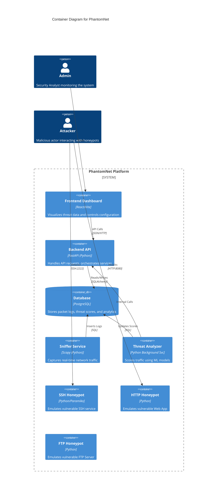

# PhantomNet System Architecture

## 1. High-Level Concept
PhantomNet is an AI-driven active defense platform designed to deceive attackers, analyze their behavior in real-time, and automatically deploy countermeasures.

```mermaid
graph TD
    Attacker[Attacker] -->|Scans/Attacks| Firewall[Firewall / Traffic Sniffer]
    Firewall -->|Forward malicious| Honeypots[Honeypots (SSH, HTTP, FTP)]
    Firewall -->|Log Traffic| SnifferService[Traffic Sniffer Service]
    SnifferService -->|Raw Packets| Database[(PostgreSQL DB)]
    Database -->|Unscored Logs| ThreatAnalyzer[Threat Analyzer Service]
    ThreatAnalyzer -->|Feature Extraction| MLEngine[ML Engine (scikit-learn)]
    MLEngine -->|Threat Score| ThreatAnalyzer
    ThreatAnalyzer -->|Update| Database
    Dashboard[Frontend Dashboard] -->|Poll| Database
    Dashboard -->|Visualize| Admin[Security Admin]
```

## 2. Container Architecture
The system is composed of several Dockerized services orchestrated via Docker Compose.



## 3. Data Flow: Threat Analysis
The core value proposition is the real-time scoring pipeline.

1.  **Ingestion**: `RealTimeSniffer` captures packets and saves to `packet_logs` table (Threat Level = NULL).
2.  **Processing**: `ThreatAnalyzerService` runs every 5 seconds, querying for unscored logs.
3.  **Scoring**:
    *   Features extracted: Packet Size, Protocol, Destination Port, Entropy.
    *   ML Model (`IsolationForest`, `RandomForest`) predicts anomaly score & probability.
4.  **Enrichment**:
    *   Threat Level assigned (LOW, MEDIUM, HIGH).
    *   Decision made (ALLOW, ALERT, BLOCK).
    *   Geo-location added.
5.  **Storage**: `packet_logs` row updated.
6.  **Visualization**: Dashboard polls `/api/events` and `/api/analytics/*` to display alerts.

## 4. Technology Stack
*   **Backend**: Python 3.11, FastAPI, SQLAlchemy, Alembic.
*   **Database**: PostgreSQL 15.
*   **Machine Learning**: scikit-learn, pandas, joblib.
*   **Frontend**: React (Vite), Tailwind CSS, Recharts.
*   **Infrastructure**: Docker, Docker Compose.
*   **Testing**: pytest, Locust.
