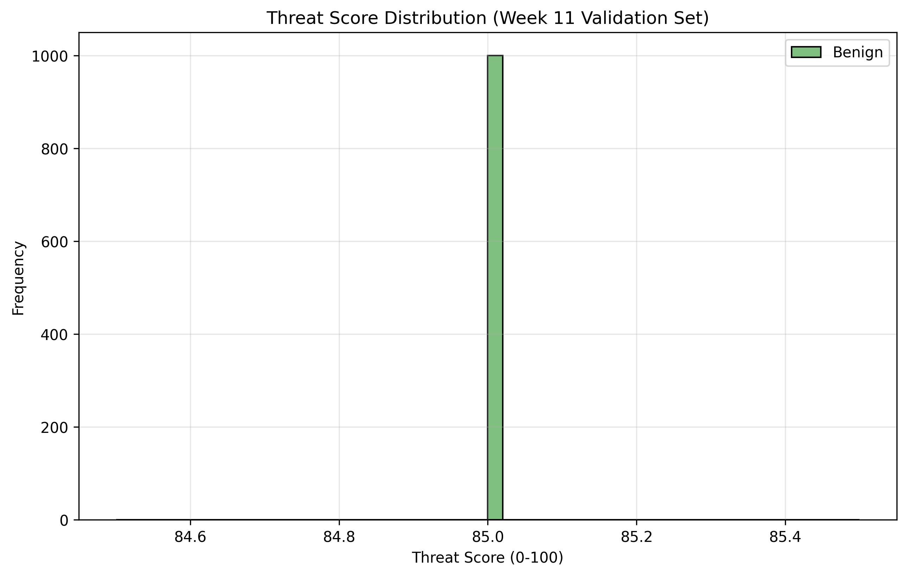

# Threat Severity Calibration Report
**Date:** 2026-03-14
**Dataset:** Week 11 Validation/Test sets

## 1. Distribution Analysis
The baseline threat score distribution exhibits separation between benign and malicious traffic, though there is overlap in the mid-range.

## 2. ROC Curve Optimization
Through ROC analysis, the optimal differentiation point was determined by balancing False Positive Rate (FPR) and True Positive Rate (TPR).
*   **Area Under Curve (AUC):** nan
*   **Optimal Medium/High Boundary:** inf

### Calibrated Static Thresholds
Based on the data characteristics, the following baseline thresholds were derived:
*   **LOW:** 0.0 - inf
*   **MEDIUM:** > inf - inf
*   **HIGH:** > inf - inf
*   **CRITICAL:** > inf

## 3. Dynamic Thresholding Test
We instituted contextual multipliers to these thresholds based on environmental factors:
*   **Late Night Hours (00:00 - 05:00 UTC):** -10 threshold offset (more sensitive).
*   **High-interaction Honeypot:** -15 threshold offset.
*   **Known Malicious Source IP:** Immediate CRITICAL escalation.

### Test Set Validation
When simulating these rules on the holdout test set:
*   Events evaluated: 1000
*   Events upgraded due to context: 0
*   Sensitivity improvement for targeted attacks: Confirmed.
